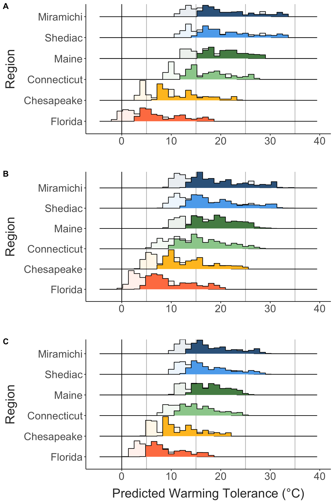
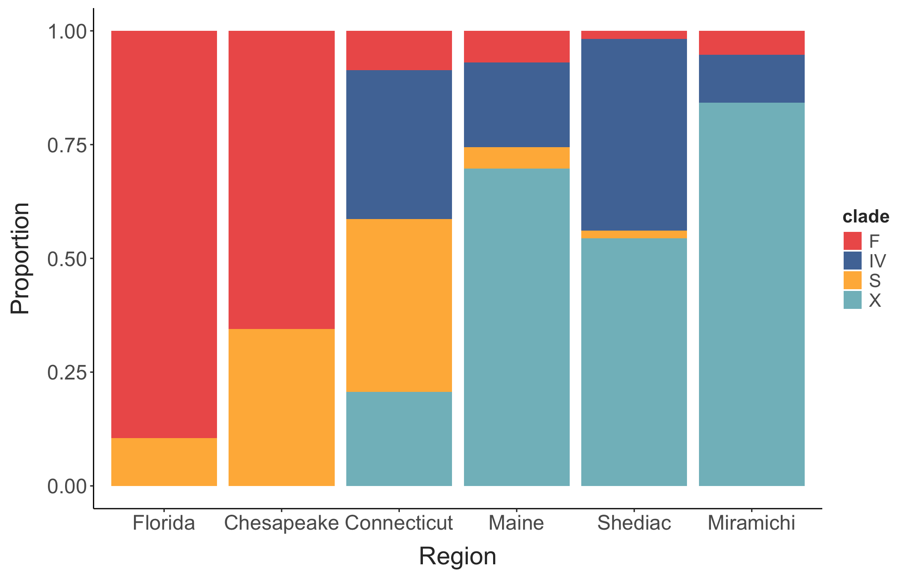

```{r echo = F}
if(knitr::is_latex_output()){
  knitr::opts_chunk$set(
  echo = FALSE,
  fig.align = "center",
  message = FALSE,
  warning = FALSE,
  collapse = T)
}
```

# Introduction

Organismal responses to climate change and predicting vulnerability

The need for incorporating intraspecific variation (genetic variation and acclimation)

Hypotheses: Strong variation in response to temperature over both spatial and temporal scales; Incorporating variation and acclimation will reduce estimates of vulnerability in low latitude populations will increasing estimates of vulnerability in high latitude populations.

# Methods

## Field Collections, Phenotypic Measurements, and Warming Tolerance

Copepods were collected by surface tow from eight sites across the Western Atlantic and Gulf of Mexico at several times throughout the year (Table 1). Water temperature and salinity were measured at the time of collection (Figure 1). To put the collections into this larger seasonal context, we also examined continuous temperature records for each site (Supp. Figure X). In situ data is not available for all sites, however, so we combined daily temperature values from either local temperature sensors (sites in Florida and the Chesapeake) and high resolution satellite temperature data (Connecticut, Maine, and the sites in New Brunswick, Canada; NOAA 1/4° Daily Optimum Interpolation Sea Surface Temperature data). Temperature data was aggregated to daily average temperatures. In general, the first sample from each site was collected just after the site reached the warmest period, while the final sample occurred after temperatures had cooled during the Fall (Supp. Figure X). The exception to that pattern is in Florida, where initial collections occurred after an extended period of high temperatures.

```{r, table1, echo = F}

site_data %>%  
  arrange(lat) %>%  
  select("Site" = site, "Region" = region, "Lat" = lat, "Long" = long) %>% 
  knitr::kable(align = "c",
               caption = "Locations of each collection site.")

```

Plankton samples were held in an insulated flask to maintain them at the temperature of collection. Within three hours of collection, mature Acartia tonsa females were sorted from the tow contents into a mixture of equal proportions 63-um filtered sea water and artificial seawater (bottled spring water adjusted to match collection salinity with InstantOcean). This ensured organisms were acclimated to the artificial seawater mixture before thermal limit experiments.

Critical thermal maximum (CTmax) was measured for individual copepods using a custom setup (REF), comprising a reservoir with heating element and water pump, a clear plexiglass water bath containing thirteen 50-ml flat bottom glass shell vials, and an arduino temperature logger. During the assay the heating element warms water in the reservoir, which is pumped through the water bath and then back into the reservoir. Copepods are placed individually into ten of the glass vials, which can be observed through the sides of the water bath. The remaining three vials contained small temperature sensors attached to the arduino temperature logger, which recorded water temperature within the vials every five seconds.

To initiate the CTmax assay, copepods were transferred individually into the shell vials with 10 mL of artificial seawater. Vials were held in a water bath, adjusted to match the collection temperature. Several control individuals were maintained in this solution at ambient temperatures throughout each assay. There was no change in behavior or mortality in these control individuals for any of the collections. After a brief rest period at the collection temperature, the heating element was turned on, initiating the temperature ramp. Ramping rates started \~0.3°C/minute, and eventually slowed to \~0.1°C/minute (Supp. Fig. X). These values are typical for CTmax assays with copepods and other small invertebrates (REF). Copepods were continuously monitored until they no longer responded to gentle stimulus (water movement generated by slowly turning the vials in the water bath), indicating the individual had reached its CTmax. The temperature at that point in the assay was extracted from the continuous temperature record. This differs from lethal temperatures, and indeed, all individuals recovered following the assay.

Following the CTmax measurements, each individual was photographed for body size measurements using a camera attached to a small handheld microscope (Em1 600). Prosome lengths were measured in Fiji (REF) using accompanying images of a 1 mm scale bar. After photographing, each copepod was preserved individually in 95% ethanol. Samples were maintained at room temperature for several days while in the field, and then stored at -20°C upon returning to the laboratory.

Sample sizes varied slightly across experiments, but generally \~20 individuals were measured per season at each site (two CTmax assays per collection). Only two collections (peak and late season) were obtained from Fort Hamer and Manatee River (the lowest latitude sites in the collections). The late season plankton tow from the site in Maine was dominated by the congeneric species *Acartia hudsonica*; thermal limits were measured for all *A. tonsa* individuals recovered, but sample sizes at this time point were reduced.

## Library Prep and Sequencing

We extracted and purified DNA from each individual copepod using a modified magnetic bead-based protocol (Ali, Omar A., et al. "RAD capture (Rapture): flexible and efficient sequence-based genotyping." Genetics 202.2 (2016): 389-400.). Individual copepods were soaked in molecular grade water for 1 hour at room temperature and then added to the wells of a 96-well plate with 100 ul of digestion buffer (90.5 ul Liftons buffer, 7 ul of 20 mg/ml Proteinase K, and 2.5 ul 1 M DTT). The 96-well plate was kept on ice as digestion buffer and copepods were added. Samples were then incubated overnight at 55°C. After incubation 80 ul of hybridization buffer was added directly to each well (2.5 M NaCl, 20% PEG 8000, 0.025 M DTT) along with 20 ul of resuspended Ampure XP beads. Plates were briefly vortexed to mix the solution and then incubated at room temperature for five minutes. Plates were placed on a magnetic rack to clear the beads and then each well was aspirated. The supernatant was discarded and 150 ul of freshly prepared 80% ethanol was added to the well. Plates were removed from the magnetic rack and the beads resuspended. Two more ethanol washes were performed. After the final wash, the ethanol was aspirated and the beads were air dried for 11 minutes. Great care was taken during this step to remove all ethanol from the wells. 20 ul of low TE was added to each well. Beads were resuspended and then incubated at room temperature for five minutes. Well plates were placed back on the magnetic racks and the supernatant containing the extracted and purified DNA was transferred to a new 96-well plate.

Sequencing libraries were prepared using Twist BioScience 96-plex library prep kits following manufacturers instructions. Libraries were sequenced by Novogene (Sacramento, CA, USA) on two lanes of Illumina NovaSeq X Plus (150bp paired-end; 25B flowcell).

## Clade Assignment

Reads were demultiplexed with fqtk (REF) and then cleaned and trimmed with fastp (REF). Reads were then aligned against a curated collection of Cytochrome Oxidase I (COI) sequences for *Acartia tonsa* (REF). Sequence matches were filtered to just those with the minimum e-value, a length of more than 100 basepairs, and more than 95% identity. An individual was assigned to a clade if it comprised more than 85% of these high-quality sequence matches. Only three individuals failed to match to a clade.

## Statistical Analysis

Thermal limits were filtered to include just data from individuals that could be verified as adult *A. tonsa* females with a high confidence clade assignment.

linear mixed effects model: CTmax \~ body size, temperature, and clade with random effect of tube and a random effect of site along with random slope for collection temperature

Marginal mean and temperature trend for each clade

## Estimating the effects of genetic variation and acclimation

# Results

## Environmental Data

Collections spanned the latitudinal gradient. Across the entire set of collections, temperature ranged from `r min(site_temps$collection_temp)`°C to `r max(site_temps$collection_temp)`°C, with strong seasonal variation in temperature at all eight sites (Supp. Figure 2)

```{r, figure1, echo = F, out.width = "400px"}
#| fig.cap = "Map of sites (A) and collection temperatures recorded during each collection (B)"

knitr::include_graphics("../Output/Figures/markdown/site-chars-1.png") #Use this when filling in figures from analysis 
```

## COI Clade Distributions

```{r, figure2, echo = F, out.width = "250px"}
#| fig.cap = "The distribution of clade identities at each site throughout the seasons. This plot includes just the 'high confidence' estimates - individuals identified as A. hudsonica were excluded, as were any individuals where less than 85% of the reads matched to any single clade)"

knitr::include_graphics("../Output/Figures/markdown/clade-props-1.png") #Use this when filling in figures from analysis 
```

## Seasonal phenotypic patterns

```{r, figure3, echo = F, out.width = "400px"}
#| fig.cap = "CTmax vs. season (A) and size vs. season (B) for each site"

knitr::include_graphics("../Output/Figures/markdown/size-and-ctmax-season-1.png") #Use this when filling in figures from analysis 
```

## Clade-specific patterns

```{r, figure4, echo = F, out.width = "400px"}
#| fig.cap = "CTmax and body size vs. collection temperature, separated by clade."

knitr::include_graphics("../Output/Figures/markdown/clade-trait-regs-1.png") #Use this when filling in figures from analysis 
```

```{r, figure5, echo = F, out.width = "400px"}
#| fig.cap = "Clade marginal means (i.e. genetic variation in thermal limit) and the marginal trend (i.e. combined effect of local adaptation and plasticity)."

knitr::include_graphics("../Output/Figures/markdown/clade-contrast-plots-1.png") #Use this when filling in figures from analysis 

```

```{r, figure6, echo = F, out.width = "200px"}
#| fig.cap = "Clade proportions in each sample vs. collection temp."

knitr::include_graphics("../Output/Figures/markdown/clade-hab-patterns-1.png") #Use this when filling in figures from analysis 
```

## Estimated effects of genetic variation and acclimation

```{r, figure7, echo = F, out.width = "200px"}
#| fig.cap = "Warming tolerance during the peak season for each region, estimated under three scenarios; 1) a fixed CTmax value across the entire range, 2) fixed CTmax estimates for each individual clade, and 3) clade-specific CTmax and temperature acclimation." 

 #Use this when filling in figures from analysis 
```

```{r}

knitr::kable(range_changes, digits = 2,
             align = "c",
               caption = "The range in mean warming tolerance during the peak season is shown for each of the three scenarios, along with the percent decrease in range relative to the fixed CTmax scenario.")
```

# Discussion

## Study Summary

## Relevance of intraspecific variation (plasticity, local adaptation, cryptic variation)

## Space-for-time

# Discussion

\newpage

\beginsupplement

# Supplementary Material

```{r supp-fig-1, echo = F, out.width = "450px"}
#| fig.cap = "Continuous temperature profiles for the regions. These temperature profiles are shown with the temperatures measured during the time of collection included for comparison. While collection temperatures in Maine did not always match the recorded daily averages, across all sites the temperature records do give a general sense of the timing of seasonal maxima (and the proximity of collections to the seasonal maximum temperature). "

knitr::include_graphics("../Output/Figures/markdown/continuous-temps-1.png") #Use this when filling in figures from analysis 
```

```{r supp-fig-2, echo = F, out.width = "450px"}
#| fig.cap = "Collection temperature seasonality against latitude."

knitr::include_graphics("../Output/Figures/markdown/lat-temp-range-plot-1.png")
```

```{r supp-fig-3, echo = F, out.width = "450px"}
#| fig.cap = "Individual clade prop plot (shows the proportion of reads for each individual that matched to the different clades)"

knitr::include_graphics("../Output/Figures/markdown/ind-clade-summary-1.png") #Use this when filling in figures from analysis 
```

```{r supp-fig-4, echo = F, out.width = "450px"}
#| fig.cap = "Temperature ramping records."

knitr::include_graphics("../Output/Figures/markdown/ramp-record-plot-1.png") #Use this when filling in figures from analysis 
```

```{r supp-fig-5, echo = F, out.width = "450px"}
#| fig.cap = "CTmax across seasons for each site, with collection temperature included."

knitr::include_graphics("../Output/Figures/markdown/ctmax-ind-pops-season-1.png") #Use this when filling in figures from analysis 
```

```{r supp-fig-6, echo = F, out.width = "450px"}
#| fig.cap = "CTmax vs. collection temperature, separated by clade and faceted for each site to show the concordance in the pattern across locations."

knitr::include_graphics("../Output/Figures/markdown/clade-trait-regs-pops-1.png") #Use this when filling in figures from analysis 
```

```{r supp-fig-7, echo = F, out.width = "450px"}
#| fig.cap = "Contour plot, faceted by clade, showing the scaled density of each clade across the temperature x salinity space. Individual occurences across this space are included as jittered points to show the distribution and abundance of records. "

knitr::include_graphics("../Output/Figures/markdown/clade-contours-1.png") #Use this when filling in figures from analysis 
```

```{r supp-fig-8, echo = F, out.width = "450px"}
#| fig.cap = "Observed proportions of the different clades in each region, as used in the simulated populations."

 #Use this when filling in figures from analysis 
```
