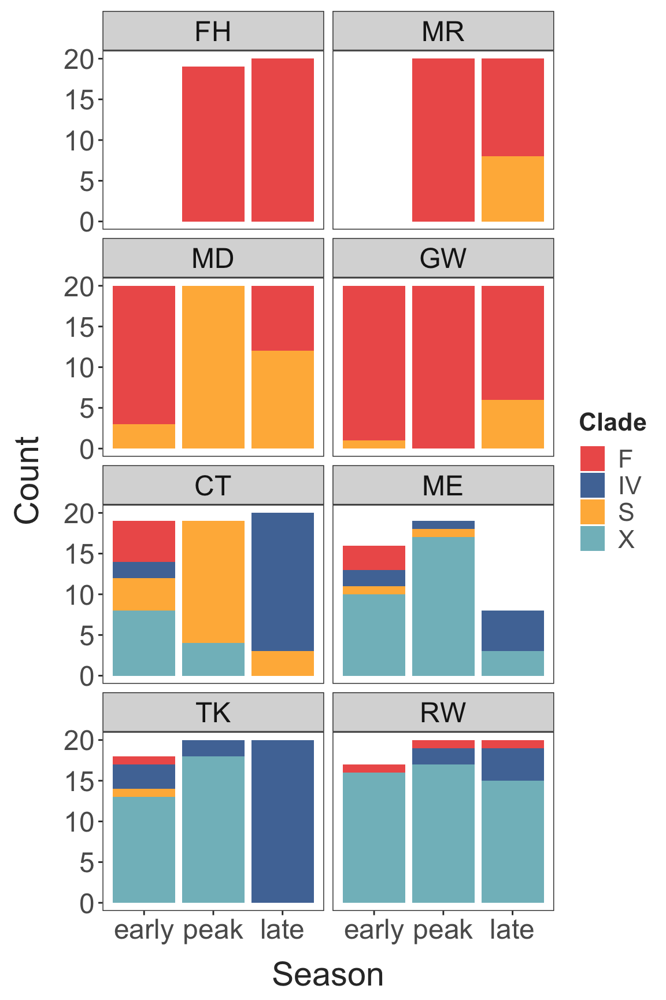
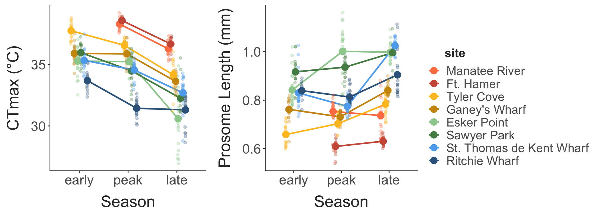
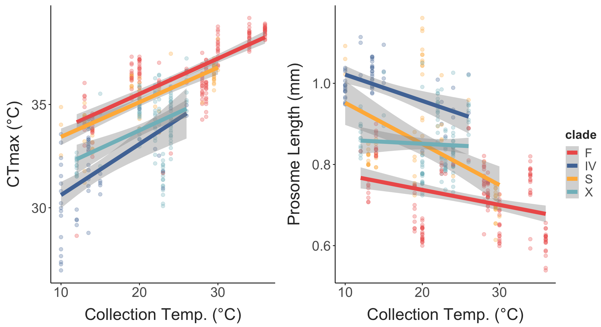
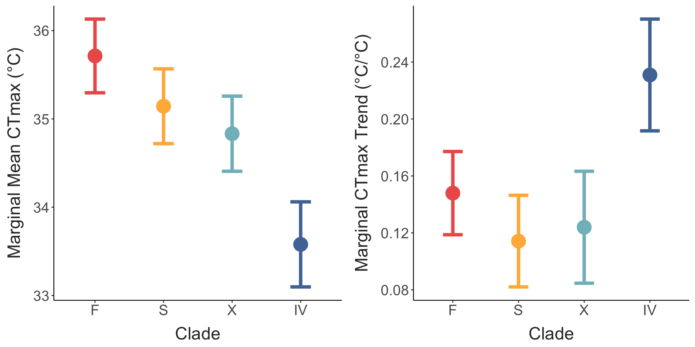
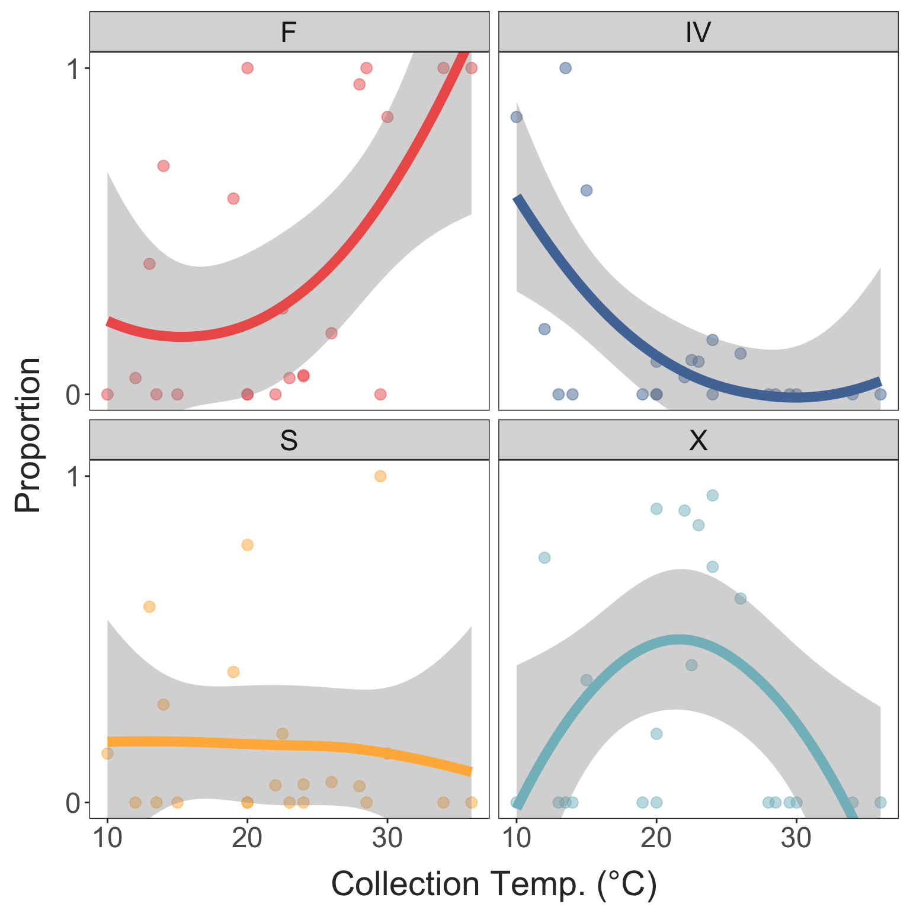
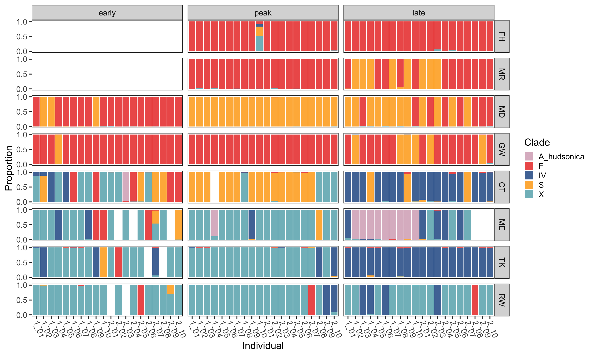
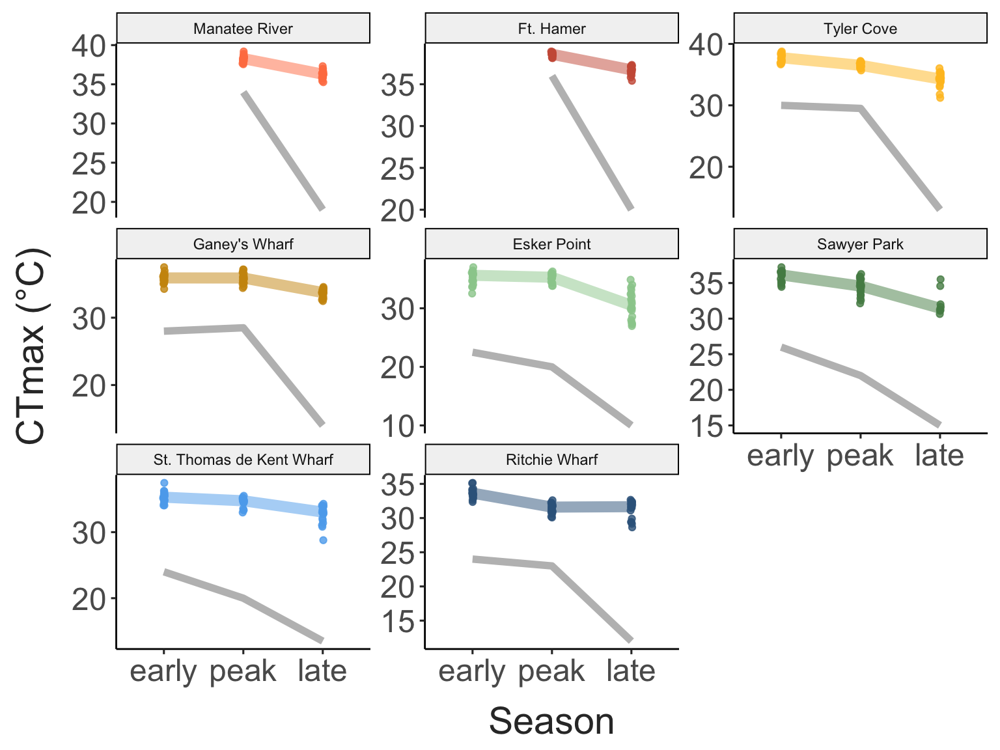
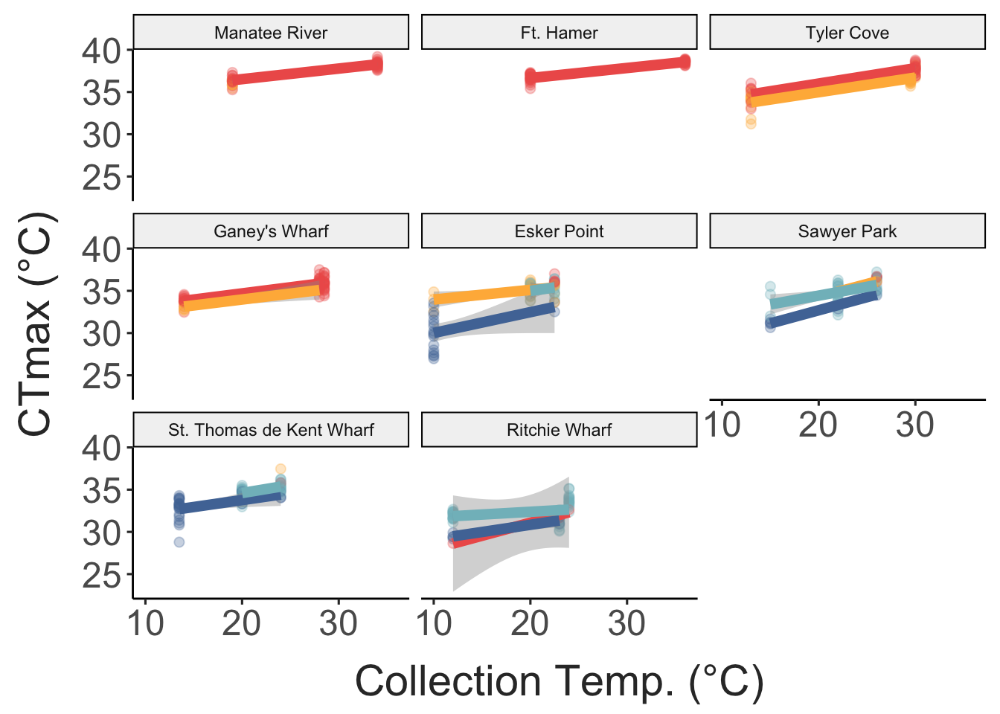
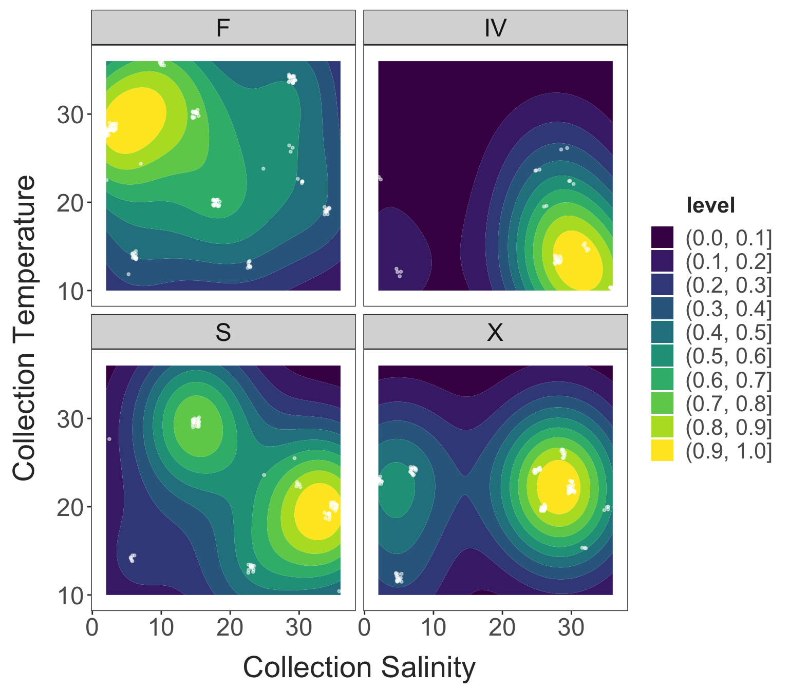

```{r echo = F}
if(knitr::is_latex_output()){
  knitr::opts_chunk$set(
  echo = FALSE,
  fig.align = "center",
  message = FALSE,
  warning = FALSE,
  collapse = T)
}
```

# Introduction

# Methods

## Field Collections and Phenotypic Measurements

## Warming Tolerance

## Library Prep and Sequencing

## Clade Assignment

## Statistical Analysis

linear mixed effects model: CTmax ~ body size, temperature, and clade with random effect of tube and a random effect of site along with random slope for collection temperature

Marginal mean and temperature trend for each clade 

# Results

## Environmental Data

Table 1: Site Data 
```{r, table, echo = F}

site_data %>%  
  arrange(lat) %>%  
  select("Site" = site, "Region" = region, "Lat" = lat, "Long" = long) %>% 
  knitr::kable(align = "c",
               caption = "Locations of each collection site.")

```


```{r, figure1, echo = F, out.width = "400px"}
#| fig.cap = "Map of sites (A) and collection temperatures recorded during each collection (B)"

knitr::include_graphics("../Output/Figures/markdown/site-chars-1.png") #Use this when filling in figures from analysis 
```

## COI Clade Distributions

```{r, figure2, echo = F, out.width = "250px"}
#| fig.cap = "The distribution of clade identities at each site throughout the seasons. This plot includes just the 'high confidence' estimates - individuals identified as A. hudsonica were excluded, as were any individuals where less than 85% of the reads matched to any single clade)"

 #Use this when filling in figures from analysis 
```


## Seasonal phenotypic patterns

```{r, figure3, echo = F, out.width = "400px"}
#| fig.cap = "CTmax vs. season (A) and size vs. season (B) for each site"

 #Use this when filling in figures from analysis 
```

## Clade-specific patterns

```{r, figure4, echo = F, out.width = "400px"}
#| fig.cap = "CTmax and body size vs. collection temperature, separated by clade."

 #Use this when filling in figures from analysis 
```

```{r, figure5, echo = F, out.width = "400px"}
#| fig.cap = "Clade marginal means (i.e. genetic variation in thermal limit) and the marginal trend (i.e. combined effect of local adaptation and plasticity)."

 #Use this when filling in figures from analysis 

```

```{r, figure6, echo = F, out.width = "200px"}
#| fig.cap = "Clade proportions in each sample vs. collection temp."

 #Use this when filling in figures from analysis 
```


# Discussion 

## Study Summary 

## Space-for-time 

## Relevance of intraspecific variation (plasticity, local adaptation, cryptic variation like clades)


# Discussion

\newpage

```{=tex}
\beginsupplement
```
# Supplementary Material

```{r supp-fig-1, echo = F, out.width = "450px"}
#| fig.cap = "Continuous temperature profiles for the regions."

knitr::include_graphics("../Output/Figures/markdown/continuous-temps-1.png") #Use this when filling in figures from analysis 
```


```{r supp-fig-2, echo = F, out.width = "450px"}
#| fig.cap = "Collection temperature seasonality against latitude."

knitr::include_graphics("../Output/Figures/markdown/lat-temp-range-plot-1.png")
```


```{r supp-fig-3, echo = F, out.width = "450px"}
#| fig.cap = "Individual clade prop plot (shows the proportion of reads for each individual that matched to the different clades)"

 #Use this when filling in figures from analysis 
```

```{r supp-fig-4, echo = F, out.width = "450px"}
#| fig.cap = "Temperature ramping records."

knitr::include_graphics("../Output/Figures/markdown/ramp-record-plot-1.png") #Use this when filling in figures from analysis 
```

```{r supp-fig-5, echo = F, out.width = "450px"}
#| fig.cap = "CTmax across seasons for each site, with collection temperature included."

 #Use this when filling in figures from analysis 
```


```{r supp-fig-6, echo = F, out.width = "450px"}
#| fig.cap = "CTmax vs. collection temperature, separated by clade and faceted for each site to show the concordance in the pattern across locations."

 #Use this when filling in figures from analysis 
```

```{r supp-fig-7, echo = F, out.width = "450px"}
#| fig.cap = "Contour plot, faceted by clade, showing the scaled density of each clade across the temperature x salinity space. Individual occurences across this space are included as jittered points to show the distribution and abundance of records. "

 #Use this when filling in figures from analysis 
```