Comparing seasonal and latitudinal patterns in thermal adaptation
================
2023-10-22

- [Site Characteristics](#site-characteristics)
- [Critical Thermal Limits](#critical-thermal-limits)
- [Warming tolerance](#warming-tolerance)
- [Body Size](#body-size)
  - [Salinity Pair Comparisons](#salinity-pair-comparisons)
- [Trait Correlations](#trait-correlations)
- [Trait Variability](#trait-variability)
- [Next Steps](#next-steps)
- [Misc. Details](#misc-details)

## Site Characteristics

Copepods were collected by surface tow from sites across the Western
Atlantic at several times throughout the year. The sites are shown
below. Temperatures at the time of collection were measured using a
manual thermometer.

``` r
coords = site_data %>%
  select(site, long, lat) %>%
  distinct()

site_map = map_data("world") %>% 
  filter(region %in% c("USA", "Canada")) %>% 
  ggplot() + 
  geom_polygon(aes(x = long, y = lat, group = group),
               fill = "lightgrey") + 
  coord_map(xlim = c(-85,-60),
            ylim = c(25, 48)) + 
  geom_point(data = coords,
             mapping = aes(x = long, y = lat, colour = site),
             size = 3) +
  scale_colour_manual(values = site_cols) + 
  labs(x = "Longitude", 
       y = "Latitude") + 
  theme_matt(base_size = 16)

site_temp_plot = full_data %>% 
  select(site, season, doy, collection_temp, collection_salinity) %>%  
  distinct() %>% 
  filter(doy > 100) %>% 
  ggplot(aes(x = doy, y = collection_temp, colour = site)) + 
  geom_line(linewidth = 2) + 
  geom_point(size = 5) +
  scale_colour_manual(values = site_cols) + 
  labs(y = "Temperature (°C)",
       x = "Day of the Year") +
  theme_matt() + 
  theme(legend.position = "right")

ggarrange(site_map, site_temp_plot, common.legend = T, legend = "bottom")
```

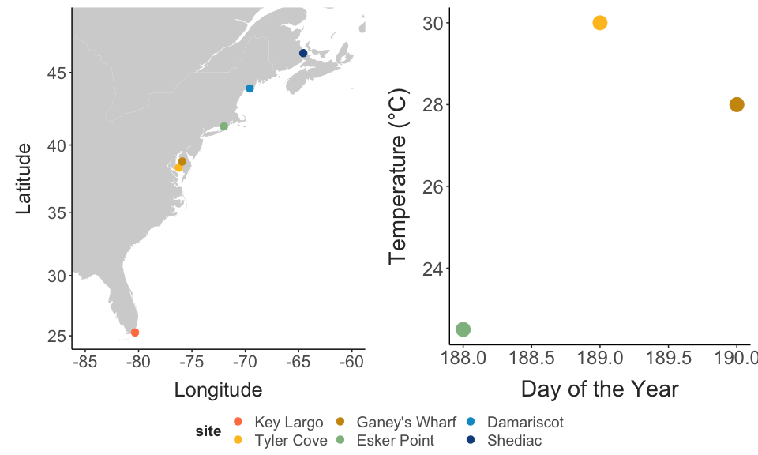

Exact locations for the sites are provided here.

``` r
site_data %>%  
  arrange(lat) %>%  
  select("Site" = site, "Region" = region, "Lat" = lat, "Long" = long) %>% 
  knitr::kable(align = "c")
```

|           Site           |    Region     |   Lat    |   Long    |
|:------------------------:|:-------------:|:--------:|:---------:|
|        Key Largo         |    Florida    | 25.28391 | -80.33014 |
|      Manatee River       |    Florida    | 27.50561 | -82.57277 |
|        Ft. Hamer         |    Florida    | 27.52488 | -82.43101 |
|        Tyler Cove        |   Maryland    | 38.35083 | -76.22902 |
|      Ganey’s Wharf       |   Maryland    | 38.80555 | -75.90906 |
|       Esker Point        |  Connecticut  | 41.32081 | -72.00166 |
|       Sawyer Park        |     Maine     | 43.90698 | -69.87179 |
| St. Thomas de Kent Wharf | New Brunswick | 46.44761 | -64.63692 |
|      Ritchie Wharf       | New Brunswick | 47.00481 | -65.56291 |

Nested within each of the three regions (South, Central, and Northern
regions) are pairs of low and high salinity sites:

``` r
data.frame("Region" = c("South", "Central", "North"),
           "Low Salinity" = c("Ft. Hamer", "Ganey's Wharf", "Ritchie Wharf"),
           "High Salinity" = c("Manatee River", "Tyler Cove", "St. Thomas de Kent Wharf")) %>% 
  knitr::kable(align = "c")
```

| Region  | Low.Salinity  |      High.Salinity       |
|:-------:|:-------------:|:------------------------:|
|  South  |   Ft. Hamer   |      Manatee River       |
| Central | Ganey’s Wharf |        Tyler Cove        |
|  North  | Ritchie Wharf | St. Thomas de Kent Wharf |

 

There are fairly well-established divergences between high salinity and
low salinity populations of *Acartia tonsa*. These sets of
geographically proximate but isolated populations provide independent
comparisons of the effects of seasonality.

``` r
season_cols = c("early" = "grey75", 
                "peak" = "grey50", 
                "late" = "grey25")

sal_regions = data.frame(region = rep(c("South", "Central", "North"), each = 2), 
                         site = c("Ft. Hamer", "Manatee River", 
                                  "Ganey's Wharf", "Tyler Cove", 
                                  "Ritchie Wharf", "St. Thomas de Kent Wharf"),
                         salinity = c("low", "high"))

sal_comps = full_data %>% 
  filter(site %in% sal_regions$site) %>% 
  inner_join(sal_regions, by = c("site")) %>% 
  select( region = region.y, site, salinity, season, doy, collection_temp, collection_salinity,
          size, ctmax, warming_tol) %>% 
  mutate(salinity = fct_relevel(salinity, "low", "high"),
         region = fct_relevel(region, "South", "Central", "North"))

sal_comp_temps = sal_comps %>%  
  select(salinity, season, region, collection_temp, collection_salinity) %>% 
  distinct() %>% 
  ggplot(aes(x = salinity, y = collection_temp, colour = season, group = season)) + 
  facet_wrap(region~.) + 
  geom_point(size = 4) + 
  geom_line(linewidth = 1.5) + 
  scale_colour_manual(values = season_cols) + 
  labs(y = "Collection Temp. (°C)",
       x = "") + 
  theme_matt_facets(base_size = 14)

sal_comp_sal = sal_comps %>%  
  select(salinity, season, region, collection_temp, collection_salinity) %>% 
  distinct() %>% 
  ggplot(aes(x = salinity, y = collection_salinity, colour = season, group = season)) + 
  facet_wrap(region~.) + 
  geom_point(size = 4) + 
  geom_line(linewidth = 1.5) + 
  scale_colour_manual(values = season_cols) + 
  labs(y = "Collection Salinity (psu)",
       x = "Salinity") + 
  theme_matt_facets(base_size = 14)

ggarrange(sal_comp_temps, sal_comp_sal, nrow = 2, common.legend = T, legend = "right")
```

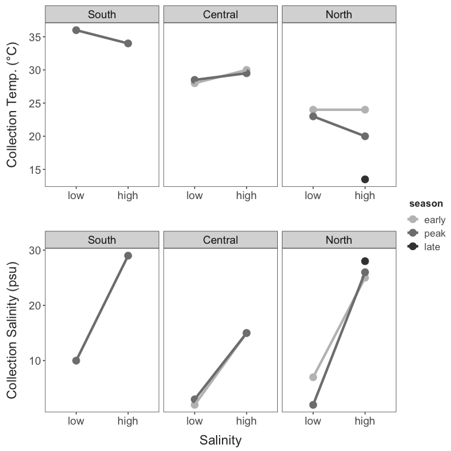

``` r

# sal_comps %>%  
#   select(site, salinity, season, region, collection_temp, collection_salinity) %>% 
#   distinct() %>% 
#   ggplot(aes(x = collection_salinity, y = collection_temp, colour = site)) + 
#   facet_grid(region~.) + 
#   geom_point(size = 4) + 
#   #stat_ellipse() +
#   #geom_path(arrow = arrow(length = unit(0.1, "inches"), type = "closed")) + 
#   scale_colour_manual(values = site_cols) + 
#   theme_matt_facets(base_size = 14)
```

## Critical Thermal Limits

A total of 356 individuals were examined. Critical thermal limits and
body size measurements were made before individuals were preserved in
ethanol. We excluded data for 6 individuals, detailed below. These
individuals had either very low CTmax or were, upon re-examination of
photographs, identified as juveniles instead of mature females.

``` r
excluded %>% 
  select(region, site, season, collection_temp, collection_salinity, replicate, tube, ctmax, size) %>% 
  knitr::kable(align = "c")
```

|    region     |           site           | season | collection_temp | collection_salinity | replicate | tube |  ctmax   | size  |
|:-------------:|:------------------------:|:------:|:---------------:|:-------------------:|:---------:|:----:|:--------:|:-----:|
|    Florida    |      Manatee River       |  peak  |      34.0       |         29          |     2     |  6   | 38.45833 | 0.616 |
|    Florida    |      Manatee River       |  peak  |      34.0       |         29          |     2     |  7   | 38.23750 | 0.593 |
|   Maryland    |        Tyler Cove        |  peak  |      29.5       |         15          |     2     |  2   | 36.84375 | 0.614 |
|  Connecticut  |       Esker Point        | early  |      22.5       |         30          |     2     |  3   | 30.02604 | 0.687 |
|     Maine     |       Sawyer Park        |  peak  |      22.0       |         30          |     1     |  4   | 30.81424 | 0.865 |
| New Brunswick | St. Thomas de Kent Wharf |  late  |      13.5       |         28          |     1     |  3   | 28.78299 | 1.039 |

Critical thermal maxima (CTmax) was measured using a custom setup. The
method uses a standard dynamic ramping assay to determine the maximum
temperature individuals could sustain normal functioning. This differs
from lethal temperatures, and indeed, all individuals observed so far
recovered following the assay.

Individuals were rested for one hour after collection before the assay.
During the assay, copepods were held in 0.2 um filtered seawater,
adjusted to match the salinity at the time of collection with bottled
spring water. During the assay, several ‘control’ individuals were
maintained in this adjusted salinity solution, but did not experience
the temperature ramp, to ensure that there was no background mortality.

Shown below are the measured CTmax values. Note: CTmax values for the
early season Key Largo copepods were collected at the end of February
2023 as part of a separate project. Body size values were not measured
during this project, nor were copepods individually preserved after the
experiments. These early season CTmax values are included as a point of
comparison. Individual measurements are shown in small points for each
collection. The large point indicates the median value.

``` r
mean_ctmax = full_data %>% 
  group_by(site, season, collection_temp) %>% 
  summarize(mean_ctmax = mean(ctmax),
            median_ctmax = median(ctmax))

ggplot(full_data, aes(x = season, y = ctmax, colour = site)) + 
  geom_line(data = mean_ctmax, 
            aes(y = median_ctmax, group = site),
            position = position_dodge(width = 0.4),
            linewidth = 1) + 
  geom_point(position = position_jitterdodge(jitter.width = 0.1, jitter.height = 0,
                                             dodge.width = 0.4),
             alpha = 0.3) + 
  geom_point(data = mean_ctmax, 
             aes(y = median_ctmax),
             position = position_dodge(width = 0.4),
             size = 4) + 
  scale_colour_manual(values = site_cols) + 
  labs(y = "CTmax (°C)",
       x = "Season") +
  theme_matt() + 
  theme(legend.position = "right", 
        legend.title.align = 0.125)
```

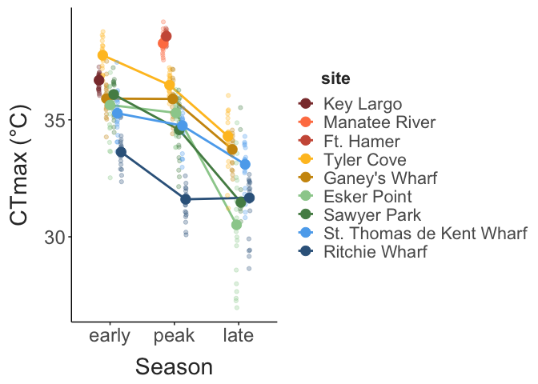

``` r
ggplot(full_data, aes(x = season, y = ctmax, colour = site)) + 
  facet_wrap(.~site, scales = "free_y") + 
  geom_line(data = mean_ctmax, 
            aes(y = median_ctmax, group = site),
            position = position_dodge(width = 0.4),
            linewidth = 3, alpha = 0.5) + 
  geom_line(data = mean_ctmax, 
            aes(y = collection_temp, group = site),
            position = position_dodge(width = 0.4),
            linewidth = 2,
            colour = "grey") + 
  geom_point(position = position_jitterdodge(jitter.width = 0.1, jitter.height = 0,
                                             dodge.width = 0.4),
             alpha = 0.8) + 
  # geom_point(data = mean_ctmax, 
  #            aes(y = median_ctmax),
  #            position = position_dodge(width = 0.4),
  #            size = 4) + 
  scale_colour_manual(values = site_cols) + 
  labs(y = "CTmax (°C)",
       x = "Season") +
  theme_matt() + 
  theme(legend.position = "none", 
        legend.title.align = 0.125)
```

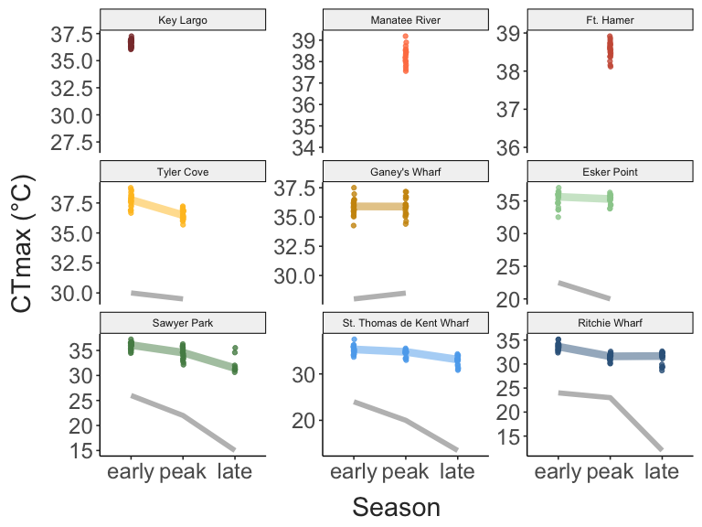

## Warming tolerance

Warming tolerance was calculated as the difference between measured
CTmax values and the collection temperature. Lower warming tolerance
values indicate that populations were nearer to their upper thermal
limits, and may therefore be more vulnerable to additional warming.

``` r
mean_wt = full_data %>% 
  group_by(site, season) %>% 
  summarize(mean_wt = mean(warming_tol),
            median_wt = median(warming_tol))

ggplot(full_data, aes(x = season, y = warming_tol, colour = site)) + 
  geom_line(data = mean_wt, 
            aes(y = median_wt, group = site),
            position = position_dodge(width = 0.4),
            linewidth = 1) + 
  geom_point(position = position_jitterdodge(jitter.width = 0.1, jitter.height = 0,
                                             dodge.width = 0.4),
             alpha = 0.3) + 
  geom_point(data = mean_wt, 
             aes(y = median_wt),
             position = position_dodge(width = 0.4),
             size = 4) + 
  scale_colour_manual(values = site_cols) + 
  labs(y = "Warming Tolerance (°C)",
       x = "Season") +
  theme_matt() + 
  theme(legend.position = "right", 
        legend.title.align = 0.125)
```

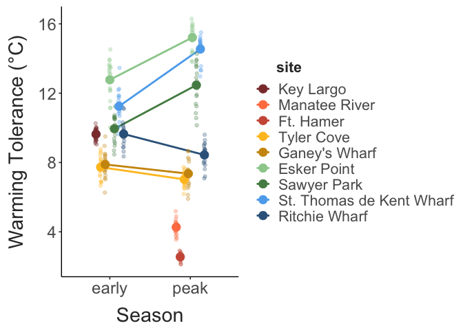

## Body Size

Following the CTmax assay, individuals were photographed for body size
measurements. Prosome lengths were measured from these photographs using
a scale micrometer and the software ImageJ. These measurements are shown
below.

``` r
mean_size = full_data %>% 
  group_by(site, season) %>% 
  summarize(mean_size = mean(size),
            median_size = median(size))

ggplot(full_data, aes(x = season, y = size, colour = site)) + 
  geom_line(data = mean_size, 
            aes(y = median_size, group = site),
            position = position_dodge(width = 0.4),
            linewidth = 1) + 
  geom_point(position = position_jitterdodge(jitter.width = 0.1, jitter.height = 0,
                                             dodge.width = 0.4),
             alpha = 0.3) + 
  geom_point(data = mean_size, 
             aes(y = median_size),
             position = position_dodge(width = 0.4),
             size = 4) + 
  scale_colour_manual(values = site_cols) + 
  labs(y = "Prosome Length (mm)",
       x = "Season") +
  theme_matt() + 
  theme(legend.position = "right", 
        legend.title.align = 0.125)
```

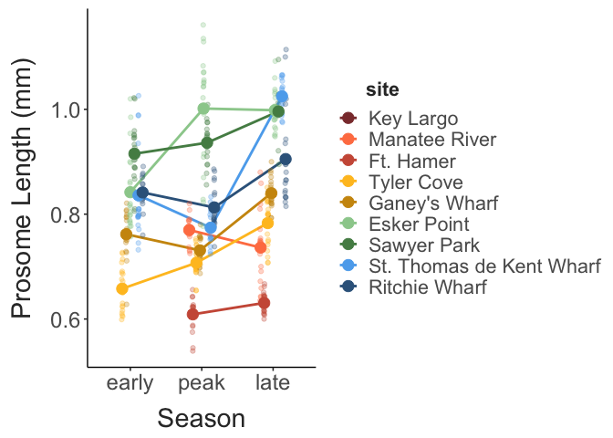

``` r
ggplot(full_data, aes(x = season, y = size, colour = site)) + 
  facet_wrap(.~site) + 
  geom_line(data = mean_size, 
            aes(y = median_size, group = site),
            position = position_dodge(width = 0.4),
            linewidth = 3, alpha = 0.5) + 
  geom_point(position = position_jitterdodge(jitter.width = 0.1, jitter.height = 0,
                                             dodge.width = 0.4),
             alpha = 0.8) + 
  # geom_point(data = mean_ctmax, 
  #            aes(y = median_ctmax),
  #            position = position_dodge(width = 0.4),
  #            size = 4) + 
  scale_colour_manual(values = site_cols) + 
  labs(y = "Prosome Length (mm)",
       x = "Season") +
  theme_matt() + 
  theme(legend.position = "none", 
        legend.title.align = 0.125)
```

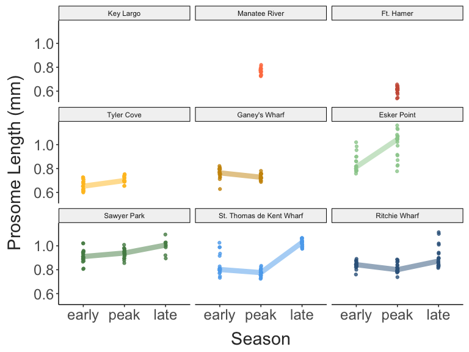

### Salinity Pair Comparisons

``` r
sal_comp_ctmax_plot = sal_comps %>% 
  ggplot(aes(x = salinity, y = ctmax, colour = season, group = season)) + 
  facet_wrap(region~.) + 
  geom_point(size = 2,
             position = position_dodge(width = 0.2)) + 
  #geom_line(size = 1.5) + 
  scale_colour_manual(values = season_cols) + 
  labs(y = "CTmax (°C)",
       x = "") + 
  theme_matt_facets(base_size = 14)

sal_comp_size_plot = sal_comps %>% 
  ggplot(aes(x = salinity, y = size, colour = season, group = season)) + 
  facet_wrap(region~.) + 
  geom_point(size = 2, 
             position = position_dodge(width = 0.2)) + 
  #geom_line(size = 1.5) + 
  scale_colour_manual(values = season_cols) + 
  labs(y = "Prosome Length (mm)",
       x = "") + 
  theme_matt_facets(base_size = 14)

ggarrange(sal_comp_ctmax_plot, sal_comp_size_plot, nrow = 2, common.legend = T, legend = "right")
```

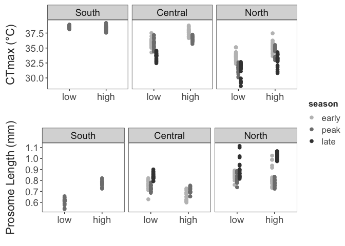

``` r

###

sal_comp_ctmax.model = lm(ctmax ~ collection_temp, data = sal_comps)
# summary(ctmax_temp.model)
# car::Anova(ctmax_temp.model)
sal_comp_ctmax_resids = residuals(sal_comp_ctmax.model)

sal_comp_size.model = lm(size ~ collection_temp, data = sal_comps)
# summary(size_temp.model)
# car::Anova(size_temp.model)
sal_comp_size_resids = residuals(sal_comp_size.model)

sal_comp_ctmax_resid_plot = sal_comps %>%
  mutate(ctmax_resids = sal_comp_ctmax_resids,
         size_resids = sal_comp_size_resids) %>%
  ggplot(aes(x = salinity, y = ctmax_resids, colour = season, group = season)) +
  facet_wrap(region~.) +
  geom_point(size = 2,
             position = position_dodge(width = 0.5)) +
  #geom_line(size = 1.5) +
  scale_colour_manual(values = season_cols) +
  labs(y = "CTmax \nResiduals",
       x = "") +
  theme_matt_facets(base_size = 14)

sal_comp_size_resid_plot = sal_comps %>%
  mutate(ctmax_resids = sal_comp_ctmax_resids,
         size_resids = sal_comp_size_resids) %>%
  ggplot(aes(x = salinity, y = size_resids, colour = season, group = season)) +
  facet_wrap(region~.) +
  geom_point(size = 2,
             position = position_dodge(width = 0.5)) +
  #geom_line(size = 1.5) +
  scale_colour_manual(values = season_cols) +
  labs(y = "Prosome Length \nResiduals",
       x = "") +
  theme_matt_facets(base_size = 14)

#ggarrange(sal_comp_ctmax_resid_plot, sal_comp_size_resid_plot, nrow = 2, common.legend = T, legend = "right")
```

## Trait Correlations

We expect that collections from warmer waters should yield copepods with
higher thermal limits and smaller body sizes.

``` r
ctmax_temp_plot = ggplot(full_data, aes(x = collection_temp, y = ctmax)) + 
  geom_smooth(method = "lm", se = T,
              linewidth = 2, 
              colour = "grey") + 
  geom_point(aes(colour = site), 
             size = 2, alpha = 0.7) + 
  scale_colour_manual(values = site_cols) + 
  labs(y = "CTmax (°C)",
       x = "Collection Temp. (°C)") +
  theme_matt() + 
  theme(legend.position = "none")

size_temp_plot = ggplot(full_data, aes(x = collection_temp, y = size)) + 
  geom_smooth(method = "lm", se = T,
              linewidth = 2, 
              colour = "grey") + 
  geom_point(aes(colour = site), 
             size = 2, alpha = 0.7) + 
  scale_colour_manual(values = site_cols) + 
  labs(y = "Prosome Length (mm)",
       x = "Collection Temp. (°C)") +
  theme_matt() + 
  theme(legend.position = "right")

wt_temp_plot = ggplot(full_data, aes(x = collection_temp, y = warming_tol)) + 
  geom_smooth(method = "lm", se = T,
              linewidth = 2, 
              colour = "grey") + 
  geom_point(aes(colour = site), 
             size = 2, alpha = 0.7) + 
  scale_colour_manual(values = site_cols) + 
  labs(y = "Warming Tolerance (°C)",
       x = "Collection Temp. (°C)") +
  theme_matt() + 
  theme(legend.position = "right")

ggarrange(ctmax_temp_plot, wt_temp_plot, size_temp_plot, common.legend = T, legend = "bottom", nrow = 1)
```


Of particular interest is the relationship between prosome length and
CTmax. In many cases, larger body sizes are associated with cold
adaptation/acclimation. We may therefore see this pattern emerge across
populations or seasons. If populations contain a mix of cold- and
warm-adapted genotypes, however, we might also see this relationship
emerge **within** individual collections. Shown below is the
relationship between prosome length and CTmax for the individuals
measured thus far. Individual regression lines for each site are also
included. Note that raw CTmax and body size values are shown, rather
than metrics like residuals from a statistical model correcting for
variation in collection temperature.

``` r
universal_size = full_data %>% 
  ggplot(aes(x = size, y = ctmax)) + 
  # geom_smooth(data = filter(full_data, ctmax > 31), 
  #             aes(x = size, y = ctmax),
  #             method = "lm", 
  #             colour = "grey60", 
  #             se = F,
  #             linewidth = 2) + 
  geom_smooth(method = "lm", se = T,
              linewidth = 2,
              colour = "grey70") + 
  geom_point(aes(colour = site),
             size = 2, alpha = 0.7) + 
  scale_colour_manual(values = site_cols) + 
  labs(y = "CTmax (°C)",
       x = "") +
  theme_matt(base_size = 14) + 
  theme(legend.position = "right",
        axis.title.x = element_blank())

pop_size = full_data %>% 
  ggplot(aes(x = size, y = ctmax, colour = site, group = season)) + 
  facet_wrap(site~.) + 
  # geom_smooth(data = filter(full_data, ctmax > 31), 
  #             aes(x = size, y = ctmax),
  #             method = "lm", 
  #             colour = "grey60", 
  #             se = F,
  #             linewidth = 2) + 
  geom_point(size = 1.3, alpha = 0.3) + 
  geom_smooth(data = full_data, 
              aes(x = size, y = ctmax, group = site), 
              colour = "grey70", method = "lm", se = F) + 
  geom_smooth(method = "lm", se = F,
              linewidth = 1) + 
  scale_colour_manual(values = site_cols) + 
  scale_x_continuous(breaks = c(0.6, 0.8, 1)) + 
  labs(y = "CTmax (°C)",
       x = "Prosome Length (mm)") +
  theme_matt(base_size = 14) + 
  theme(legend.position = "right")

ggarrange(universal_size, pop_size, common.legend = T, legend = "none", nrow = 2)
```

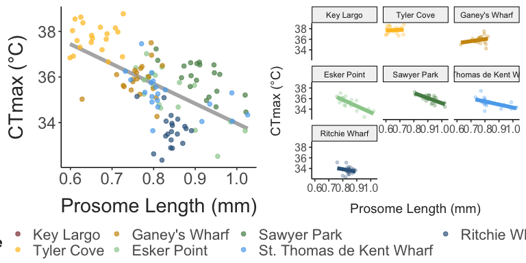

## Trait Variability

Shown below is the trait variation (ranges) for each site. Ranges are
calculated for each season separately.

``` r
trait_ranges = full_data %>% 
  group_by(site, season, collection_temp, collection_salinity, doy, lat) %>% 
  summarise(mean_ctmax = mean(ctmax),
            ctmax_range = max(ctmax) - min(ctmax),
            ctmax_var = var(ctmax),
            mean_size = mean(size),
            size_range = max(size) - min(size),
            size_var = var(size)) %>% 
  mutate(prop_ctmax_range = ctmax_range / mean_ctmax,
         prop_size_range = size_range / mean_size)

ctmax_range_temp = ggplot(trait_ranges, aes(x = collection_temp, y = ctmax_range, colour = site)) + 
  geom_point(size = 3) + 
  scale_colour_manual(values = site_cols) + 
  labs(y = "CTmax Range (°C)",
       x = "Collection Temp. (°C)") +
  theme_matt() + 
  theme(legend.position = "right")

ctmax_var_temp = ggplot(trait_ranges, aes(x = collection_temp, y = ctmax_var, colour = site)) + 
  geom_point(size = 3) + 
  scale_colour_manual(values = site_cols) + 
  labs(y = "CTmax Range (°C)",
       x = "Collection Temp. (°C)") +
  theme_matt() + 
  theme(legend.position = "right")

size_range_temp = ggplot(trait_ranges, aes(x = collection_temp, y = size_range, colour = site)) + 
  geom_point(size = 3) + 
  scale_colour_manual(values = site_cols) + 
  labs(y = "Size Range (mm)",
       x = "Collection Temp. (°C)") +
  theme_matt() + 
  theme(legend.position = "right")

size_var_temp = ggplot(trait_ranges, aes(x = collection_temp, y = size_var, colour = site)) + 
  geom_point(size = 3) + 
  scale_colour_manual(values = site_cols) + 
  labs(y = "Size Range (mm)",
       x = "Collection Temp. (°C)") +
  theme_matt() + 
  theme(legend.position = "right")

ggarrange(ctmax_range_temp, size_range_temp, common.legend = T, legend = "bottom")
```

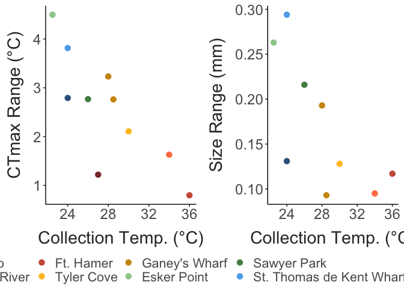

Changes in trait variance may be indicative of phenotypic selection. If
selection (as opposed to acclimation) are driving seasonal changes, we
may expect to see a reduction in variance in the peak samples relative
to the early season samples. Note that early season collection
temperatures this year were higher than expected, driven by fairly
strong heatwaves in the North Atlantic.

``` r
ggplot(trait_ranges, aes(x = season, y = ctmax_var, colour = site)) + 
  geom_line(aes(group = site), 
            linewidth = 1.5) + 
  geom_point(size = 3) + 
  scale_colour_manual(values = site_cols) + 
  labs(y = "CTmax Variance",
       x = "Season") +
  theme_matt() + 
  theme(legend.position = "right", 
        legend.title.align = 0.125)
```

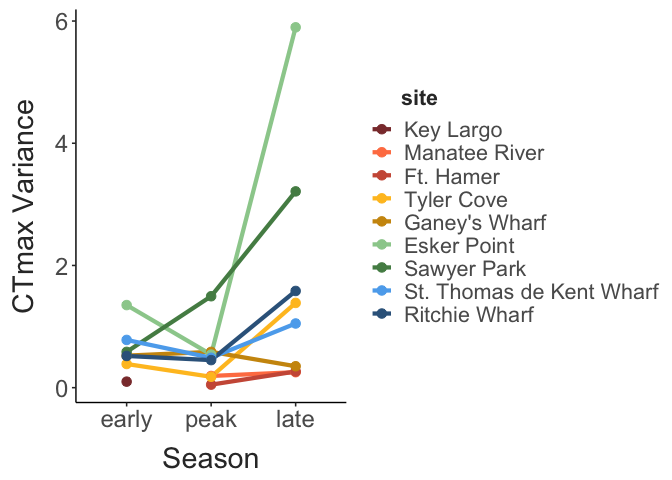

## Next Steps

After phenotyping, each individual was preserved in 95% ethanol.
Individual DNA libraries will be prepared using Twist Bio 96-plex prep
kits, then sequenced on an Illumina NovaSeq X Plus. Using the
low-coverage whole genome sequences, we will examine seasonal patterns
in allele frequency change, and compare these fine scale temporal
patterns with the larger latitudinal patterns in allele frequency to
determine whether the same alleles driving rapid seasonal adaptation are
in play over larger spatial (and longer temporal) scales.

## Misc. Details

``` r
ggplot(temp_record, aes(x = minute_passed, y = temp_C, group = factor(run))) + 
  geom_abline(slope = 0.3, intercept = mean(temp_record[temp_record$minute_interval == 0, 8])) + 
  geom_abline(slope = 0.1, intercept = mean(temp_record[temp_record$minute_interval == 0, 8])) + 
  geom_line(linewidth = 0.2, alpha = 0.8) + 
  geom_point(data = full_data, 
             aes(x = time, y = ctmax + 0.4),
             size = 2,
             shape = 25) +
  labs(x = "Time passed (minutes)",
       y = "Temperature (degrees C)",
       fill = "Trial Number") + 
  guides(colour = "none") + 
  theme_matt(base_size = 16) + 
  theme(legend.position = "right")
```

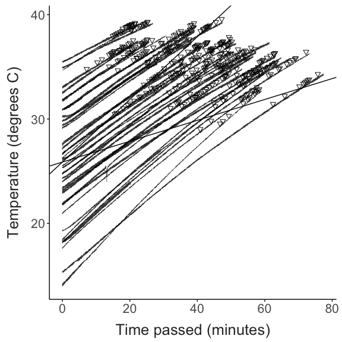

``` r
ramp_record2 = ramp_record %>% 
  group_by(run, minute_interval) %>% 
  summarise(mean_ramp = mean(ramp_per_minute)) %>% 
  ungroup()

ggplot(ramp_record2, aes(x = minute_interval, y = mean_ramp)) + 
  geom_hline(yintercept = 0.3) + 
  geom_hline(yintercept = 0.1) + 
  #geom_point() + 
  geom_hex(bins = 30) + 
  ylim(0, 0.35) + 
  labs(y = "Ramp Rate (deg. C / min.)",
       x = "Time into run (minute)") + 
  theme_matt(base_size = 16) 
```

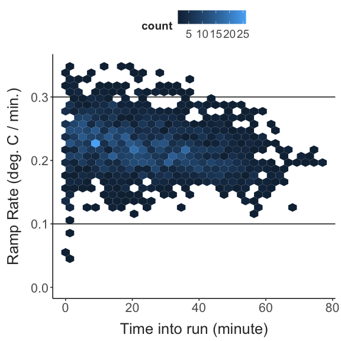
