Comparing seasonal and latitudinal patterns in thermal adaptation
================
2025-09-07

- [Main Message](#main-message)
- [Site Characteristics](#site-characteristics)
- [Phenotypic Measurements](#phenotypic-measurements)
  - [Critical Thermal Limits](#critical-thermal-limits)
  - [Warming tolerance](#warming-tolerance)
  - [Body Size](#body-size)
  - [Salinity Pair Comparisons](#salinity-pair-comparisons)
- [Trait Correlations](#trait-correlations)
- [Trait Variability](#trait-variability)
- [Low-Coverage Whole Genome
  Sequencing](#low-coverage-whole-genome-sequencing)
  - [Clade IDs](#clade-ids)
  - [PCA](#pca)
  - [Selection Scans](#selection-scans)
- [Misc. Details](#misc-details)

## Main Message

By assaying thermal limits several times per year in natural populations
distributed across a large latitudinal gradient, we highlight the
importance of intra-specific variation for predicting vulnerability to
climate change. Indeed, across the entire spatiotemporal framework
examined here, we observed an ~12°C range in thermal limits. Both
spatial and temporal variation in thermal limits is essential for robust
predictions.

## Site Characteristics

``` r
site_temps = join_data %>% 
  dplyr::select(site, lat, season, doy, collection_temp, collection_salinity) %>%  
  distinct() %>% 
  filter(doy > 100) 
```

Copepods were collected by surface tow from sites across the Western
Atlantic at several times throughout the year. The sites are shown below
along with surface temperatures and salinity were measured at the time
of collection. Across the entire set of collections, temperature ranged
from 10°C to 36°C.

``` r
coords = site_data %>%
  dplyr::select(site, long, lat) %>%
  distinct()

site_map = map_data("world") %>% 
  filter(region %in% c("USA", "Canada")) %>% 
  ggplot() + 
  geom_polygon(aes(x = long, y = lat, group = group),
               fill = "lightgrey") + 
  coord_map(xlim = c(-85,-60),
            ylim = c(25, 48)) + 
  geom_point(data = coords,
             mapping = aes(x = long, y = lat, colour = site),
             size = 3) +
  scale_colour_manual(values = site_cols) + 
  labs(x = "Longitude", 
       y = "Latitude") + 
  theme_matt(base_size = 16)

site_temp_plot = ggplot(site_temps, aes(x = doy, y = collection_temp, colour = site)) + 
  geom_line(linewidth = 2) + 
  geom_point(size = 5) +
  scale_colour_manual(values = site_cols) + 
  labs(y = "Temperature (°C)",
       x = "Day of the Year") +
  theme_matt() + 
  theme(legend.position = "right")

ggarrange(site_map, site_temp_plot, common.legend = T, legend = "bottom")
```

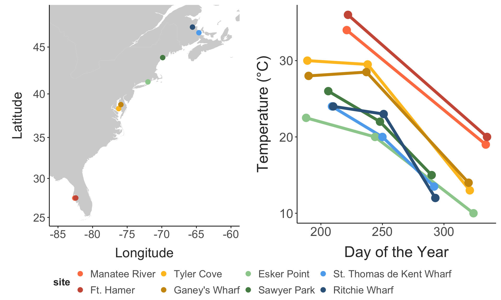

Collections aimed to obtain copepods near the onset of peak
temperatures, after peak temperatures, and then after temperatures
cooled during the Fall. To put the temperature data we measured into
this larger seasonal context, we examined continuous temperature records
for each site. Continuous data is not available for all sites, however,
so here we’ve pieced together daily temperature values from either local
temperature sensors (sites in Florida and the Chesapeake) and high
resolution satellite temperature data (Connecticut, Maine, and the
Canadian sites). This satellite data comes from the NOAA 1/4° Daily
Optimum Interpolation Sea Surface Temperature (OISST).

These temperature profiles are shown below, with the temperatures
measured during the time of collection included for comparison While
collection temperatures in Maine did not always match the recorded daily
averages, across all sites the temperature records do give a general
sense of the timing of seasonal maxima (and the proximity of collections
to the seasonal maximum temperature). In general, the first sample from
each site fell just after the site reached the warmest period. The
exception to that pattern is in Florida, where collections occurred
after an extended period of high temperatures.

``` r
temp_profiles = temp_profiles %>% 
  filter(doy > 100) %>% 
  mutate(region = fct_relevel(region, "Florida", "Chesapeake", "Connecticut",
                              "Maine", "Shediac", "Miramichi"))

site_temps2 = site_temps %>% 
  mutate(region = case_when(
    site == "Manatee River" ~ "Florida",
    site == "Ft. Hamer" ~ "Florida",
    site == "Tyler Cove" ~ "Chesapeake",
    site == "Ganey's Wharf" ~ "Chesapeake",
    site == "Esker Point" ~ "Connecticut",
    site == "Sawyer Park" ~ "Maine",
    site == "St. Thomas de Kent Wharf" ~ "Shediac",
    site == "Ritchie Wharf" ~ "Miramichi"),
    region = fct_relevel(region, "Florida", "Chesapeake", "Connecticut",
                         "Maine", "Shediac", "Miramichi"))

ggplot(temp_profiles, aes(x = doy, y = temp_c)) + 
  facet_wrap(region~.) + 
  geom_point(data = site_temps2,
             aes(x = doy, y = collection_temp, colour = site),
             size = 3) +
  geom_line() + 
  scale_colour_manual(values = site_cols) + 
  labs(x = "Day of the Year", 
       y = "Mean Daily Temp. (°C)") + 
  theme_matt_facets() + 
  theme(legend.position = "none", 
        axis.text.x = element_text(angle = 320, hjust = 0, vjust = 0.5))
```

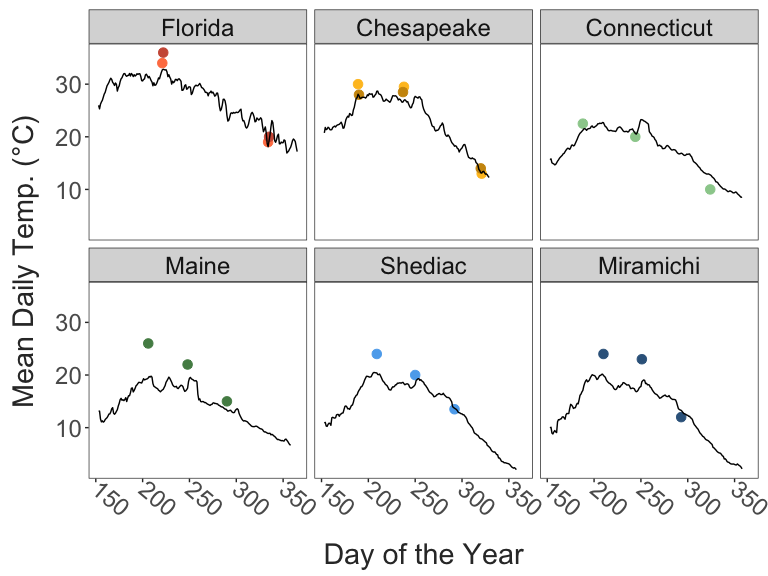

Exact locations for the sites are provided here:

``` r
site_data %>%  
  arrange(lat) %>%  
  select("Site" = site, "Region" = region, "Lat" = lat, "Long" = long) %>% 
  knitr::kable(align = "c")
```

|           Site           |    Region     |   Lat    |   Long    |
|:------------------------:|:-------------:|:--------:|:---------:|
|        Key Largo         |    Florida    | 25.28391 | -80.33014 |
|      Manatee River       |    Florida    | 27.50561 | -82.57277 |
|        Ft. Hamer         |    Florida    | 27.52488 | -82.43101 |
|        Tyler Cove        |   Maryland    | 38.35083 | -76.22902 |
|      Ganey’s Wharf       |   Maryland    | 38.80555 | -75.90906 |
|       Esker Point        |  Connecticut  | 41.32081 | -72.00166 |
|       Sawyer Park        |     Maine     | 43.90698 | -69.87179 |
| St. Thomas de Kent Wharf | New Brunswick | 46.44761 | -64.63692 |
|      Ritchie Wharf       | New Brunswick | 47.00481 | -65.56291 |

Nested within each of the three regions (South, Central, and Northern
regions) are pairs of low and high salinity sites:

``` r
data.frame("Region" = c("South", "Central", "North"),
           "Low Salinity" = c("Ft. Hamer", "Ganey's Wharf", "Ritchie Wharf"),
           "High Salinity" = c("Manatee River", "Tyler Cove", "St. Thomas de Kent Wharf")) %>% 
  knitr::kable(align = "c")
```

| Region  | Low.Salinity  |      High.Salinity       |
|:-------:|:-------------:|:------------------------:|
|  South  |   Ft. Hamer   |      Manatee River       |
| Central | Ganey’s Wharf |        Tyler Cove        |
|  North  | Ritchie Wharf | St. Thomas de Kent Wharf |

 

There are fairly well-established divergences between high salinity and
low salinity populations of *Acartia tonsa*. These sets of
geographically proximate sites potentially provide independent
comparisons of the effects of seasonality across salinity gradients.
Shown here are the collection conditions for these pairs of sites.
Temperature was typically similar across the pairs within each
collection, while salinity differences were fairly stable across
collections.

``` r
season_cols = c("early" = "grey75", 
                "peak" = "grey50", 
                "late" = "grey25")

sal_regions = data.frame(region = rep(c("South", "Central", "North"), each = 2), 
                         site = c("Ft. Hamer", "Manatee River", 
                                  "Ganey's Wharf", "Tyler Cove", 
                                  "Ritchie Wharf", "St. Thomas de Kent Wharf"),
                         salinity = c("low", "high"))

sal_comps = join_data %>% 
  filter(site %in% sal_regions$site) %>% 
  inner_join(sal_regions, by = c("site")) %>% 
  select( region = region.y, site, salinity, season, doy, collection_temp, collection_salinity,
          size, ctmax, warming_tol) %>% 
  mutate(salinity = fct_relevel(salinity, "low", "high"),
         region = fct_relevel(region, "South", "Central", "North"))

sal_comp_temps = sal_comps %>%  
  select(salinity, season, region, collection_temp, collection_salinity) %>% 
  distinct() %>% 
  ggplot(aes(x = salinity, y = collection_temp, colour = season, group = season)) + 
  facet_wrap(region~.) + 
  geom_line(linewidth = 1.5) + 
  geom_point(size = 4) + 
  scale_colour_manual(values = season_cols) + 
  labs(y = "Collection Temp. (°C)",
       x = "") + 
  theme_matt_facets(base_size = 14)

sal_comp_sal = sal_comps %>%  
  select(salinity, season, region, collection_temp, collection_salinity) %>% 
  distinct() %>% 
  ggplot(aes(x = salinity, y = collection_salinity, colour = season, group = season)) + 
  facet_wrap(region~.) + 
  geom_line(linewidth = 1.5) + 
  geom_point(size = 4) + 
  scale_colour_manual(values = season_cols) + 
  labs(y = "Collection Salinity (psu)",
       x = "Salinity") + 
  theme_matt_facets(base_size = 14)

ggarrange(sal_comp_temps, sal_comp_sal, nrow = 2, common.legend = T, legend = "right")
```

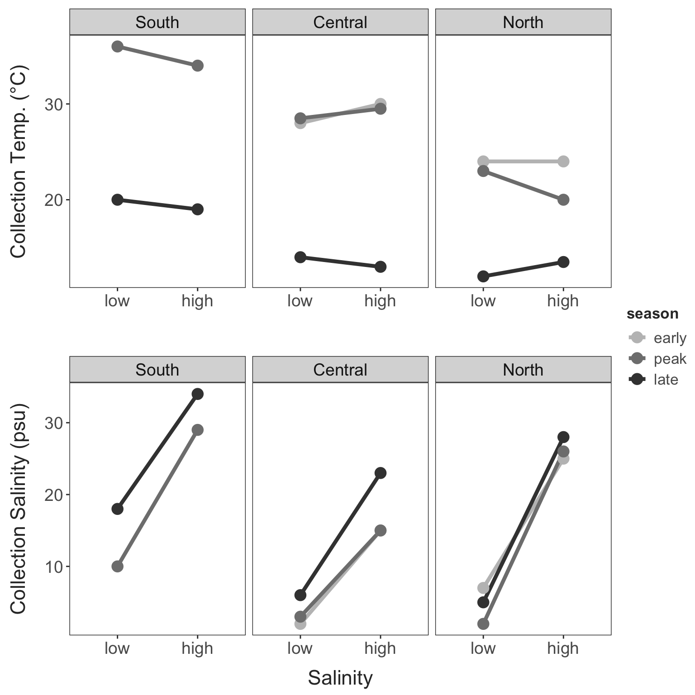

The latitudinal gradient covers a wide range of seasonality. Shown below
is the temperature range. While based on collection temperatures, and
therefore an underestimate of the total seasonal range of temperatures,
these patterns are representative of the expected latitudinal gradient
in seasonality.

``` r
site_temps %>% 
  group_by(site, lat) %>%  
  summarise(temp_range = max(collection_temp) - min(collection_temp)) %>%  
  ggplot(aes(x = lat, y = temp_range)) + 
  geom_point(aes(colour = site),
             size = 3) + 
  scale_color_manual(values = site_cols) + 
  labs(x = "Latitude", 
       y = "Collection Temp. Range (°C)") + 
  theme_matt() + 
  theme(legend.position = "right")
```

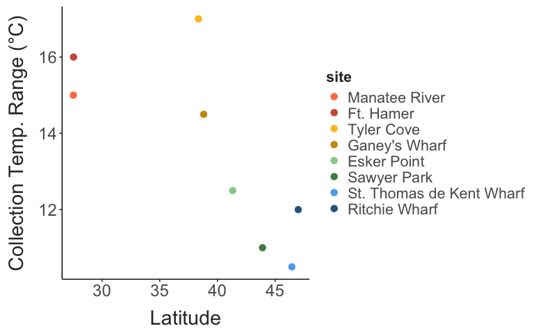

## Phenotypic Measurements

### Critical Thermal Limits

A total of 456 individuals were examined. Critical thermal limits and
body size measurements were made before individuals were preserved in
ethanol. We excluded data for individuals that were either later
classified as males or juveniles, that we were unable to assign to a
clade, or that were identified as individuals from a closely related
species (*Acartia hudsonica*). With these individuals excluded, the full
data set contains 436 phenotyped and clade-identified individuals.

Critical thermal maxima (CTmax) was measured using a custom setup. The
method uses a standard dynamic ramping assay to determine the maximum
temperature individuals could sustain normal functioning. This differs
from lethal temperatures, and indeed, all individuals observed recovered
following the assay.

Individuals were rested for one hour after collection before the assay.
During the assay, copepods were held in artificial seawater, composed of
bottled spring water and Instant Ocean salt mix adjusted to match
collection salinities. During the assay, several ‘control’ individuals
were maintained in this solution at ambient temperatures without the
temperature ramp to ensure that there was no background mortality. When
sorting individuals from the plankton tow contents, they were held in a
50:50 mix of 60 um filtered water from the collection site and
artificial seawater as an additional acclimation step.

Sample sizes varied slightly across experiments, but generally ~20
individuals were measured per season at each site. The major exceptions
were the early samples from the Florida sites and the late sample from
Sawyer Park (Maine). Only two sets of samples (peak and late) were
collected from Fort Hamer and Manatee River. The late season collection
from Sawyer Park occurred after *Acartia tonsa* abundance decreased, and
samples were dominated by *Acartia hudsonica*. Thermal limits were
measured for all *A. tonsa* individuals recovered. No samples were
collected from Key Largo for this project, as *Acartia tonsa* wasn’t
present in the water during the peak season, likely due to a recent
extreme heat event. Thermal limits from a separate project that examined
thermal limits at this site (collected February 2023; Sasaki et
al. 2023) are included as a point of comparison. Body size values were
not measured for these Key Largo copepods, nor were copepods
individually preserved after the experiments.

``` r
join_data %>%  
  group_by(site, season) %>% 
  count() %>%  
  pivot_wider(id_cols = "site", 
              names_from = season, 
              values_from = n, 
              values_fill = 0) %>% 
  select(site, early, peak, late) %>% 
  knitr::kable()
```

| site                     | early | peak | late |
|:-------------------------|------:|-----:|-----:|
| Manatee River            |     0 |   20 |   20 |
| Ft. Hamer                |     0 |   20 |   20 |
| Tyler Cove               |    20 |   20 |   20 |
| Ganey’s Wharf            |    20 |   20 |   20 |
| Esker Point              |    20 |   19 |   20 |
| Sawyer Park              |    20 |   20 |   17 |
| St. Thomas de Kent Wharf |    20 |   20 |   20 |
| Ritchie Wharf            |    20 |   20 |   20 |

Shown below are the measured CTmax values. Individual measurements are
shown in small points for each collection. The large points indicate the
mean values for each collection.

``` r
mean_ctmax = join_data %>% 
  group_by(site, season, doy, collection_temp) %>% 
  summarize(mean_ctmax = mean(ctmax),
            median_ctmax = median(ctmax))

ctmax_plot = ggplot(join_data, aes(x = season, y = ctmax, colour = site)) + 
  geom_line(data = mean_ctmax, 
            aes(y = mean_ctmax, group = site),
            position = position_dodge(width = 0.4),
            linewidth = 1) + 
  geom_point(position = position_jitterdodge(jitter.width = 0.1, jitter.height = 0,
                                             dodge.width = 0.4),
             alpha = 0.3) + 
  geom_point(data = mean_ctmax, 
             aes(y = mean_ctmax),
             position = position_dodge(width = 0.4),
             size = 4) + 
  scale_colour_manual(values = site_cols) + 
  labs(y = "CTmax (°C)",
       x = "Season") +
  theme_matt() + 
  theme(legend.position = "right", 
        legend.title.align = 0.125)

ctmax_plot
```

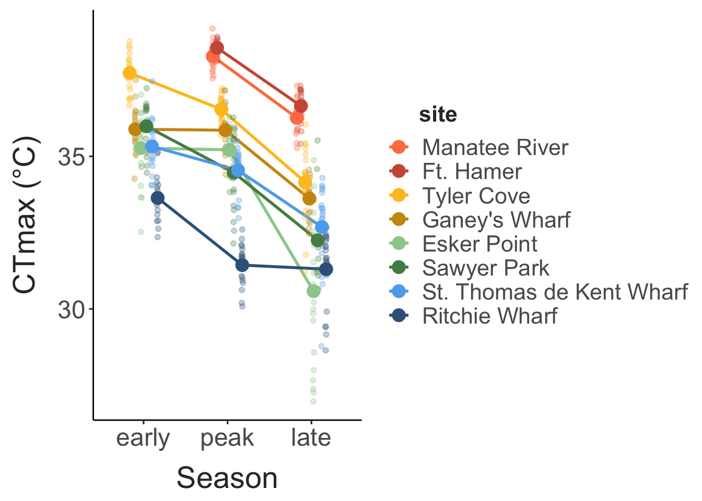

### Warming tolerance

Warming tolerance (the difference between thermal limits and
environmental temperatures) is a commonly used metric of climate
vulnerability. We calculated this as the difference between measured
CTmax values and the collection temperature. Smaller warming tolerance
values indicate that populations were nearer to their upper thermal
limits, suggesting greater vulnerability.

``` r
mean_wt = join_data %>% 
  group_by(site, season) %>% 
  summarize(mean_wt = mean(warming_tol),
            median_wt = median(warming_tol))

ggplot(join_data, aes(x = season, y = warming_tol, colour = site)) + 
  geom_line(data = mean_wt, 
            aes(y = mean_wt, group = site),
            position = position_dodge(width = 0.4),
            linewidth = 1) + 
  geom_point(position = position_jitterdodge(jitter.width = 0.1, jitter.height = 0,
                                             dodge.width = 0.4),
             alpha = 0.3) + 
  geom_point(data = mean_wt, 
             aes(y = mean_wt),
             position = position_dodge(width = 0.4),
             size = 4) + 
  scale_colour_manual(values = site_cols) + 
  labs(y = "Warming Tolerance (°C)",
       x = "Season") +
  theme_matt() + 
  theme(legend.position = "right", 
        legend.title.align = 0.125)
```

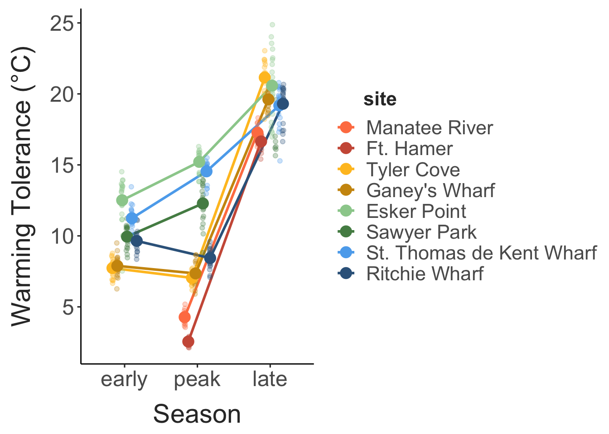

### Body Size

Following the CTmax assay, individuals were photographed for body size
measurements. Prosome lengths were measured from these photographs using
a scale micrometer and the software ImageJ. These measurements are shown
below. As before, large points indicate the mean body size. While less
cohesive than CTmax, a general trend of increasing body size with
latitude and time of year can be seen.

``` r
mean_size = join_data %>% 
  group_by(site, season, doy, collection_temp) %>% 
  summarize(mean_size = mean(size),
            median_size = median(size))

ggplot(join_data, aes(x = season, y = size, colour = site)) + 
  geom_line(data = mean_size, 
            aes(y = mean_size, group = site),
            position = position_dodge(width = 0.4),
            linewidth = 1) + 
  geom_point(position = position_jitterdodge(jitter.width = 0.1, jitter.height = 0,
                                             dodge.width = 0.4),
             alpha = 0.3) + 
  geom_point(data = mean_size, 
             aes(y = mean_size),
             position = position_dodge(width = 0.4),
             size = 4) + 
  scale_colour_manual(values = site_cols) + 
  labs(y = "Prosome Length (mm)",
       x = "Season") +
  theme_matt() + 
  theme(legend.position = "right", 
        legend.title.align = 0.125)
```

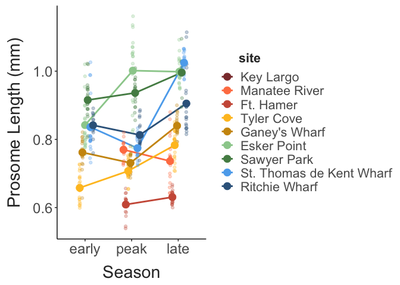

### Salinity Pair Comparisons

The three pairs of cross-salinity comparisons do show evidence for
fine-scale trait divergence, although there was no consistent pattern in
the direction or magnitude of differences. CTmax was similar across
sites in the Southern and Central pairs. In the Northern pair, CTmax
tended to be slightly lower for individuals from the low salinity site.
Size was more variable between the paired sites. In the South,
individuals from the low salinity site were consistently smaller than
individuals from the high salinity site, despite experiencing similar
temperatures. By contrast, in the Central pair individuals from the low
salinity site tended to be slightly larger than those from the high
salinity site, although the magnitude of this difference this varied
seasonally. In the Northern pair, individuals from the low salinity site
were slightly larger than individuals from the high salinity site during
the early and peak season collections, but there was an abrupt reversal
of this pattern during the late collection, when individuals from the
high salinity site were much larger than individuals from the low
salinity site.

We will return to potential mechanisms behind divergence between these
geographically proximate but environmentally separated sites later in
this report.

``` r
sal_means = sal_comps %>% 
  group_by(region, site, salinity, season) %>% 
  summarize(mean_ctmax = mean(ctmax),
            mean_size = median(size))

sal_comp_ctmax_plot = sal_comps %>% 
  ggplot(aes(x = salinity, y = ctmax, colour = season, group = season)) + 
  facet_wrap(region~.) + 
    geom_line(data = sal_means, 
            aes(y = mean_ctmax, group = season),
            position = position_dodge(width = 0.4),
            linewidth = 1) + 
  geom_point(position = position_jitterdodge(jitter.width = 0.1, jitter.height = 0,
                                             dodge.width = 0.4),
             alpha = 0.3) + 
  geom_point(data = sal_means, 
             aes(y = mean_ctmax),
             position = position_dodge(width = 0.4),
             size = 4) + 
  scale_colour_manual(values = season_cols) + 
  labs(y = "CTmax (°C)",
       x = "") + 
  theme_matt_facets(base_size = 14)

sal_comp_size_plot = sal_comps %>% 
  ggplot(aes(x = salinity, y = size, colour = season, group = season)) + 
  facet_wrap(region~.) + 
    geom_line(data = sal_means, 
            aes(y = mean_size, group = season),
            position = position_dodge(width = 0.4),
            linewidth = 1) + 
  geom_point(position = position_jitterdodge(jitter.width = 0.1, jitter.height = 0,
                                             dodge.width = 0.4),
             alpha = 0.3) + 
  geom_point(data = sal_means, 
             aes(y = mean_size),
             position = position_dodge(width = 0.4),
             size = 4) + 
  scale_colour_manual(values = season_cols) + 
  labs(y = "Prosome Length (mm)",
       x = "") + 
  theme_matt_facets(base_size = 14)

ggarrange(sal_comp_ctmax_plot, sal_comp_size_plot, nrow = 2, common.legend = T, legend = "right")
```

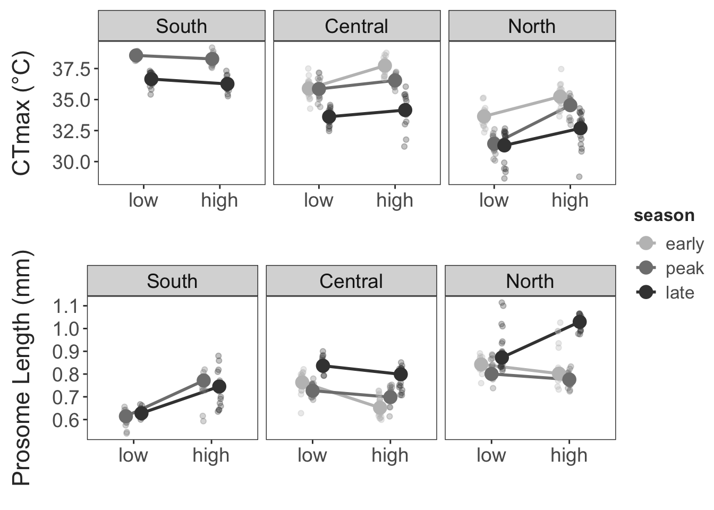

## Trait Correlations

Regardless of the underlying mechanism (genetic differentiation or
phenotypic plasticity), we expect that collections from warmer waters
should yield copepods with higher thermal limits and smaller body sizes.
Our observations largely fit this expectation, with strong increases in
CTmax at higher temperatures, and a general decrease in prosome lengths
as temperature increased. There was a larger correlation between CTmax
and temperature than size and temperature. There are myriad reasons this
might be observed, but one potential is the potential for acclimation of
thermal limits. Body size is fixed in the adult stage, while CTmax can
continue to vary as water temperature changes. This is indirect evidence
for the importance of rapid acclimation in the observed patterns.

``` r
ctmax_temp_plot = ggplot(join_data, aes(x = collection_temp, y = ctmax)) + 
  geom_smooth(method = "lm", se = T,
              linewidth = 2, 
              colour = "grey") + 
  geom_point(aes(colour = site), 
             size = 2, alpha = 0.7) + 
  scale_colour_manual(values = site_cols) + 
  labs(y = "CTmax (°C)",
       x = "Collection Temp. (°C)") +
  theme_matt() + 
  theme(legend.position = "none")

size_temp_plot = ggplot(join_data, aes(x = collection_temp, y = size)) + 
  geom_smooth(method = "lm", se = T,
              linewidth = 2, 
              colour = "grey") + 
  geom_point(aes(colour = site), 
             size = 2, alpha = 0.7) + 
  scale_colour_manual(values = site_cols) + 
  labs(y = "Prosome Length (mm)",
       x = "Collection Temp. (°C)") +
  theme_matt() + 
  theme(legend.position = "right")

wt_temp_plot = ggplot(join_data, aes(x = collection_temp, y = warming_tol)) + 
  geom_smooth(method = "lm", se = T,
              linewidth = 2, 
              colour = "grey") + 
  geom_point(aes(colour = site), 
             size = 2, alpha = 0.7) + 
  scale_colour_manual(values = site_cols) + 
  labs(y = "Warming Tolerance (°C)",
       x = "Collection Temp. (°C)") +
  theme_matt() + 
  theme(legend.position = "right")

ggarrange(ctmax_temp_plot, wt_temp_plot, size_temp_plot, common.legend = T, legend = "bottom", nrow = 1)
```

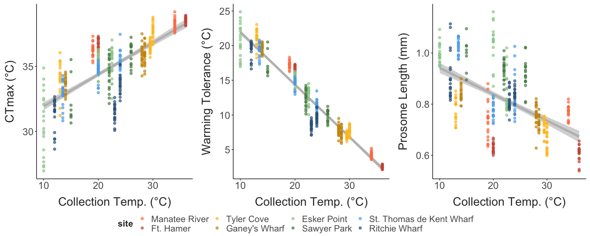

The relationship between prosome length and CTmax is also of interest.
Given that larger body sizes are associated with cold
adaptation/acclimation, it is unsurprising that there is a general trend
of decreasing thermal limits with increasing size. Individual regression
lines for each site are also included - the dark grey lines in the
background represent the ‘universal’ regression for that site, with
individual colored regression lines for each collection. At most sites,
evidence for this negative relationship between CTmax and body size is
observed across collections rather than within collections, suggesting
this relationship is primaly a reflection of the response to seasonal
temperature variation.

``` r
universal_size = join_data %>% 
  ggplot(aes(x = size, y = ctmax)) + 
  # geom_smooth(data = filter(full_data, ctmax > 31), 
  #             aes(x = size, y = ctmax),
  #             method = "lm", 
  #             colour = "grey60", 
  #             se = F,
  #             linewidth = 2) + 
  geom_smooth(method = "lm", se = T,
              linewidth = 2,
              colour = "grey70") + 
  geom_point(aes(colour = site),
             size = 2, alpha = 0.7) + 
  scale_colour_manual(values = site_cols) + 
  labs(y = "CTmax (°C)",
       x = "") +
  theme_matt(base_size = 14) + 
  theme(legend.position = "right",
        axis.title.x = element_blank())

pop_size = join_data %>% 
  ggplot(aes(x = size, y = ctmax, colour = site, group = season)) + 
  facet_wrap(site~.) + 
  # geom_smooth(data = filter(full_data, ctmax > 31), 
  #             aes(x = size, y = ctmax),
  #             method = "lm", 
  #             colour = "grey60", 
  #             se = F,
  #             linewidth = 2) + 
  geom_smooth(data = join_data, 
              aes(x = size, y = ctmax, group = site), 
              colour = "grey20", method = "lm", se = F) + 
  geom_point(size = 1.3, alpha = 0.3) + 
  geom_smooth(method = "lm", se = F,
              linewidth = 1) + 
  scale_colour_manual(values = site_cols) + 
  scale_x_continuous(breaks = c(0.6, 0.8, 1)) + 
  labs(y = "CTmax (°C)",
       x = "Prosome Length (mm)") +
  theme_matt(base_size = 14) + 
  theme(legend.position = "right")

ggarrange(universal_size, pop_size, common.legend = T, legend = "none", nrow = 2)
```

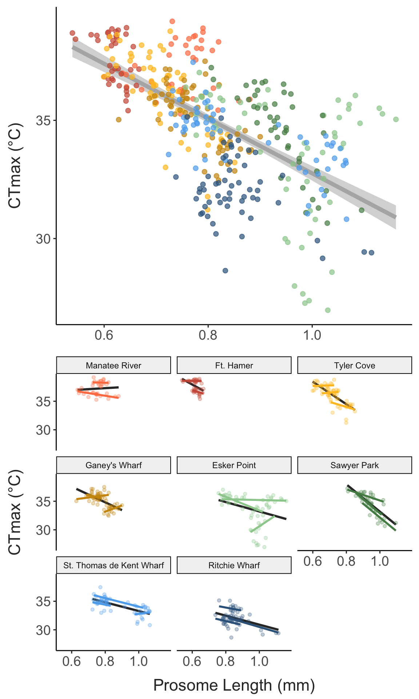

If there is a true mechanistic relationship between body size and
thermal limits, we would expect to see this relationship emerge
**within** populations, or even individual collections. Shown below is
the relationship between CTmax and size residuals, acquired from
regressions of these traits against collection temperature. This
substantially reduces the strength of the apparent relationship, but
there is still a slightly negative overall relationship, spanning both
across-population, within-population, and even within-collection scales
(see the Sawyer Park collections, for example).

``` r
filtered_data = join_data %>% 
  ungroup() %>% 
  drop_na(size, ctmax) %>% 
  mutate(temp_cent = scale(collection_temp, scale = F)[,1],
         size_cent = scale(size, scale = F)[,1],
         sal_cent = scale(collection_salinity, scale = F)[,1],
         sal_type = if_else(collection_salinity > 15, "High", "Low"))

ctmax_temp.model = lm(ctmax ~ collection_temp + site, data = filtered_data)
ctmax_resids = residuals(ctmax_temp.model)

size_temp.model = lm(size ~ collection_temp + site, data = filtered_data)
size_resids = residuals(size_temp.model)

universal_resids = filtered_data %>% 
  mutate(ctmax_resids = ctmax_resids,
         size_resids = size_resids) 

all_resids = ggplot(universal_resids, aes(x = size_resids, y = ctmax_resids)) + 
  # geom_smooth(data = filter(full_data, ctmax > 31), 
  #             aes(x = size, y = ctmax),
  #             method = "lm", 
  #             colour = "grey60", 
  #             se = F,
  #             linewidth = 2) + 
  geom_smooth(method = "lm", se = T,
              linewidth = 2,
              colour = "grey70") + 
  geom_point(aes(colour = site),
             size = 2, alpha = 0.7) + 
  scale_colour_manual(values = site_cols) + 
  labs(y = "CTmax Residuals",
       x = "") +
  theme_matt(base_size = 14) + 
  theme(legend.position = "right",
        axis.title.x = element_blank())

pop_resids = ggplot(universal_resids, aes(x = size_resids, y = ctmax_resids, colour = site, group = season)) + 
  facet_wrap(site~.) + 
  # geom_smooth(data = filter(full_data, ctmax > 31), 
  #             aes(x = size, y = ctmax),
  #             method = "lm", 
  #             colour = "grey60", 
  #             se = F,
  #             linewidth = 2) + 
  geom_smooth(aes(x = size_resids, y = ctmax_resids, group = site), 
              colour = "grey20", method = "lm", se = F) + 
  geom_point(size = 1.3, alpha = 0.3) + 
  geom_smooth(method = "lm", se = F,
              linewidth = 1) + 
  scale_colour_manual(values = site_cols) + 
  labs(y = "CTmax Residuals",
       x = "Prosome Length Residuals") +
  theme_matt(base_size = 14) + 
  theme(legend.position = "right")

ggarrange(all_resids, pop_resids, common.legend = T, legend = "none", nrow = 2)
```

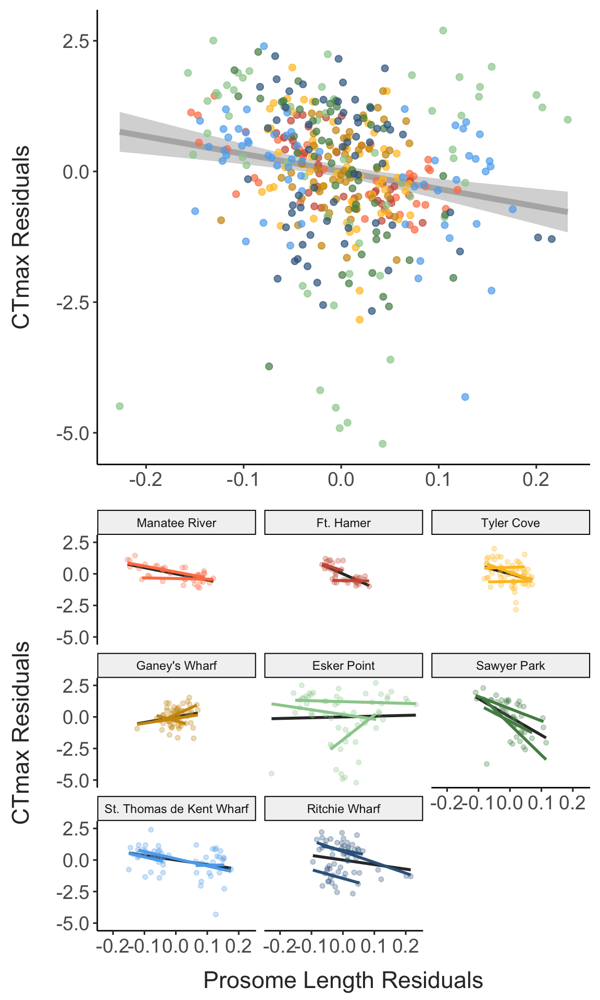

To more formally test the relationships between CTmax, collection
temperature, and size, we used a linear mixed effects model, structured
as `ctmax ~ collection temp. x clade ID + (1 + collection temp.|site)`.
This examines the effects of temperature and size on CTmax, along with
differences between the salinity groupings. Collection temperature was
centered before model fitting. The model also includes random intercepts
for each site and random slopes for collection temperature (i.e. -
variation in the acclimation capacity of CTmax at each site).

Both collection temperature and clade ID, along with the interaction,
had a significant effect on CTmax.

By extracting the conditional mode for the random effects, we can also
examine how thermal limits vary across sites beyond the influence of
collection temperatures and body sizes. Shown below are these
“population” values (essentially, all else being equal, how would
thermal limit vary across populations). We can see that, similar to
what’s been observed in common garden experiments with *A. tonsa*
previously, there is a general latitudinal trend in thermal limits
(decreasing with increasing latitude). Divergence is particularly strong
in the Northern populations.

``` r
site_max = temp_profiles %>% 
  ungroup() %>% 
  group_by(region) %>% 
  summarize(mean = mean(temp_c),
            max = max(temp_c),
            min = min(temp_c)) %>% 
  mutate(region = str_replace_all(region, "Chesapeake", "Maryland"))

pop_effs = REsim(ctmax.model) %>% 
  dplyr::select("site" = groupID, term, mean, sd) %>% 
  pivot_wider(names_from = term, values_from = c(mean, sd)) %>%  
  janitor::clean_names() %>% 
  inner_join(temp_summaries, by = c("site")) %>% #site_mean is the average temperature recorded during collection
  left_join(site_max, by = c("region")) %>% 
  mutate(site = fct_reorder(site, lat))

#plotREsim(REsim(ctmax.model))  # plot the interval estimates

pop_effs_plot = ggplot(pop_effs, aes(x = lat, y = mean_intercept, colour = site)) + 
  geom_hline(yintercept = 0, colour = "grey") +
  geom_errorbar(aes(ymin = mean_intercept - sd_intercept, ymax = mean_intercept + sd_intercept),
                width = 0.5, linewidth = 1) + 
  geom_point(size = 3) + 
  scale_colour_manual(values = site_cols) + 
  labs(x = "Latitude", 
       y = "Population Effect") + 
  theme_matt() + 
  theme(legend.position = "right")

pop_clim_plot = ggplot(pop_effs, aes(x = site_mean, y = mean_intercept)) + 
  #geom_abline(slope = 1, intercept = -19) + 
  geom_smooth(method = "lm", colour = "black") +
  geom_point(aes(colour = site), size = 4) + 
  scale_colour_manual(values = site_cols) + 
  labs(x = "Mean Season Temp.", 
       y = "Population Effect") + 
  theme_matt() + 
  theme(legend.position = "right")

ggarrange(pop_effs_plot, pop_clim_plot, common.legend = T, legend = "bottom")
```

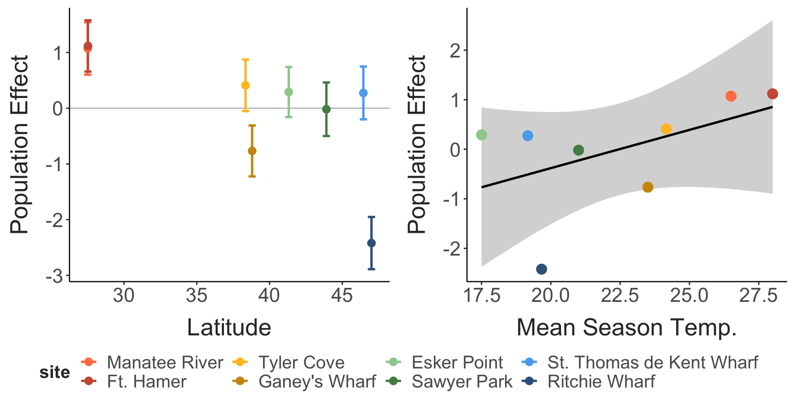

Finally, shown below are the estimated random slopes for each site.
These represent the effects of collection temperature on CTmax for each
site. Interestingly, these estimates diverge from the results of
previous common garden experiments, which showed the strongest
plasticity in high latitude sites. Here, acclimation appears to peak in
mid-latitudes, and decrease at both high and low latitude sites. This
suggests factors may constrain acclimation capacity in natural
populations (e.g. food availability, environmental variation, pathogens,
etc.).

``` r

ggplot(pop_effs, aes(x = mean_temp_cent, y = site)) +
  geom_point(aes(colour = site),
             size = 5) +
  scale_colour_manual(values = site_cols) +
  labs(x = "ARR") + 
  theme_matt() +
  theme(legend.position = "none",
        axis.title.y = element_blank())
```

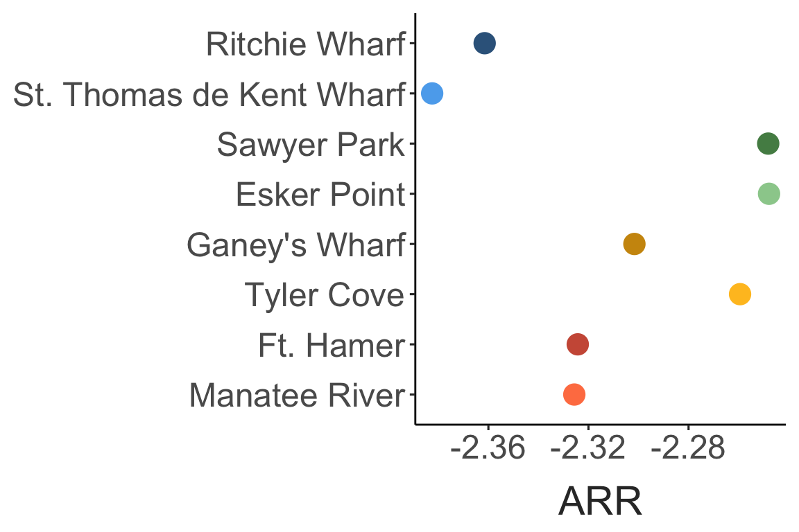

## Trait Variability

Shown below is the trait variation (ranges) for each site. Ranges are
calculated for each collection separately.

``` r
trait_ranges = join_data %>% 
  drop_na(clade) %>% 
  filter(clade != "A_hudsonica") %>% 
  group_by(site, season, clade, collection_temp, collection_salinity, doy, lat) %>% 
  summarise(mean_ctmax = mean(ctmax),
            ctmax_range = max(ctmax) - min(ctmax),
            ctmax_var = var(ctmax),
            mean_size = mean(size),
            size_range = max(size) - min(size),
            size_var = var(size)) %>% 
  mutate(prop_ctmax_range = ctmax_range / mean_ctmax,
         prop_size_range = size_range / mean_size)

ctmax_range_temp = ggplot(trait_ranges, aes(x = collection_temp, y = ctmax_range)) + 
  facet_wrap(clade~.) + 
  geom_smooth(method = "lm", colour = "black", se = F) + 
  geom_point(aes(colour = site), 
             size = 3) + 
  scale_colour_manual(values = site_cols) + 
  labs(y = "CTmax Range (°C)",
       x = "Collection Temp. (°C)") +
  theme_matt() + 
  theme(legend.position = "right")

ctmax_var_temp = ggplot(trait_ranges, aes(x = collection_temp, y = ctmax_var, colour = site)) + 
  facet_wrap(clade~.) + 
  geom_smooth(method = "lm", colour = "black", se = F) + 
  geom_point(aes(colour = site), 
             size = 3) + 
  scale_colour_manual(values = site_cols) + 
  labs(y = "CTmax Range (°C)",
       x = "Collection Temp. (°C)") +
  theme_matt() + 
  theme(legend.position = "right")

size_range_temp = ggplot(trait_ranges, aes(x = collection_temp, y = size_range, colour = site)) + 
  facet_wrap(clade~.) + 
  geom_smooth(method = "lm", colour = "black", se = F) + 
  geom_point(aes(colour = site), 
             size = 3) + 
  scale_colour_manual(values = site_cols) + 
  labs(y = "CTmax Range (°C)",
       x = "Collection Temp. (°C)") +
  theme_matt() + 
  theme(legend.position = "right")

size_var_temp = ggplot(trait_ranges, aes(x = collection_temp, y = size_var, colour = site)) + 
  facet_wrap(clade~.) + 
  geom_smooth(method = "lm", colour = "black", se = F) + 
  geom_point(aes(colour = site), 
             size = 3) + 
  scale_colour_manual(values = site_cols) + 
  labs(y = "CTmax Range (°C)",
       x = "Collection Temp. (°C)") +
  theme_matt() + 
  theme(legend.position = "right")

ggarrange(ctmax_range_temp, size_range_temp, common.legend = T, legend = "right")
```

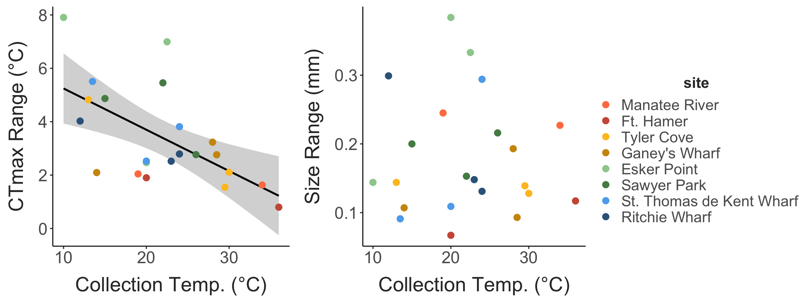

Changes in trait variance may be indicative of phenotypic selection. If
selection (as opposed to acclimation) are driving seasonal changes, we
may expect to see a reduction in variance in the peak samples relative
to the early season samples. Note that early season collection
temperatures this year were higher than expected, driven by fairly
strong heatwaves across the North Atlantic. As shown in the temperature
profiles for each site, the ‘early’ samples were collected just after
high temperatures were reached, while ‘peak’ samples were collected
after sites had experienced high temperatures for several weeks
(generations). As warming tolerances were fairly high throughout this
period, we will assume that selection was weak before the early samples.
If the early onset of high temperatures filtered out vulnerable
genotypes prior to our sampling, the results will be a conservative
estimate of the effects of selection on trait variance.

## Low-Coverage Whole Genome Sequencing

While plasticity appears to play a large role in the response of
*Acartia tonsa* populations to seasonality, a growing number of studies
have also uncovered patterns in allele frequency indicating of rapid
adaptive responses to seasonality. Our data set of seasonal samples
across a large latitudinal gradient enables a comparison of these fine
scale temporal patterns with the larger latitudinal patterns in allele
frequency to determine whether the same alleles driving rapid seasonal
adaptation are in play over larger spatial (and longer temporal) scales.

After phenotyping, each individual was preserved in 95% ethanol.
Individual DNA libraries were prepared using Twist Bio 96-plex prep
kits, then sequenced on two lanes of an Illumina NovaSeq X Plus 25B by
Novogene. Reads were de-multiplexed first to the plate level, and then
to the sample level.

``` r
join_data %>% 
  arrange(site_code, season, replicate, tube) %>% 
  ggplot(aes(x = site_code, y = templates)) + 
  geom_boxplot() + 
  theme_matt()
```

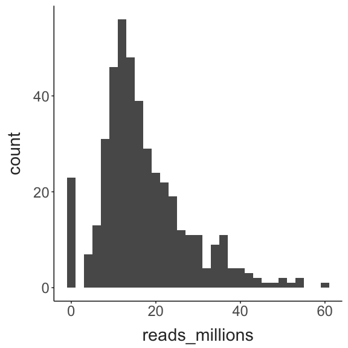

While the number of reads aligned for each individual varies, there is
no clear relationship between the number of aligned reads and individual
size or CTmax.

``` r

reads_size_plot = ggplot(join_data, aes(x = size, y = pf_hq_aligned_reads)) + 
  geom_smooth() + 
  geom_point() + 
  theme_matt()

reads_ctmax_plot = ggplot(join_data, aes(x = ctmax, y = pf_hq_aligned_reads)) + 
  geom_smooth() + 
  geom_point() + 
  theme_matt()

ggarrange(reads_size_plot, reads_ctmax_plot, nrow = 1)
```

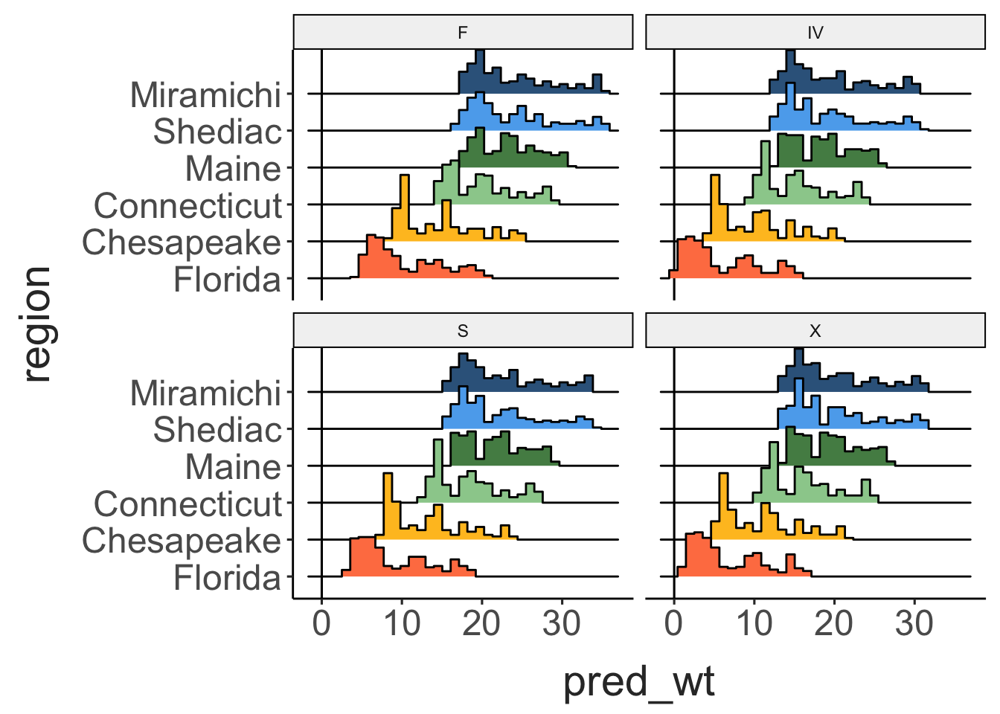

``` r

read.model = lm(data = join_data, 
                templates ~ size + ctmax)

knitr::kable(car::Anova(read.model))
```

|           |       Sum Sq |  Df |   F value |   Pr(\>F) |
|:----------|-------------:|----:|----------:|----------:|
| size      | 5.103676e+14 |   1 | 1.1909556 | 0.2757566 |
| ctmax     | 5.081386e+11 |   1 | 0.0011858 | 0.9725467 |
| Residuals | 1.816994e+17 | 424 |        NA |        NA |

``` r
join_data %>% 
  ggplot(aes(x = site_code, y = pct_1x)) + 
  geom_boxplot() + 
  theme_matt()
```

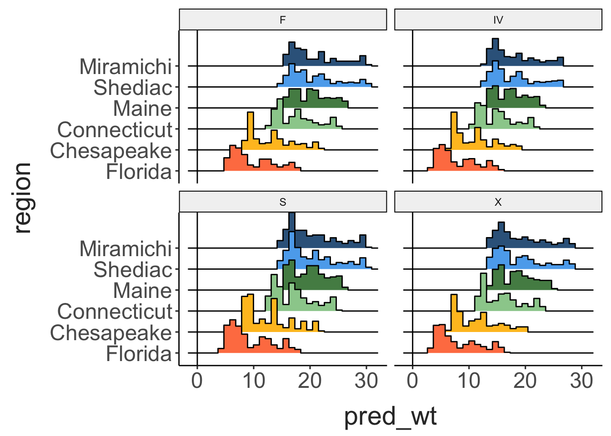

``` r

join_data %>% 
  ggplot(aes(x = site_code, y = pct_aligned)) + 
  geom_boxplot() + 
  theme_matt()
```

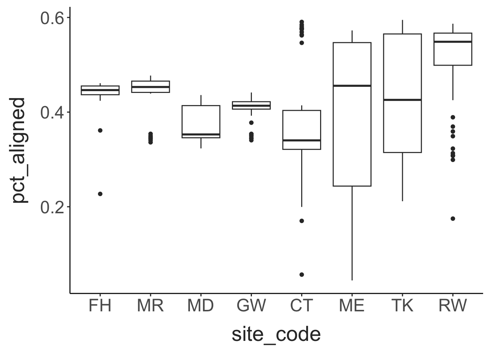

### Clade IDs

*Acartia tonsa* is well known to comprise multiple, deeply diverged
clades. To determine the clade composition of our sample set, we skimmed
COI sequences from the low-coverage data.

``` r
# clade_matches %>% 
#   group_by(sample) %>% 
#   count(Clade) %>% 
#   mutate(population = str_split_fixed(sample, pattern = "_", n = 4)[,1],
#          season = str_split_fixed(sample, pattern = "_", n = 4)[,2],
#          individual = str_split_fixed(sample, pattern = "_", n = 3)[,3])  %>% 
#   ungroup() %>% 
#   mutate(population = fct_relevel(population, "MR", "FH", "MD", "GW", "CT", "ME", "TK", "RW"), 
#          season = fct_relevel(season, "early", "peak", "late"), 
#          sample = fct_reorder2(sample, .y = population, .x = season, .desc = F))
#   #write.csv(file = "Output/Output_data/COI_clades_summary.csv", row.names = F)


ggplot(clade_summary, aes(x = individual, y = n, fill = Clade)) + 
  facet_grid(population~season) + 
  geom_bar(stat = "identity", position = "fill") + 
  scale_y_continuous(breaks = c(0, 0.5, 1)) + 
  scale_fill_manual(values = clade_cols) + 
  labs(x = "Individual", 
       y = "Proportion") + 
  theme_bw(base_size = 18) + 
  theme(panel.grid = element_blank(), 
        axis.text.x = element_text(angle = 290, hjust = 0, vjust = 0.5))
```


These clades are deeply diverged, which affects the alignment and final
coverage of the genome data.

``` r
join_data %>% 
  drop_na(clade) %>% 
  ggplot(aes(x = clade, y = pct_1x)) + 
  geom_boxplot() + 
  theme_matt()
```

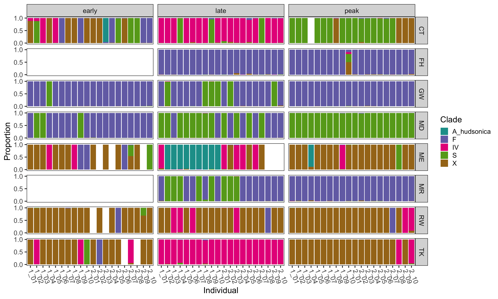

``` r

join_data %>% 
  drop_na(clade) %>%
  ggplot(aes(x = clade, y = pct_aligned)) + 
  geom_boxplot() + 
  theme_matt()
```

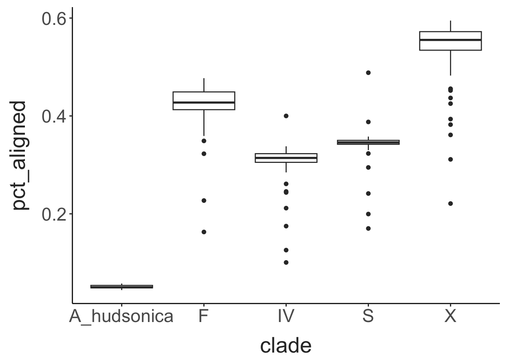

These COI clades were then merged with the CTmax and body size data set
to examine clade-specific patterns of divergence. By plotting CTmax and
size against the collection temperature we can see that these clades
appear to be physiologically differentiated. Clades F and S tend to have
higher CTmax, even when collected at the same temperatures as Clades X
and IV. Size is more variable, with varying degrees of temperature
sensitivity across the clades. Overall, however, Clade F tends to be
smaller than Clades S and X. Clade IV tended to be the largest.

``` r
clade_ctmax_plot = join_data %>% 
  drop_na(clade) %>% 
  filter(clade != "A_hudsonica") %>% 
  ggplot(aes(x = collection_temp, y = ctmax, colour = clade)) + 
  geom_point(size = 2, alpha = 0.3) + 
  geom_smooth(method = "lm", linewidth = 2.5) + 
  labs(x = "Collection Temp. (°C)", 
       y = "CTmax (°C)") + 
  scale_colour_manual(values = clade_cols) + 
  theme_matt() + 
  theme(legend.position = "none")

clade_size_plot =  join_data %>% 
  drop_na(clade) %>% 
  filter(clade != "A_hudsonica") %>% 
  ggplot(aes(x = collection_temp, y = size, colour = clade)) + 
  geom_point(size = 2, alpha = 0.3) + 
  geom_smooth(method = "lm", linewidth = 2.5) + 
    labs(x = "Collection Temp. (°C)", 
       y = "Prosome Length (mm)") + 
  scale_colour_manual(values = clade_cols) + 
  theme_matt() + 
  theme(legend.position = "none")

ggarrange(clade_ctmax_plot, clade_size_plot, nrow = 1, common.legend = T, legend = "right")
```

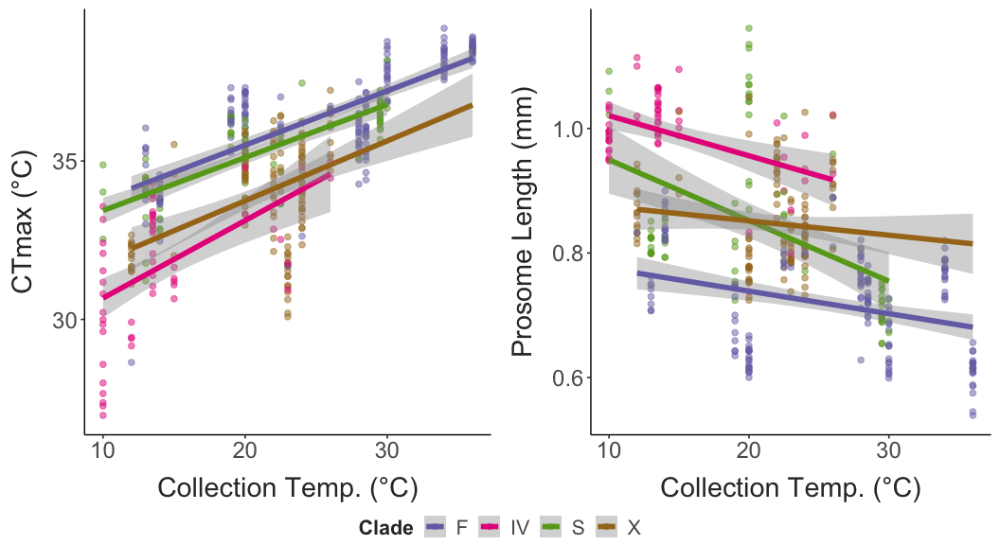

``` r

# ggplot(clade_ctmax, aes(x = size, y = ctmax, colour = Clade)) + 
#   geom_point(size = 2) + 
#   #geom_smooth(method = "lm", linewidth = 2) + 
#     labs(y = "CTmax (°C)", 
#        x = "Prosome Length (mm)") + 
#   scale_colour_manual(values = c("A_hudsonica" = "#1B9E99",
#                                "A_lilljeborgi" = "#D95F02",
#                                "F" = "#7570B3",
#                                "IV" = "#E7298A",
#                                "out_group" = "#666666",
#                                "S" = "#66A61E",
#                                "SB" = "#E6AB02",
#                                "X" = "#A6761D"),
#                     na.value = "black") + 
#   theme_matt_facets()
```

``` r
universal_resids %>%  
  drop_na(clade) %>% 
  filter(clade != "A_hudsonica") %>% 
  ggplot(aes(x = size_resids, y = ctmax_resids, colour = clade)) + 
  facet_wrap(clade~.) + 
  geom_point(alpha = 0.3) + 
  geom_smooth(method = "lm", linewidth = 2.5) + 
  scale_color_manual(values = clade_cols) + 
  theme_matt_facets()
```

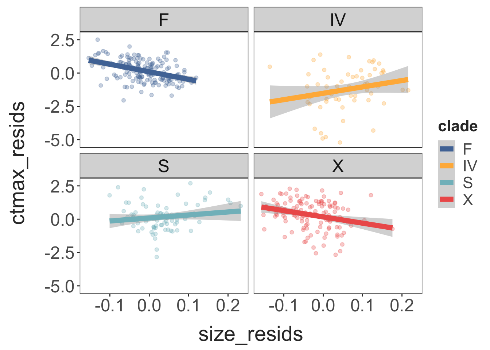

These differences in physiology correspond to the distributional
patterns for each clade. Using a Loess smoother (span = 2) highlights
how the proportional abundance of the clades is affected by temperature
in different ways. Clade F occurs in high proportion at high
temperature, Clade IV occurs in high proportions at low temperatures,
while Clade X occurs in high proportions at intermediate temperatures.
Clade S generally occurs in low proportions, with a few exceptions.

``` r
clade_prop = join_data %>% 
  drop_na(clade) %>% 
  select(site, season, clade, collection_temp, lat) %>% 
  group_by(site, season, collection_temp, lat) %>% 
  count(clade) %>% 
  ungroup(collection_temp, lat) %>% 
  mutate("prop" = n / sum(n)) %>% 
  ungroup() %>% 
  complete(nesting(site, season, collection_temp, lat), clade, fill = list(prop = 0, n = 0)) %>%  
  mutate(n = if_else(n == 0, 0, 1), 
         num_season = case_when(
           season == "early" ~ 1,
           season == "peak" ~ 2,
           season == "late" ~ 3))

clade_prop %>% 
  filter(clade != "A_hudsonica") %>% 
  drop_na(clade) %>% 
  ggplot(aes(x = collection_temp, y = prop, colour = clade)) + 
  facet_wrap(clade~.) + 
  geom_point(size = 3, alpha = 0.5) + 
  geom_smooth(span = 2,
    se = T, 
    linewidth = 3) + 
  labs(x = "Collection Temp. (°C)", 
       y = "Proportion") + 
  coord_cartesian(ylim = c(0,1)) + 
  scale_y_continuous(breaks = c(0,1)) + 
  scale_colour_manual(values = clade_cols) + 
  theme_matt_facets() + 
  theme(legend.position = "none")
```

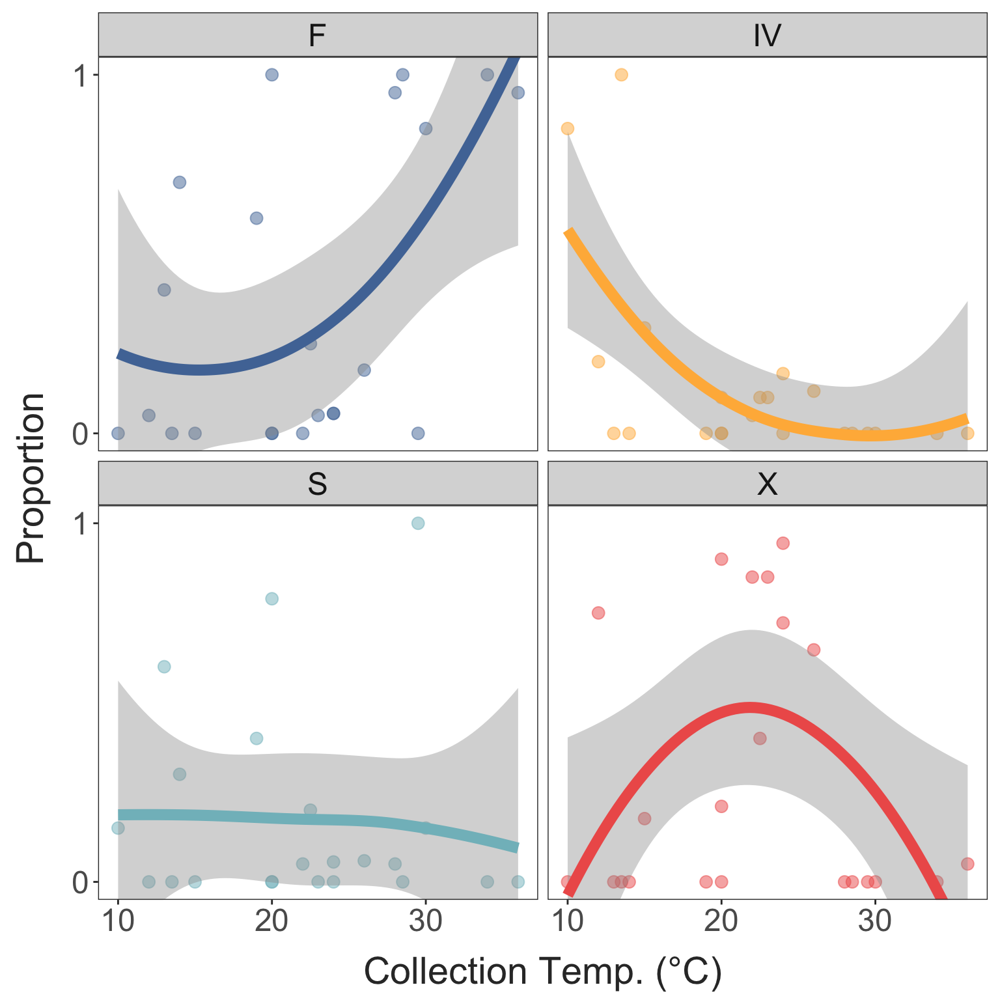

### PCA

``` r
tonsa_eigs = data.frame(eigen(tonsa_matrix)$vectors[,1:2])
pc1_var = round((eigen(tonsa_matrix)$values[1] / sum(eigen(tonsa_matrix)$values)) * 100, digits = 2)
pc2_var = round((eigen(tonsa_matrix)$values[2] / sum(eigen(tonsa_matrix)$values)) * 100, digits = 2)
tonsa_pca_df = tonsa_eigs %>% 
  bind_cols(bam_list)

ggplot(tonsa_pca_df, aes(x = X1, y = X2, colour = clade)) + 
  geom_point(size = 5) + 
  labs(x = paste0("PC1 (", pc1_var, "%)", sep = ""),
       y = paste0("PC2 (", pc2_var, "%)", sep = "")) + 
  scale_colour_manual(values = clade_cols) + 
  theme_matt() + 
  theme(legend.position = "right")
```

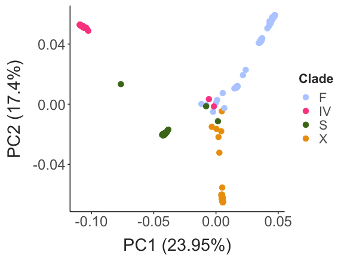

``` r

f_inds = which(tonsa_pca_df$clade == "F")
f_samples = filter(tonsa_pca_df, clade == "F") %>% select(-X1, -X2)
f_matrix = tonsa_matrix[f_inds, f_inds]
f_eigs = data.frame(eigen(f_matrix)$vectors[,1:2])
f_pc1_var = round((eigen(f_matrix)$values[1] / sum(eigen(f_matrix)$values)) * 100, digits = 2)
f_pc2_var = round((eigen(f_matrix)$values[2] / sum(eigen(f_matrix)$values)) * 100, digits = 2)
f_pca_df = f_eigs %>% 
  bind_cols(f_samples)

f_pca_plot = f_pca_df %>% 
  ggplot(aes(x = X1, y = X2, colour = site_code, shape = season)) + 
  #facet_wrap(season~.) + 
  geom_point(size = 3) + 
  labs(x = paste0("PC1 (", f_pc1_var, "%)", sep = ""),
       y = paste0("PC2 (", f_pc2_var, "%)", sep = ""),
       title = "Clade - F") + 
  scale_color_manual(values = pop_cols)  + 
  theme_matt_facets()

#########

x_inds = which(tonsa_pca_df$clade == "X")
x_samples = filter(tonsa_pca_df, clade == "X") %>% select(-X1, -X2)
x_matrix = tonsa_matrix[x_inds, x_inds]
x_eigs = data.frame(eigen(x_matrix)$vectors[,1:2])
x_pc1_var = round((eigen(x_matrix)$values[1] / sum(eigen(x_matrix)$values)) * 100, digits = 2)
x_pc2_var = round((eigen(x_matrix)$values[2] / sum(eigen(x_matrix)$values)) * 100, digits = 2)
x_pca_df = x_eigs %>% 
  bind_cols(x_samples) 

x_pca_plot = x_pca_df %>% 
  #filter(X1 < -0.082) %>% 
  ggplot(aes(x = X1, y = X2, colour = site_code, shape = season)) + 
  #facet_wrap(season~.) + 
  geom_point(size = 3) + 
  labs(x = paste0("PC1 (", x_pc1_var, "%)", sep = ""),
       y = paste0("PC2 (", x_pc2_var, "%)", sep = ""),
       title = "Clade - X") + 
  scale_color_manual(values = pop_cols)  + 
  theme_matt_facets()

#Outliers
#x_pca_df %>% filter(X1 > -0.085) 

#########

s_inds = which(tonsa_pca_df$clade == "S")
s_samples = filter(tonsa_pca_df, clade == "S") %>% select(-X1, -X2)
s_matrix = tonsa_matrix[s_inds, s_inds]
s_eigs = data.frame(eigen(s_matrix)$vectors[,1:2])
s_pc1_var = round((eigen(s_matrix)$values[1] / sum(eigen(s_matrix)$values)) * 100, digits = 2)
s_pc2_var = round((eigen(s_matrix)$values[2] / sum(eigen(s_matrix)$values)) * 100, digits = 2)
s_pca_df = s_eigs %>% 
  bind_cols(s_samples)

s_pca_plot = s_pca_df %>% 
  #filter(X1 < -0.114, X2 > -0.0015, X2< 0.004) %>% 
  ggplot(aes(x = X1, y = X2, colour = site_code, shape = season)) + 
  #facet_wrap(season~.) + 
  geom_point(size = 3) + 
  labs(x = paste0("PC1 (", s_pc1_var, "%)", sep = ""),
       y = paste0("PC2 (", s_pc2_var, "%)", sep = ""),
       title = "Clade - S") + 
  scale_color_manual(values = pop_cols)  + 
  theme_matt_facets()


#Outliers
#s_pca_df %>% filter(!(X1 < -0.114 & X2 > -0.0015 & X2< 0.004))

#########

IV_inds = which(tonsa_pca_df$clade == "IV")
IV_samples = filter(tonsa_pca_df, clade == "IV") %>% select(-X1, -X2)
IV_matrix = tonsa_matrix[IV_inds, IV_inds]
IV_eigs = data.frame(eigen(IV_matrix)$vectors[,1:2])
IV_pc1_var = round((eigen(IV_matrix)$values[1] / sum(eigen(IV_matrix)$values)) * 100, digits = 2)
IV_pc2_var = round((eigen(IV_matrix)$values[2] / sum(eigen(IV_matrix)$values)) * 100, digits = 2)
IV_pca_df = IV_eigs %>% 
  bind_cols(IV_samples) 

IV_pca_plot = IV_pca_df %>% 
  #filter(X1< -0.1) %>% 
  ggplot(aes(x = X1, y = X2, colour = site_code, shape = season)) + 
  #facet_wrap(season~.) + 
  geom_point(size = 3) + 
  labs(x = paste0("PC1 (", IV_pc1_var, "%)", sep = ""),
       y = paste0("PC2 (", IV_pc2_var, "%)", sep = ""), 
       title = "Clade - IV") + 
  scale_color_manual(values = pop_cols)  + 
  theme_matt_facets()

#Outliers
#IV_pca_df %>% filter(!(X1< -0.1 & X2))


ggarrange(f_pca_plot, x_pca_plot, s_pca_plot, IV_pca_plot, common.legend = T, legend = "right")
```

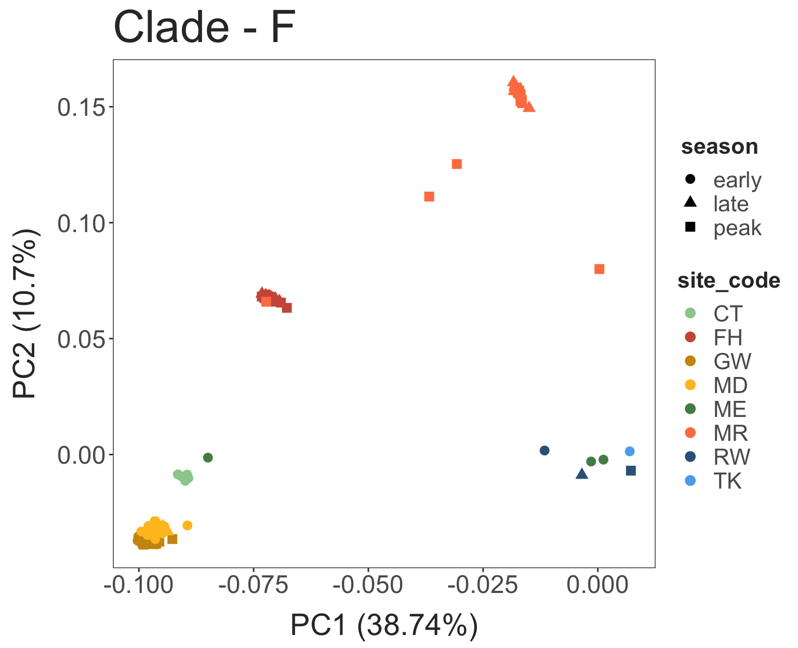

### Selection Scans

``` r

# D <- as.matrix(read.table("Raw_data/molecular/clade_pcangsd/clade_IV.selection")) # Reads PC-based selection statistics
# p <- pchisq(D[,1], 1, lower.tail=FALSE)
# 
# plot(-log10(p))
```

## Misc. Details

``` r
ramp_record2 = ramp_record %>% 
  group_by(run, minute_interval) %>% 
  summarise(mean_ramp = mean(ramp_per_minute)) %>% 
  ungroup()

ggplot(ramp_record2, aes(x = minute_interval, y = mean_ramp)) + 
  geom_hline(yintercept = 0.3) + 
  geom_hline(yintercept = 0.1) + 
  #geom_point() + 
  geom_hex(bins = 30) + 
  ylim(0, 0.35) + 
  labs(y = "Ramp Rate (deg. C / min.)",
       x = "Time into run (minute)") + 
  theme_matt(base_size = 16) 
```

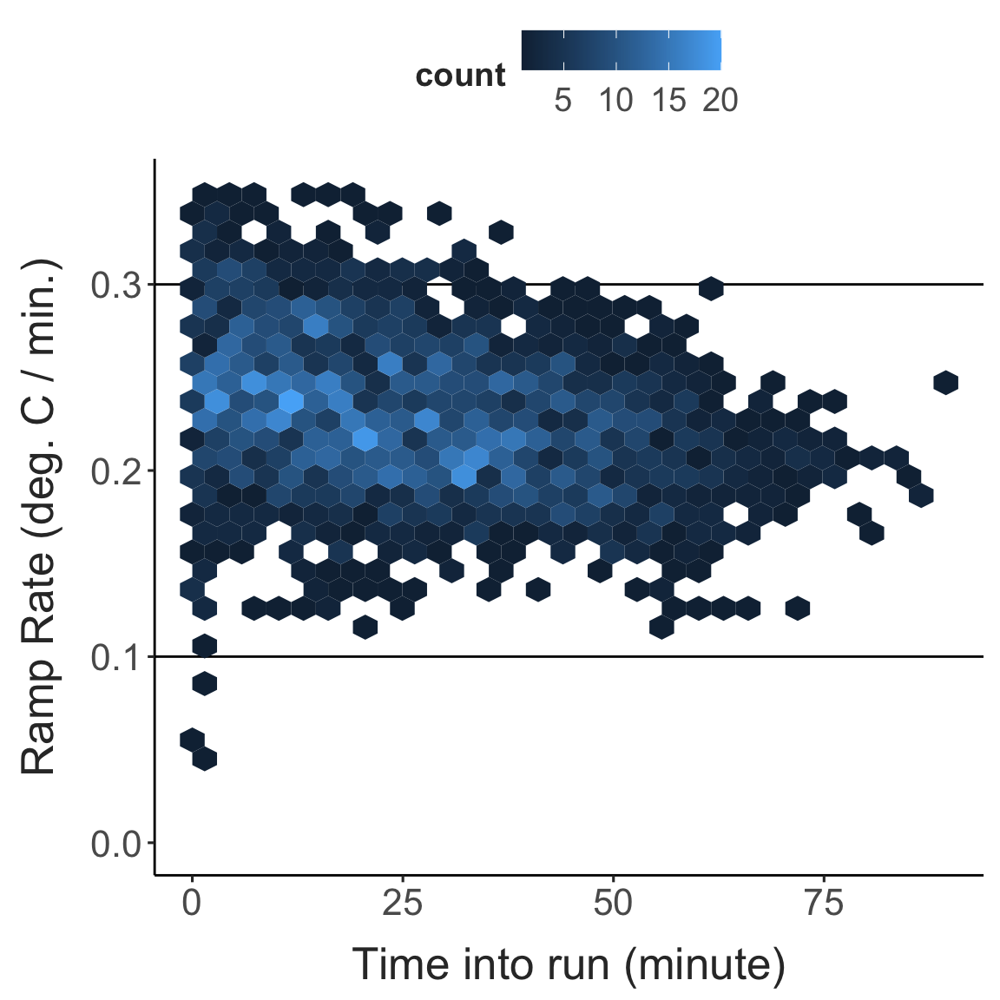

``` r
join_data %>% 
  drop_na(replicate) %>%  
  ggplot(aes(x = factor(replicate), y = ctmax, group = site)) + 
  facet_grid(site~season, scales = "free_y") + 
  geom_point(position = position_jitter(width = 0.1, height = 0),
             alpha = 0.4,
             colour = "grey30") + 
  geom_smooth(method = "lm", colour = "black") + 
  labs(x = "Replicate", 
       y = "CTmax") + 
  theme_matt_facets()
```

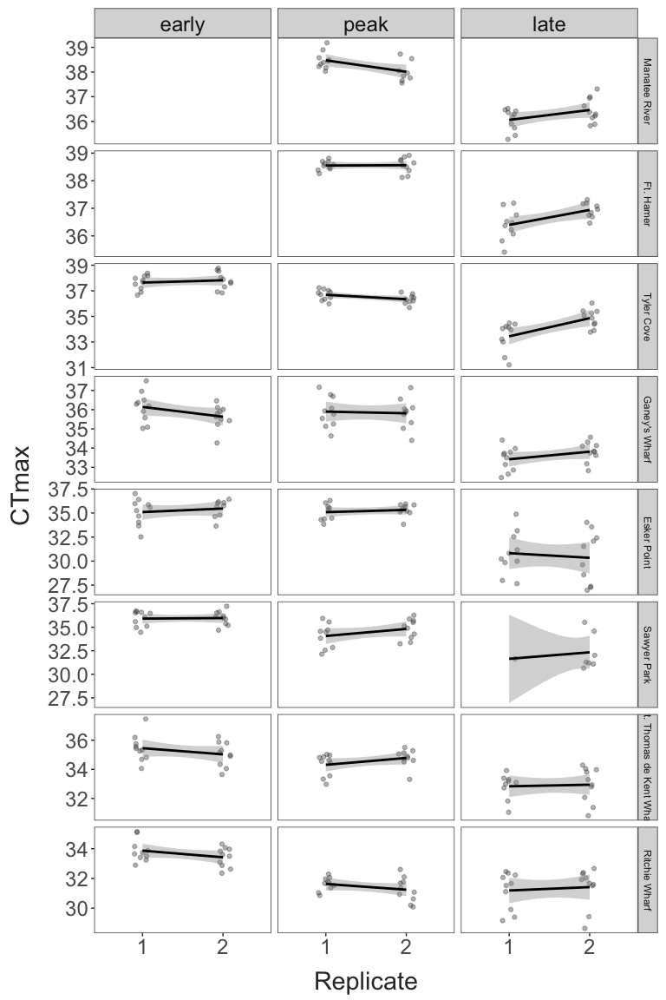

``` r

early_peak = join_data %>% 
  filter(season %in% c("early", "peak")) %>% 
  mutate(season = if_else(season == "early", "one", "two")) %>% 
  group_by(site) %>% 
  mutate(ctmax_sd_p = sd(ctmax),
         size_sd_p = sd(size), 
         temp_change = max(collection_temp) - min(collection_temp),
         avg_temp = (max(collection_temp) + min(collection_temp)) / 2,
         days_passed = max(doy) - min(doy)) %>% 
  select(site, lat, season, 
         ctmax_sd_p, size_sd_p, 
         temp_change, avg_temp, days_passed, 
         ctmax, size) %>%
  group_by(site, lat, season, 
           ctmax_sd_p, size_sd_p, 
           temp_change, avg_temp, days_passed) %>% 
  summarize(ctmax = mean(ctmax),
            size = mean(size)) %>% 
  pivot_wider(id_cols = c(site, lat, ctmax_sd_p, size_sd_p, 
                          temp_change, avg_temp, days_passed), 
              names_from = season, 
              values_from = c(ctmax, size)) %>% 
  mutate(season = "early_to_peak") %>%  
  drop_na()

peak_late = join_data %>% 
  filter(season %in% c("peak", "late")) %>% 
  mutate(season = if_else(season == "peak", "one", "two")) %>% 
  group_by(site) %>% 
  mutate(ctmax_sd_p = sd(ctmax),
         size_sd_p = sd(size), 
         temp_change = last(collection_temp) - first(collection_temp),
         avg_temp = (max(collection_temp) + min(collection_temp)) / 2,
         days_passed = max(doy) - min(doy)) %>% 
  select(site, lat, season, ctmax_sd_p, size_sd_p, 
         temp_change, avg_temp, days_passed, 
         ctmax, size) %>%
  group_by(site, lat, season, ctmax_sd_p, size_sd_p, 
           temp_change, avg_temp, days_passed) %>% 
  summarize(ctmax = mean(ctmax),
            size = mean(size)) %>% 
  pivot_wider(id_cols = c(site, lat, ctmax_sd_p, size_sd_p, 
                          temp_change, avg_temp, days_passed), 
              names_from = season, 
              values_from = c(ctmax, size)) %>% 
  mutate(season = "peak_to_late") %>%  
  drop_na()
  

generations = bind_rows(early_peak, peak_late) %>% 
  mutate("gen_time" = 5490*(avg_temp + 1)^-2.05,
         "gens" = floor(days_passed / gen_time))
```

``` r
ggplot(generations, aes(x = lat, y = gens, colour = site, shape = season)) + 
  geom_hline(yintercept = 1) + 
  geom_point(size = 5) + 
  scale_colour_manual(values = site_cols) + 
  labs(x = "Latitude", 
       y = "Generations between \ncollections") +
  scale_y_continuous(breaks = seq(from = 0, to = 21, by = 5)) + 
  theme_matt() + 
  theme(legend.position = "right")
```

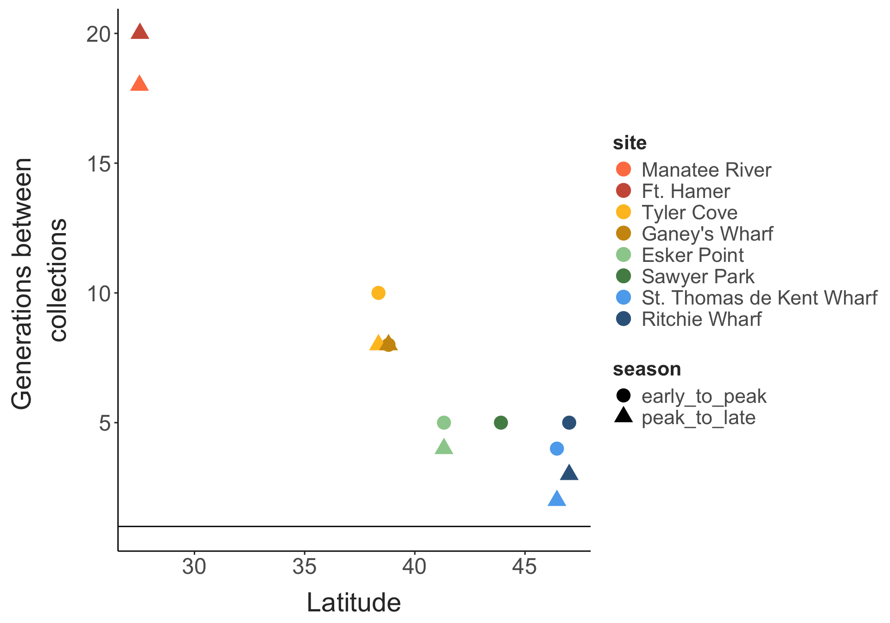

``` r
obs_ranks = ggplot(join_data, aes(x = rank)) + 
  facet_wrap(tube~.) + 
  geom_histogram(binwidth = 1) + 
  scale_x_continuous(breaks = c(2,4,6,8,10)) + 
  ggtitle("Observation") + 
  theme_matt_facets()

sim_data = data.frame()
for(i in 1:50){
  rep_data = data.frame("tube" = sample(c(1:10), size = 10, replace = F), 
                        "rank" = c(1:10),
                        "rep" = i) %>% 
    arrange(tube)
  
  sim_data = bind_rows(sim_data, rep_data)
  
}

sim_ranks = ggplot(sim_data, aes(x = rank)) + 
  facet_wrap(tube~.) + 
  geom_histogram(binwidth = 1) + 
  scale_x_continuous(breaks = c(2,4,6,8,10)) + 
  ggtitle("Simulation") + 
  theme_matt_facets()


ggarrange(obs_ranks, sim_ranks)
```

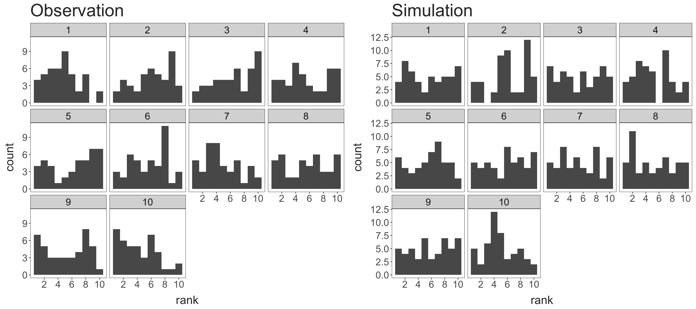
