# Comparing seasonal and latitudinal patterns in thermal adaptation

2026-10-30

- [Main Message](#main-message)
- [1. Collections and environment](#1-collections-and-environment)
  - [Sites and collection conditions](#sites-and-collection-conditions)
  - [Long-term site temperatures (MUR
    SST)](#long-term-site-temperatures-mur-sst)
  - [Paired low- and high-salinity
    sites](#paired-low--and-high-salinity-sites)
  - [Generations between collections](#generations-between-collections)
- [2. Phenotypes: thermal limits and body
  size](#2-phenotypes-thermal-limits-and-body-size)
  - [Critical Thermal Limits](#critical-thermal-limits)
  - [Body Size](#body-size)
  - [Warming tolerance](#warming-tolerance)
  - [Trait correlations](#trait-correlations)
  - [Paired sites: trait differences](#paired-sites-trait-differences)
  - [Assay checks](#assay-checks)
- [3. Low-coverage whole genome data](#3-low-coverage-whole-genome-data)
  - [Sequencing summary](#sequencing-summary)
  - [Site filtering](#site-filtering)
  - [Clade identity](#clade-identity)
  - [Genetic differentiation within
    clades](#genetic-differentiation-within-clades)
  - [Relatedness and sample quality](#relatedness-and-sample-quality)
  - [Local PCA and candidate
    inversions](#local-pca-and-candidate-inversions)
  - [Parasites and symbionts](#parasites-and-symbionts)
  - [Seasonal allele-frequency
    change](#seasonal-allele-frequency-change)
  - [Spatial vs. seasonal genetic
    variation](#spatial-vs-seasonal-genetic-variation)
  - [Does space substitute for time? Concordance of temperature
    responses](#does-space-substitute-for-time-concordance-of-temperature-responses)
- [4. Clade-specific physiological
  patterns](#4-clade-specific-physiological-patterns)
  - [CTmax model](#ctmax-model)
  - [Acclimation vs. site differences (within- and between-site
    temperature)](#acclimation-vs-site-differences-within--and-between-site-temperature)
  - [Partitioning CTmax variation](#partitioning-ctmax-variation)
  - [Lineage differences under shared conditions (natural common
    garden)](#lineage-differences-under-shared-conditions-natural-common-garden)
  - [Genetic basis of CTmax within
    collections](#genetic-basis-of-ctmax-within-collections)
  - [Candidate genes: mitochondrial amino-acid
    differences](#candidate-genes-mitochondrial-amino-acid-differences)
  - [Trait variability within clades](#trait-variability-within-clades)
  - [Parasites, epibionts and thermal
    limits](#parasites-epibionts-and-thermal-limits)
- [5. Partitioning vulnerability](#5-partitioning-vulnerability)

## Main Message

By assaying thermal limits several times per year in natural populations
distributed across a large latitudinal gradient, we highlight the
importance of intra-specific variation for predicting vulnerability to
climate change. Indeed, across the entire spatiotemporal framework
examined here, we observed an ~12°C range in thermal limits. Both
spatial and temporal variations in thermal limits are essential for
robust predictions. Also highlighted in this study are the major
differences in thermal limits between the various cryptic lineages of
*Acartia tonsa*. The broad (and sometimes overlapping) distrbutions of
these clades provide a unique opportunity to compare replicate
spatiotemporal patterns in adaptation against a relatively similar
genetic background.

## 1. Collections and environment

Collection sites, conditions at the time of collection, continuous
temperature records, and the timing of collections relative to copepod
generation times.

### Sites and collection conditions

Copepods were collected by surface tow from sites across the Western
Atlantic at several times throughout the year. The sites are shown below
along with surface temperatures and salinity were measured at the time
of collection. Across the entire set of collections, temperature ranged
from 10°C to 36°C.

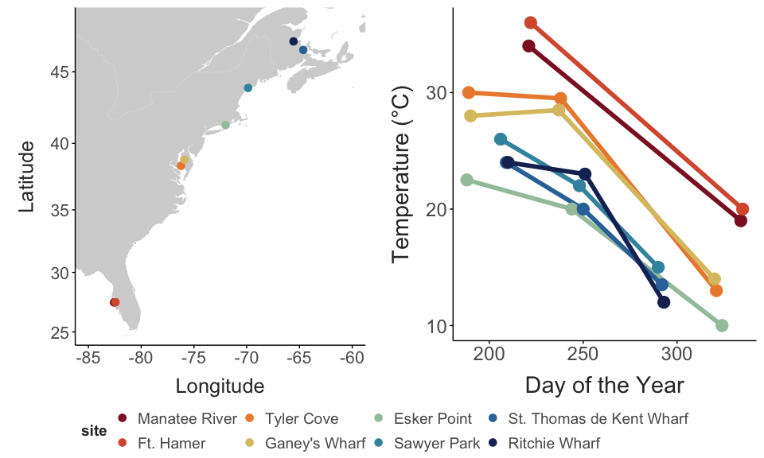

Collections aimed to obtain copepods near the onset of peak
temperatures, after peak temperatures, and then after temperatures
cooled during the Fall. To put the collections into this larger seasonal
context, we examined continuous temperature records for each site.
Continuous data is not available for all sites, however, so here we’ve
pieced together daily temperature values from either local temperature
sensors (sites in Florida and the Chesapeake) and high resolution
satellite temperature data (Connecticut, Maine, and the Canadian sites).
This satellite data comes from the NOAA 1/4° Daily Optimum Interpolation
Sea Surface Temperature (OISST).

These temperature profiles are shown below, with the temperatures
measured during the time of collection included for comparison While
collection temperatures in Maine did not always match the recorded daily
averages, across all sites the temperature records do give a general
sense of the timing of seasonal maxima (and the proximity of collections
to the seasonal maximum temperature). In general, the first sample from
each site fell just after the site reached the warmest period. The
exception to that pattern is in Florida, where collections occurred
after an extended period of high temperatures.

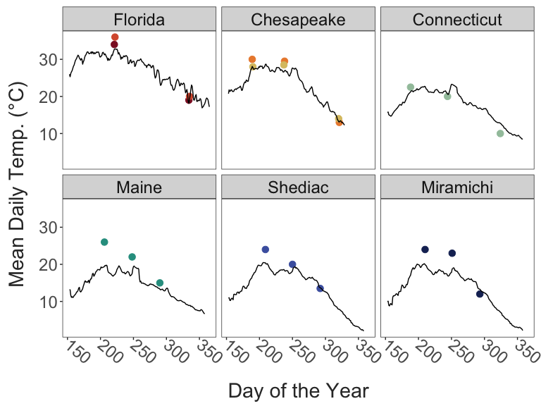

Exact locations for the sites are provided here:

|           Site           |    Region     |   Lat    |   Long    |
|:------------------------:|:-------------:|:--------:|:---------:|
|        Key Largo         |    Florida    | 25.28391 | -80.33014 |
|      Manatee River       |    Florida    | 27.50561 | -82.57277 |
|        Ft. Hamer         |    Florida    | 27.52488 | -82.43101 |
|        Tyler Cove        |   Maryland    | 38.35083 | -76.22902 |
|      Ganey’s Wharf       |   Maryland    | 38.80555 | -75.90906 |
|       Esker Point        |  Connecticut  | 41.32081 | -72.00166 |
|       Sawyer Park        |     Maine     | 43.90698 | -69.87179 |
| St. Thomas de Kent Wharf | New Brunswick | 46.44761 | -64.63692 |
|      Ritchie Wharf       | New Brunswick | 47.00481 | -65.56291 |

The latitudinal gradient covers a wide range of seasonality. Shown below
is the temperature range. While based on collection temperatures, and
therefore an underestimate of the total seasonal range of temperatures,
these patterns are representative of the expected latitudinal gradient
in seasonality.

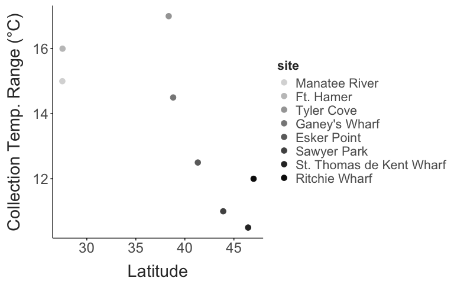

There was a general increase in the collection temperature range at
warmer sites. This provides an opportunity to disentangle some of the
traditionally proposed hypotheses about thermal adaptation
(macrophysiological gradients often include stable and warm environments
contrasted with cooler, more variable environment).

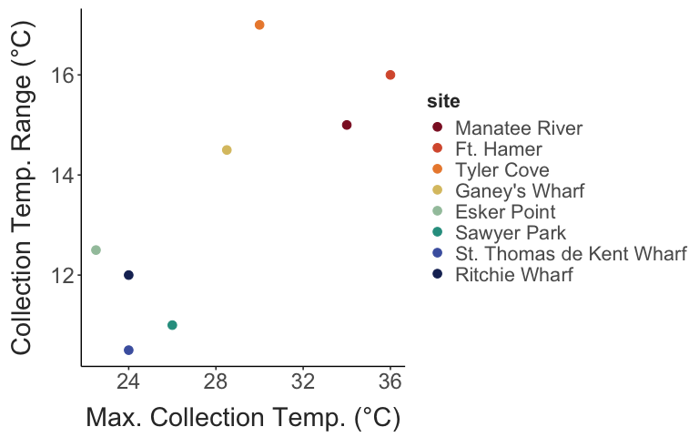

### Long-term site temperatures (MUR SST)

Daily sea-surface temperature for 2014–2023 was taken from the MUR SST
analysis (GHRSST Level 4, ~1 km) for each site, averaging the water
pixels within 5 km of the site (`Scripts/05_site_environment.R`). Where
MUR has no water near a site (Ganey’s Wharf, Ritchie Wharf), the water
within 5 km of the nearest water pixel (14–19 km away) was used. MUR
agreed closely with nearby monitoring stations wherever it resolves the
site’s own water (mean bias −0.4 to +0.4 °C at Noank, New London, Gooses
Reef, Port Manatee, Portland and the Manatee River gauge). At Ganey’s
Wharf, Chesapeake Bay Program station ET5.1 (at the wharf) is 2–4 °C
warmer than MUR in spring and 1–1.7 °C colder in autumn, as expected for
a shallow upper estuary, so Ganey’s Wharf uses MUR corrected by the
station’s smoothed monthly bias. Ritchie Wharf has no station within 50
km and is flagged. Temperatures measured at collection (shallow wharf
water, often at midday) run 2–6 °C warmer than MUR in summer at the
northern sites; MUR describes the water mass the plankton live in and is
used for site climatology and the genomic analyses, while the measured
temperatures are used for acclimation in the CTmax models.

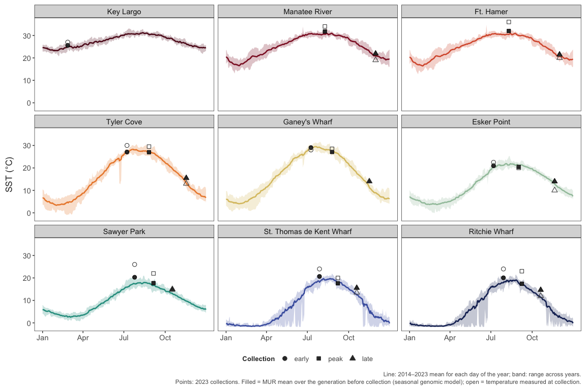

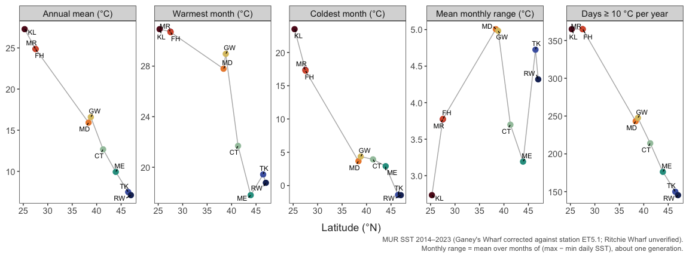

| Site | Lat (°N) | Annual mean | Jun–Nov mean | 95th pct | Warmest month | Coldest month | Monthly range | Days ≥ 10 °C | Note |
|:---|---:|---:|---:|---:|---:|---:|---:|---:|:---|
| KL | 25.3 | 27.3 | 29.2 | 31.2 | 30.9 | 23.5 | 2.7 | 365.0 |  |
| MR | 27.5 | 24.9 | 28.3 | 31.1 | 30.7 | 17.4 | 3.8 | 365.0 |  |
| FH | 27.5 | 24.9 | 28.2 | 31.0 | 30.7 | 17.3 | 3.8 | 365.0 |  |
| MD | 38.4 | 15.9 | 22.8 | 28.2 | 27.8 | 3.7 | 5.0 | 243.2 |  |
| GW | 38.8 | 16.6 | 22.9 | 29.2 | 29.0 | 4.4 | 5.0 | 247.6 | corrected (ET5.1) |
| CT | 41.3 | 12.7 | 18.4 | 22.0 | 21.7 | 3.9 | 3.7 | 214.0 |  |
| ME | 43.9 | 9.9 | 14.4 | 18.0 | 17.8 | 2.9 | 3.2 | 176.2 |  |
| TK | 46.4 | 7.5 | 14.1 | 19.5 | 19.4 | -1.4 | 4.7 | 149.9 |  |
| RW | 47.0 | 7.1 | 13.5 | 18.9 | 18.8 | -1.4 | 4.3 | 145.4 | unverified |

Site climatology from MUR SST, 2014–2023 (°C unless stated).

### Paired low- and high-salinity sites

Nested within each of the three regions (South, Central, and Northern
regions) are pairs of low and high salinity sites:

| Region  | Low.Salinity  |      High.Salinity       |
|:-------:|:-------------:|:------------------------:|
|  South  |   Ft. Hamer   |      Manatee River       |
| Central | Ganey’s Wharf |        Tyler Cove        |
|  North  | Ritchie Wharf | St. Thomas de Kent Wharf |

 

There are fairly well-established divergences between high salinity and
low salinity populations of *Acartia tonsa*. These sets of
geographically proximate sites potentially provide independent
comparisons of the effects of seasonality across salinity gradients.
Shown here are the collection conditions for these pairs of sites.
Temperature was typically similar across the pairs within each
collection, while salinity differences were fairly stable across
collections.

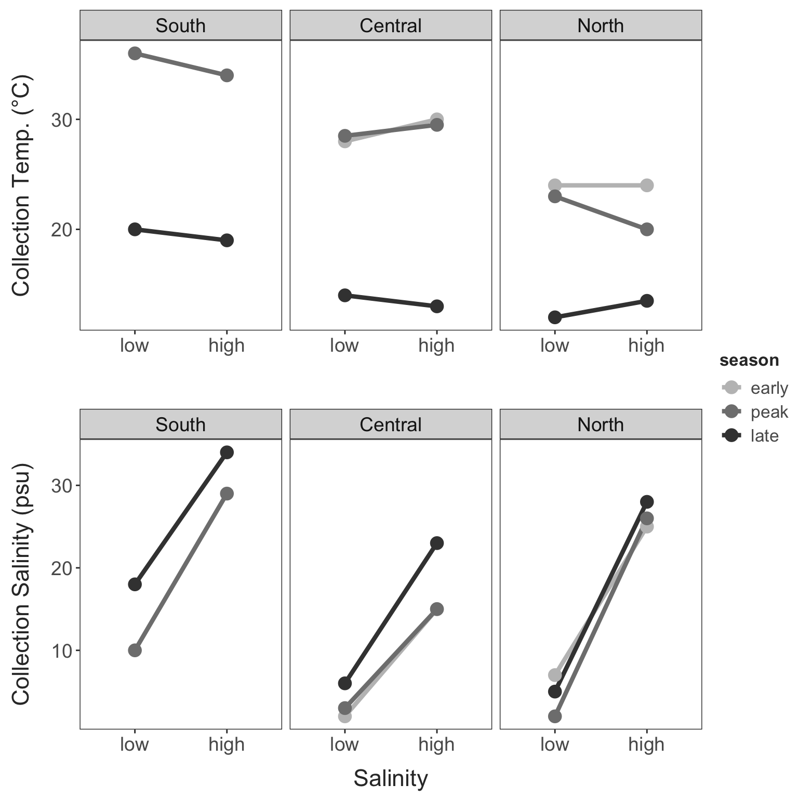

### Generations between collections

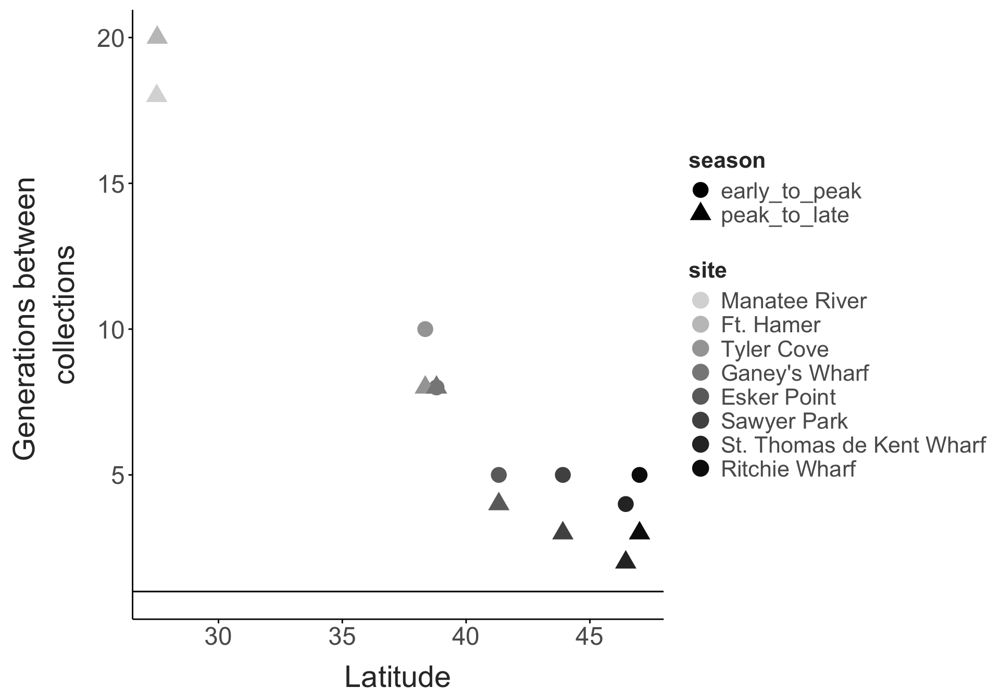

## 2. Phenotypes: thermal limits and body size

### Critical Thermal Limits

A total of 427 individuals were examined. Critical thermal limits and
body size measurements were made before individuals were preserved in
ethanol. We excluded data for individuals that were either later
classified as males or juveniles, that we were unable to assign to a
clade, or that were identified as individuals from a closely related
species (*Acartia hudsonica*). With these individuals excluded, the full
data set contains 395 adult females with CTmax and body size
measurements, and clade identifications.

Critical thermal maxima (CTmax) was measured using a custom setup. The
method uses a standard dynamic ramping assay to determine the maximum
temperature individuals could sustain normal functioning. This differs
from lethal temperatures, and indeed, all individuals recovered
following the assay.

Individuals were rested for one hour after collection before the assay.
During the assay, copepods were held in artificial seawater, composed of
bottled spring water and Instant Ocean salt mix adjusted to match
collection salinities. During the assay, several ‘control’ individuals
were maintained in this solution at ambient temperatures without the
temperature ramp to ensure that there was no background changes in
behavior or mortality. When sorting individuals from the plankton tow
contents, they were held in a 50:50 mix of 60 um filtered water from the
collection site and artificial seawater as an additional acclimation
step.

Sample sizes varied slightly across experiments, but generally ~20
individuals were measured per season at each site. The major exceptions
were the early samples from the Florida sites and the late sample from
Sawyer Park (Maine). Only two sets of samples (peak and late) were
collected from Fort Hamer and Manatee River. The late season collection
from Sawyer Park occurred after *Acartia tonsa* abundance decreased, and
samples were dominated by *Acartia hudsonica*. Thermal limits were
measured for all *A. tonsa* individuals recovered. No samples were
collected from Key Largo for this project, as *Acartia tonsa* wasn’t
present in the water during the peak season, likely due to a recent
extreme heat event.

| site                     | early | peak | late |
|:-------------------------|------:|-----:|-----:|
| Manatee River            |     0 |   17 |   20 |
| Ft. Hamer                |     0 |   19 |   19 |
| Tyler Cove               |    20 |   19 |   20 |
| Ganey’s Wharf            |    20 |   20 |   20 |
| Esker Point              |    17 |   19 |   20 |
| Sawyer Park              |    14 |   17 |    8 |
| St. Thomas de Kent Wharf |    15 |   19 |   19 |
| Ritchie Wharf            |    16 |   18 |   19 |

Shown below are the measured CTmax values. Individual measurements are
shown in small points for each collection. The large points indicate the
mean values for each collection.

### Body Size

Following the CTmax assay, individuals were photographed for body size
measurements. Prosome lengths were measured from these photographs using
a scale micrometer and the software ImageJ. These measurements are shown
below. As before, large points indicate the mean body size. While less
cohesive than CTmax, a general trend of increasing body size with
latitude and time of year can be seen.

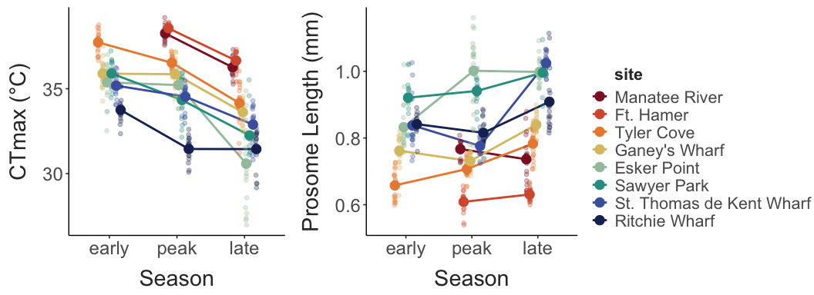

### Warming tolerance

Warming tolerance (the difference between thermal limits and
environmental temperatures) is a commonly used metric of climate
vulnerability. We calculated this as the difference between measured
CTmax values and the collection temperature. Smaller warming tolerance
values indicate that populations were nearer to their upper thermal
limits, suggesting greater vulnerability.

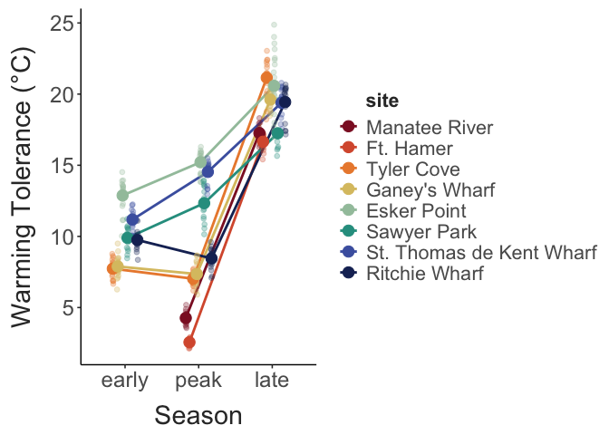

### Trait correlations

Regardless of the underlying mechanism (genetic differentiation or
phenotypic plasticity), we expect that collections from warmer waters
should yield copepods with higher thermal limits and smaller body sizes.
Our observations largely fit this expectation, with strong increases in
CTmax at higher temperatures, and a general decrease in prosome lengths
as temperature increased. There was a larger correlation between CTmax
and temperature than size and temperature. There are myriad reasons this
might be observed, but one potential is the potential for acclimation of
thermal limits. Body size is fixed in the adult stage, while CTmax can
continue to vary as water temperature changes. This is indirect evidence
for the importance of rapid acclimation in the observed patterns.

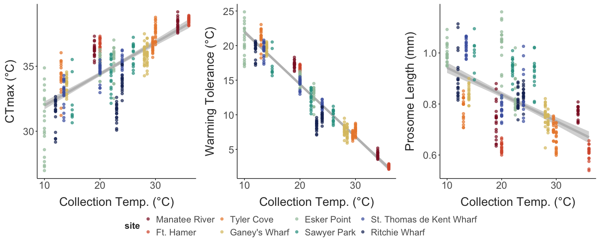

The relationship between prosome length and CTmax is also of interest.
Given that larger body sizes are associated with cold
adaptation/acclimation, it is unsurprising that there is a general trend
of decreasing thermal limits with increasing size. Individual regression
lines for each site are also included - the dark grey lines in the
background represent the ‘universal’ regression for that site, with
individual colored regression lines for each collection. At most sites,
evidence for this negative relationship between CTmax and body size is
observed across collections rather than within collections, suggesting
this relationship is primaly a reflection of the response to seasonal
temperature variation.

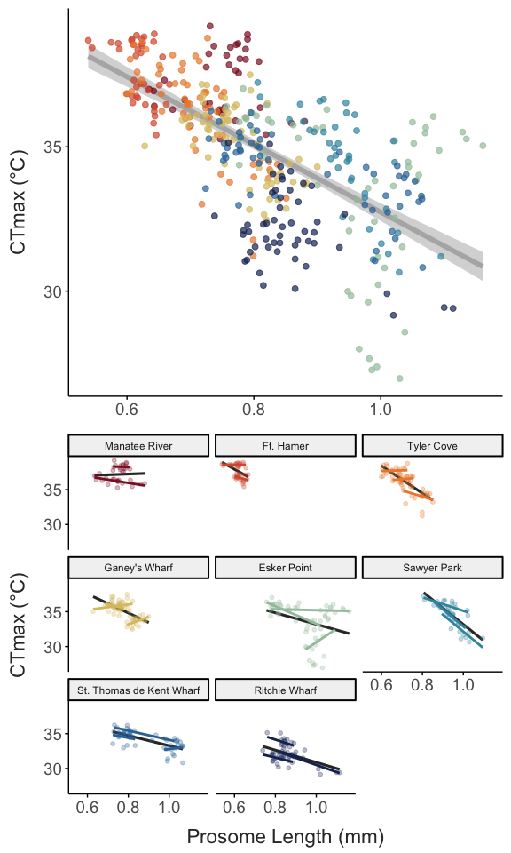

### Paired sites: trait differences

The three pairs of cross-salinity comparisons do show evidence for
fine-scale trait divergence, although there was no consistent pattern in
the direction or magnitude of differences. CTmax was similar across
sites in the Southern and Central pairs. In the Northern pair, CTmax
tended to be slightly lower for individuals from the low salinity site.
Size was more variable between the paired sites. In the South,
individuals from the low salinity site were consistently smaller than
individuals from the high salinity site, despite experiencing similar
temperatures. By contrast, in the Central pair individuals from the low
salinity site tended to be slightly larger than those from the high
salinity site, although the magnitude of this difference this varied
seasonally. In the Northern pair, individuals from the low salinity site
were slightly larger than individuals from the high salinity site during
the early and peak season collections, but there was an abrupt reversal
of this pattern during the late collection, when individuals from the
high salinity site were much larger than individuals from the low
salinity site.

Note that two of the three pairs also differ in clade composition:
Manatee River and Ft. Hamer hold different F lineages (F-MR, F-FH), and
St. Thomas de Kent Wharf and Ritchie Wharf differ in their mix of clades
X and IV (Section 3). Differences between paired sites therefore combine
environment, lineage and clade composition; Section 4 separates them.

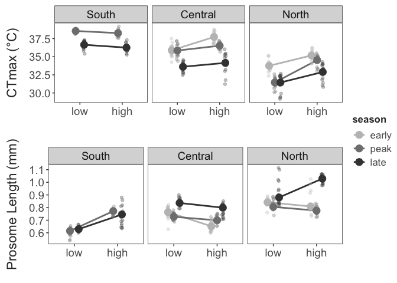

### Assay checks

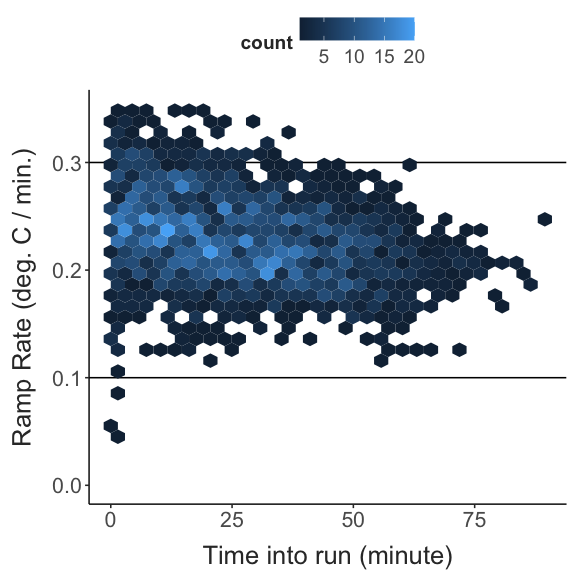

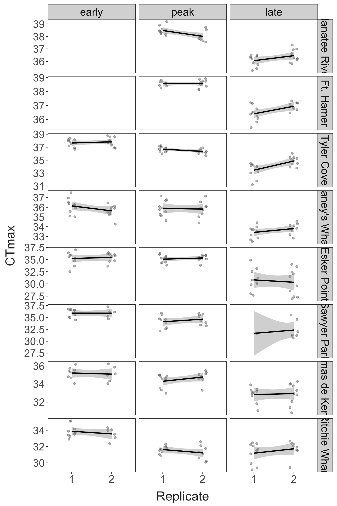

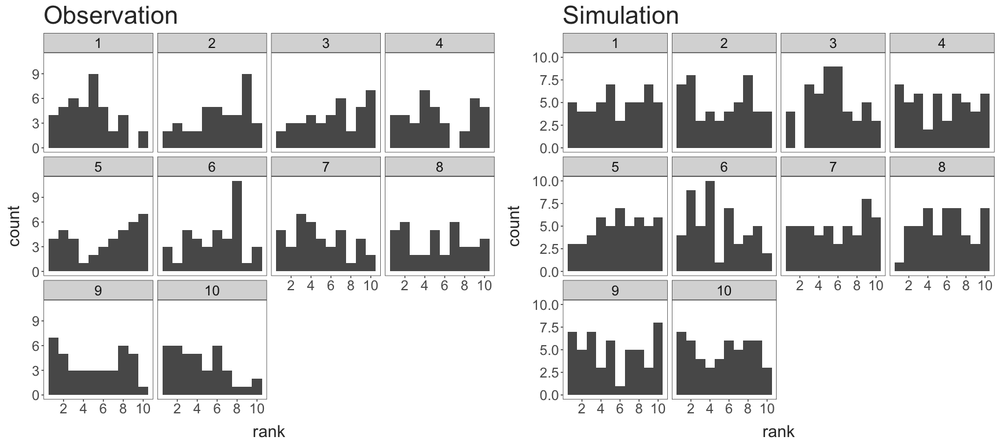

## 3. Low-coverage whole genome data

After phenotyping, each individual was preserved in 95% ethanol.
Individual DNA libraries were prepared using Twist Bio 96-plex prep
kits, then sequenced on two lanes of an Illumina NovaSeq X Plus 25B by
Novogene (436 libraries). Read processing, mapping, site filtering,
clade assignment and population genomic analyses were run on the Unity
cluster (Snakemake project `aton_lcwg`). The figures in this section are
built from the exported result tables (`Raw_data/cluster_exports/`;
export in use: aton_lcwg_tables_2026-10-30). *Acartia hudsonica*
libraries are excluded throughout.

### Sequencing summary

Reads per library varied over two orders of magnitude; 23 libraries
failed (\< 500,000 reads, 20 of them on plate 5). The reference genome
is closest to clade X: the other clades map less well and yield less
usable depth per read, on every plate. Libraries with low mapping and
high GC content carry DNA from other organisms (Section 3.3).

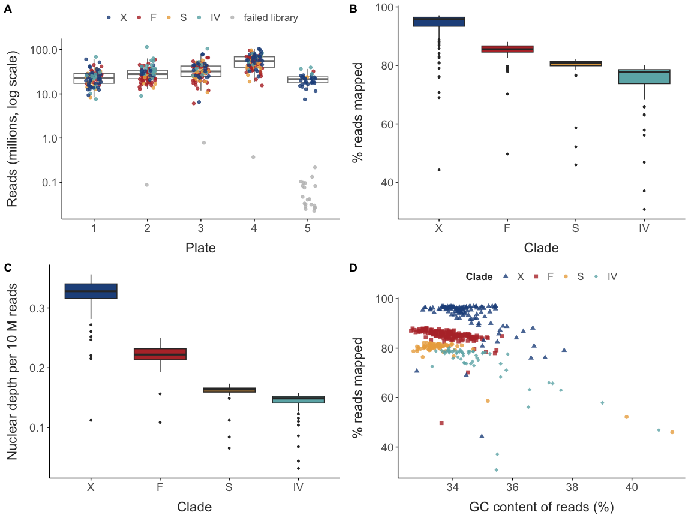

There is no clear relationship between the number of reads and
individual size or CTmax (phenotype analysis set only).

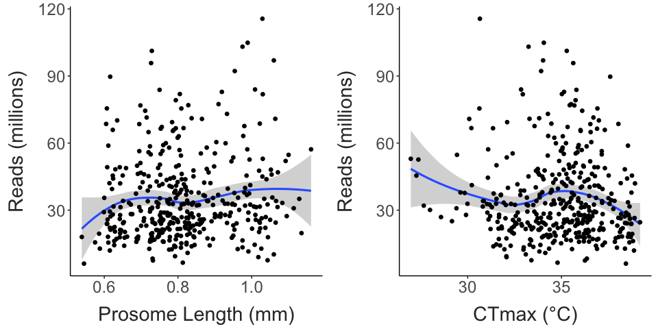

|           |       Sum Sq |  Df |   F value |   Pr(\>F) |
|:----------|-------------:|----:|----------:|----------:|
| size      | 9.603839e+14 |   1 | 2.6795203 | 0.1024488 |
| ctmax     | 1.671663e+11 |   1 | 0.0004664 | 0.9827809 |
| Residuals | 1.404992e+17 | 392 |        NA |        NA |

### Site filtering

Genotype-likelihood analyses use only the 15 chromosomes, minus
soft-masked repeats, nuclear copies of mitochondrial DNA (NUMTs) and
SNPs flagged as collapsed paralogs by ngsParalog. Because of the
reference bias, far fewer sites pass the missing-data filter (data in at
least 50% of individuals) in clades S and IV than in X.

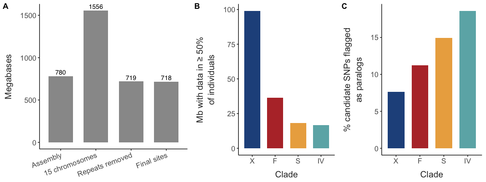

### Clade identity

Clades were assigned in two independent ways. **Mitochondrial:** each
individual’s reads were mapped to one partial mitogenome per clade, and
the clade was taken from the reads covering the COI barcode region.
**Nuclear:** genome-wide genotype likelihoods (PCAngsd, NGSadmix) on all
kept libraries. The two agree for every individual. Two libraries
contained DNA from individuals of two different clades (both
mitochondrial and nuclear signals mixed) and were excluded.

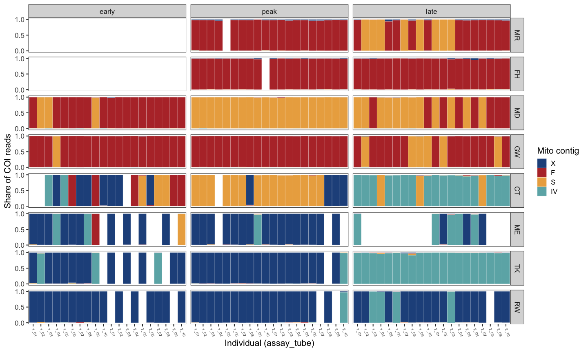

All four clades are cleanly separated in the nuclear genome. Clade F
splits further into site-specific sub-lineages (Manatee River, Ft.
Hamer, and the Chesapeake/New England group), visible on PC4 and at K =
5–6.

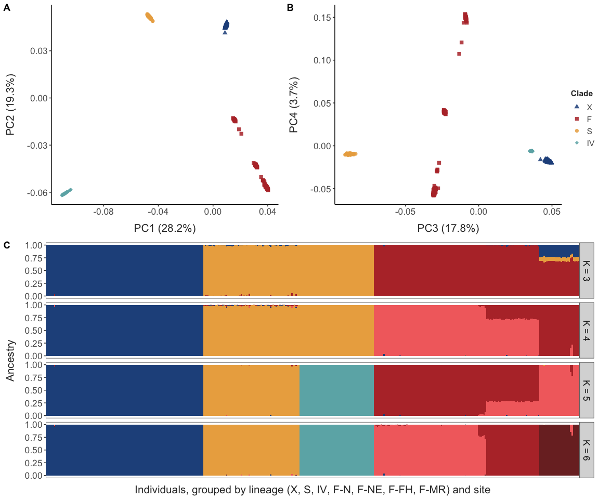

Within clade F, the sub-lineages are clearly separated (2–6% COI
divergence) but much less divergent than the clades are from each other
(12–18%). We therefore analyse four clades, and keep the F sub-lineage
as an annotation.

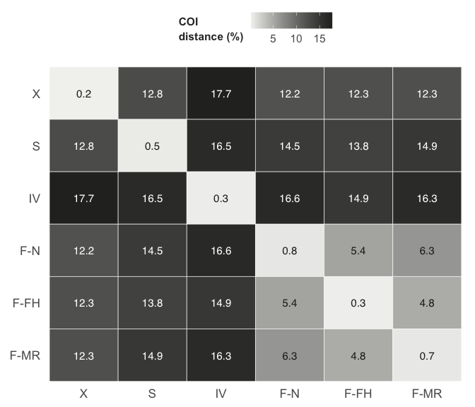

#### Lineage phylogeny: mitochondrial vs nuclear

Mitochondrial relationships come from the COI maximum-likelihood tree
(IQ-TREE, all individuals and reference haplotypes), reduced to one
representative per lineage (the individual with the most complete COI
sequence) and rooted on *A. hudsonica*. Support values are ultrafast
bootstraps of the corresponding node in the full tree. Nuclear
relationships come from genome-wide individual covariances (PCAngsd, all
individuals): pairwise distances dij = Cii +
Cjj − 2Cij were averaged between lineages and
corrected for within-lineage distance (net distance), and a
neighbour-joining tree was built from them (midpoint-rooted; support =
percentage of 200 bootstrap replicates resampling individuals within
lineages).

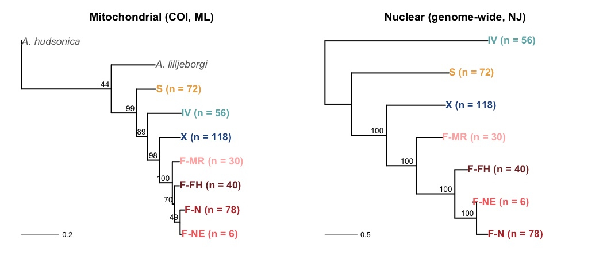

The two genomes give the same tree. Unrooted, both split the clades into
{S, IV} and {X, F}, with X sister to F (support 98 in COI, 100 in the
nuclear tree), and both order the F lineages the same way: F-MR first,
then F-FH, then F-N with F-NE. They differ only in where the root falls,
and the nuclear root is a midpoint placement, not an estimate.
Mito-nuclear concordance at every level means the lineages are not
mitochondrial types introgressed onto a shared nuclear background: they
are separate, non-interbreeding (or rarely interbreeding) genetic units.
Nuclear distances from the PCAngsd covariance summarise genome-wide
divergence rather than coming from a substitution model, so branch
lengths in the two panels are not comparable.

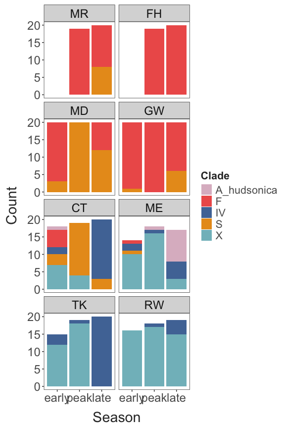

#### Seasonal turnover of lineages

Lineage composition is compared among the collections at each site
(sequenced individuals only; unassigned libraries excluded). Each site
gets a Fisher exact test of lineage × season (simulated p, 10⁴
replicates). The combined test uses the sum of per-site χ² statistics,
with season labels shuffled among individuals within each site (10⁴
permutations); sites with a single lineage contribute nothing.

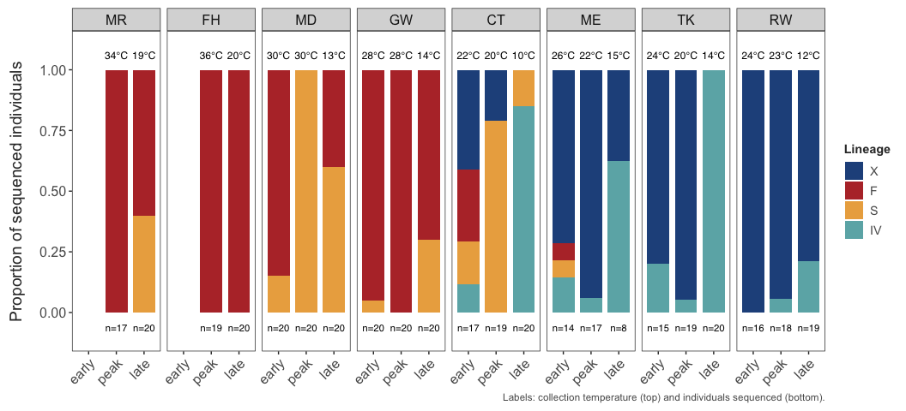

| Site | Seasons | Lineages | Individuals | Fisher p | Composition |
|:---|---:|---:|---:|:---|:---|
| MR | 2 | 3 | 37 | 0.0030 | peak: F-FH 1, F-MR 16; late: S 8, F-MR 12 |
| FH | 2 | 1 | 39 | – | peak: F-FH 19; late: F-FH 20 |
| MD | 3 | 2 | 60 | \<1e-04 | early: S 3, F-N 17; peak: S 20; late: S 12, F-N 8 |
| GW | 3 | 2 | 60 | 0.0140 | early: S 1, F-N 19; peak: F-N 20; late: S 6, F-N 14 |
| CT | 3 | 4 | 56 | \<1e-04 | early: X 7, S 3, IV 2, F-NE 5; peak: X 4, S 15; late: S 3, IV 17 |
| ME | 3 | 4 | 39 | 0.0064 | early: X 10, S 1, IV 2, F-NE 1; peak: X 16, IV 1; late: X 3, IV 5 |
| TK | 3 | 2 | 54 | \<1e-04 | early: X 12, IV 3; peak: X 18, IV 1; late: IV 20 |
| RW | 3 | 2 | 53 | 0.1195 | early: X 16; peak: X 17, IV 1; late: X 15, IV 4 |

Lineage composition by season at each site. Combined test across sites:
χ² = 166, permutation p \<1e-04.

### Genetic differentiation within clades

Population structure and diversity are analysed within each clade (X, F,
S, IV), with populations defined as clade × site × sampling event (n ≥
8). Within clade F, site differences include differences between F
sub-lineages.

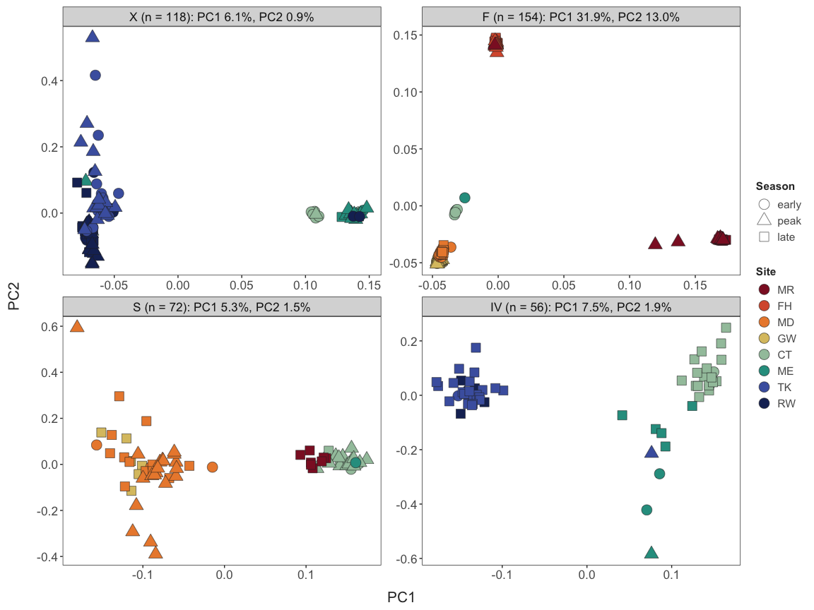

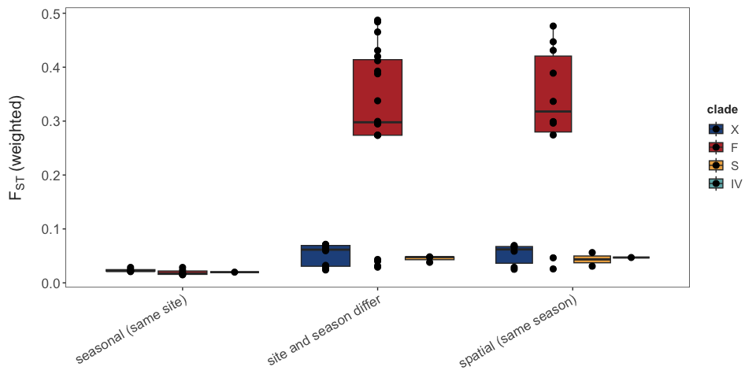

#### Isolation by distance

Genetic differentiation between sites within each clade, against the
straight-line distance between sites. FST is averaged over
the season pairs available for each pair of sites. F pairs between
sub-lineages (F-MR, F-FH, F-N) are shown separately: they reflect
divergence between lineages, not gene flow between populations.
Straight-line distances underestimate the distance by sea (around
Florida, and around Nova Scotia between Maine and the Gulf of
St. Lawrence), and each clade has only 2–4 sites, so this is
descriptive.

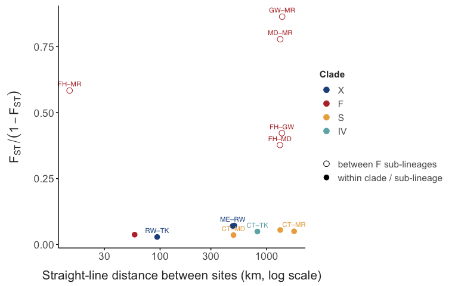

Shown below are estimates of diversity across the data set. Tajima’s D
can be used to detect random vs. non-random evolutionary processes
(e.g. drift vs. selection). A value near zero indicates neutral
processes and a stable population size. Negative values indicate an
excess of rare alleles, suggesting possible recent selective sweeps or
population expansion after a bottleneck. Positive values indicate
possible population contraction or balancing selection, resulting in
fewer rare alleles than expected.

Most values of Tajima’s D for our data set are small (within 0.5 of 0).
A few samples reached moderate values around -1 and 1. Interestingly,
all cases are from the two sites in the Chesapeake, with a low Tajima’s
D value for S clade individuals at the high salinity site, and high
values for F clade individuals at both high and low salinity sites.

We also calculated nucleotide diversity, which represents the average
number of nucleotide differences between randomly sampled sequences in a
population. Theta values tended to be high, with the exception of F
Clade individuals at the low salinity site in Florida and the two sites
in the Chesapeake.

We note that these diversity metrics should only be compared within
clades since reference bias changes which sites are usable in each
clade.

Within sites, there is notably little change in these metrics across
seasons. Three general within-clade patterns can be seen across sites:

1.  **Increasing Tajima’s D and decreased nucleotide diversity,** as
    seen in Clade F. This may indicate serial founder effects. Diversity
    should fall steadily in the direction of expansion ([Excoffier et
    al. 2009](https://doi.org/10.1146/annurev.ecolsys.39.110707.173414)).
    For a clade spreading north since the last glacial maximum, northern
    sites would be expected to have lower θπ and higher D ([Hewitt
    2000](https://doi.org/10.1038/35016000)). This suggests a low
    latitude origin for this clade.
2.  **Consistently low Tajima’s D and consistently high nucleotide
    diversity**, as seen in Clades S and IV (although note the limited
    sampling for these clades). This pattern suggests large,
    well-connected populations. There may have been population expansion
    before sites diverged, or there may be substantial gene flow between
    populations keeping them similar ([Excoffier et
    al. 2009](https://doi.org/10.1146/annurev.ecolsys.39.110707.173414)).
3.  **Consistently small Tajima’s D and consistently high nucleotide
    diversity**, as seen in Clade X. While this typically would indicate
    large, stable populations, Clade X is found only at the high
    latitude sites, where populations of *Acartia tonsa* are present
    during only part of the year, exhibiting drastic fluctuations in
    population size over this period. This may indicate the importance
    of an egg bank / resting eggs. If the population is generated each
    year by hatching out of eggs laid over many previous years,
    diversity would remain high. The egg bank acts as a store of
    diversity, so a brief active season doesn’t mean a small genetic
    population ([Hairston
    1996](https://doi.org/10.4319/lo.1996.41.5.1087)). Resting eggs are
    well documented in *Acartia* (Marcus 1996, *Hydrobiologia*
    320:141–152). In Narragansett Bay, *A. tonsa* replaces the
    egg-banking *A. hudsonica* each summer ([Sullivan & McManus
    1986](https://doi.org/10.3354/meps028121)), the same seasonal
    turnover your ME site shows. Under these dynamics, individual sites
    may retain distinct populations, as seen in the within-clade PCAs
    above.

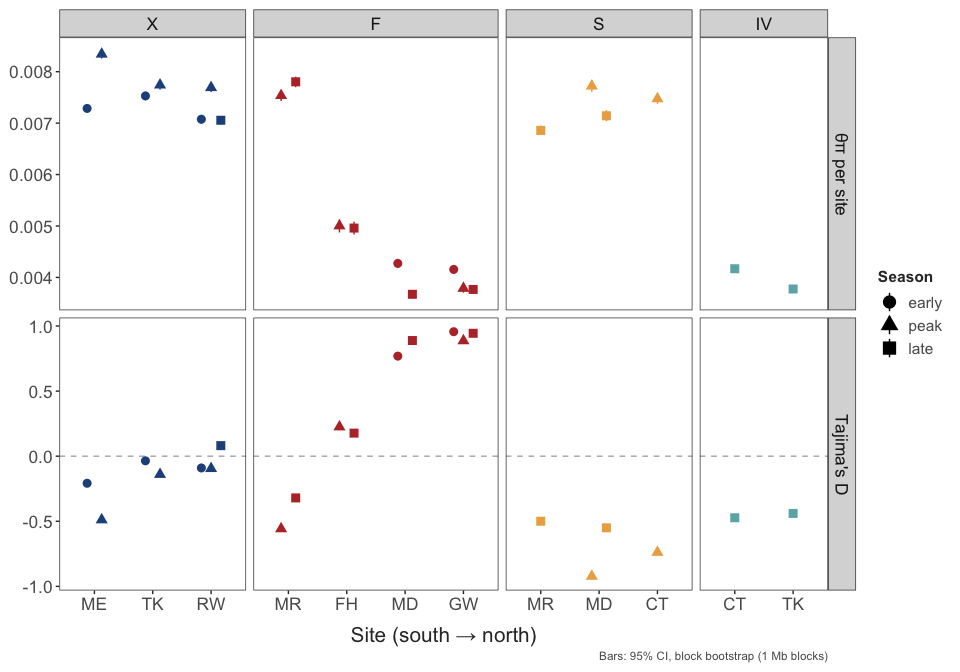

Diversity is compared within clades only: reference bias changes which
sites are usable in each clade. The spectra are folded (no outgroup),
and low-coverage data shift the absolute values of Tajima’s D, so
differences between populations of the same clade are more informative
than whether D is above or below zero. Confidence intervals come from a
block bootstrap over 1 Mb blocks; populations of 8 individuals (F MD
late, S MR late) are the least precise. \### Linkage disequilibrium

LD was estimated with ngsLD within each clade on every fifth SNP (MAF ≥
0.05), for a random 2% of SNP pairs up to 100 kb apart, and averaged in
distance bins. Dashed lines show the r² expected between unlinked SNPs
from sample size alone (≈ 1/n). LD decays to near that level within a
few kb in X, S and IV, as expected for very large long-term population
sizes. The higher plateau in F reflects allele-frequency differences
between the F sub-lineages pooled in the clade, not physical linkage.

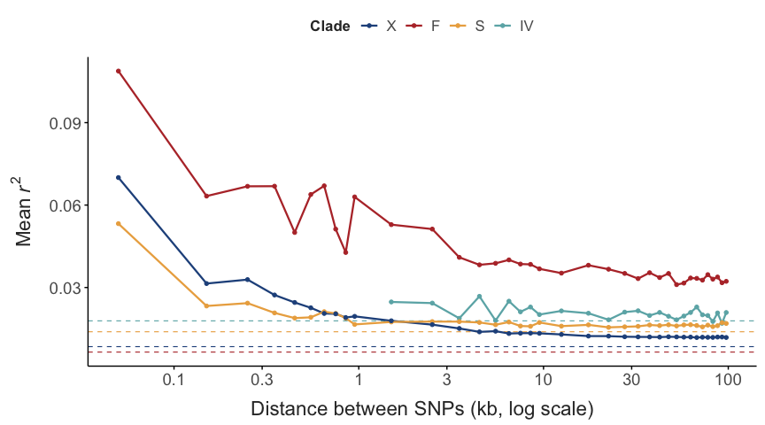

### Relatedness and sample quality

Relatedness was estimated with ngsRelate for every pair of individuals
within each population. KING-robust kinship does not depend on allele
frequencies, so it is less affected than *r*ab by the small
samples per population: unrelated pairs fall near or below 0,
second-degree relatives near 0.125 and first-degree relatives near 0.25.
In panel B, related pairs move towards high R1 and high KING; pairs
above 0.1 are labelled.

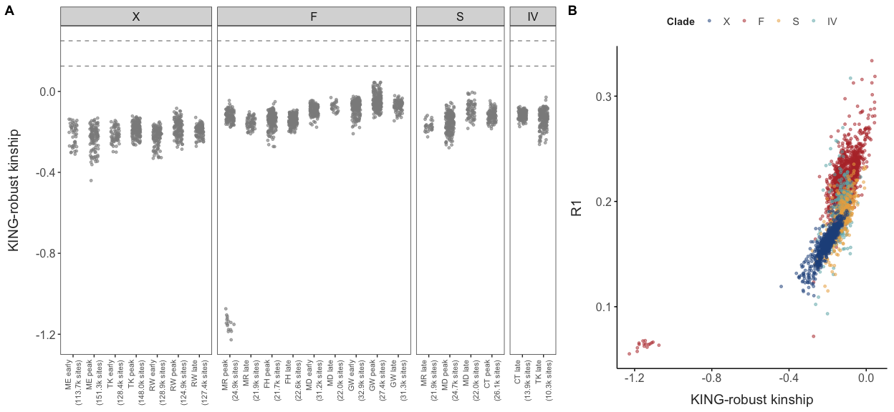

In MR peak, MR_peak_1_09 belongs to the F-FH sub-lineage while the rest
are F-MR, so its kinship with every other individual is strongly
negative (the cluster near −1.1). MR_peak_2_04 and MR_peak_2_05 carry
about 15% and 22% F-N ancestry (NGSadmix, K = 6) and have elevated
kinship with each other (KING 0.20, R0 0.11). The heterozygosity check
below shows both are far more heterozygous than any other F individual
(F = −0.18 and −0.22; clade median 0.13), so their libraries most likely
contain DNA from a second individual rather than coming from admixed
relatives. On library plate 3 they sit in wells F11 and G11, directly
next to GW early individuals (F-N; wells F10 and G10). Both were
excluded from the genomic analyses within clades
(`clades.exclude_samples` in the cluster config) and are not shown here;
their phenotype data are kept. With them removed, no pair in any
population reaches second-degree kinship.

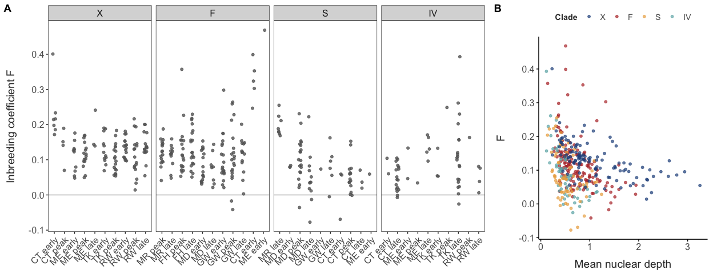

Per-individual inbreeding coefficients (PCAngsd, allowing for structure
within each clade) flag libraries that are more heterozygous than
expected (strongly negative F), the signature of DNA from two
individuals in one library. Individuals more than 4 robust SDs below
their clade’s median are labelled. High F mostly reflects low sequencing
depth (panel B: F falls with depth), so only unusually low values are
informative. MR_peak_2_04 and MR_peak_2_05 (F = −0.18 and −0.22) were
excluded on this basis and no longer appear; no other individual stands
out.

### Local PCA and candidate inversions

Each clade’s genome was split into windows of 2,000 SNPs, and the
population structure in each window (top two PCs of the covariance among
individuals) was compared between all windows (lostruct; Li & Ralph
2019). Windows were then placed on MDS axes: most of the genome shares
the same structure and clusters near zero; regions with distinct
structure, such as inversions, stand out as runs of windows far from
zero. Windows more than 4 robust SDs from the median are coloured.

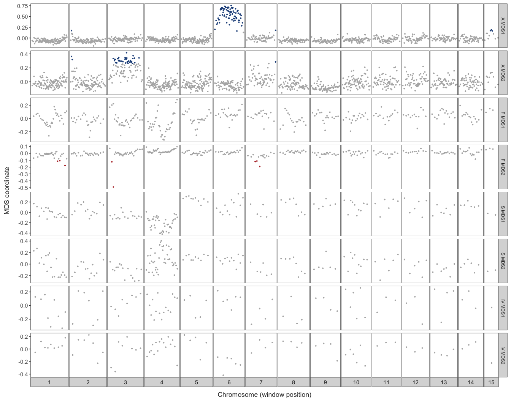

For each candidate region (at least 5 windows, mostly outliers),
individuals are placed by their average PC1 score across the region’s
windows. An inversion typically splits individuals into three groups
(the two homozygous arrangements and the heterozygotes); a region
tracking site or sub-lineage instead points to differentiation, and a
few individuals far from everyone else to a rare variant arrangement or
introgression.

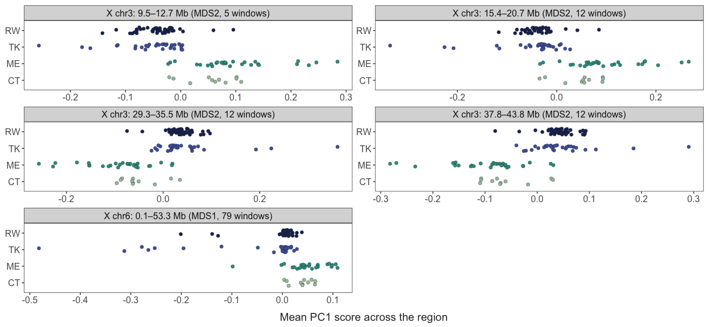

#### Follow-up of the candidate regions

Each candidate region (and a control region on chromosome 1 with no
local-PCA signal) was analysed on its own: a PCA of the region
(PCAngsd), each individual’s heterozygosity inside the region relative
to its genome-wide heterozygosity, and LD over distances up to 2 Mb. An
inversion shows as groups on the regional PC1 with heterozygotes raised
in heterozygosity (ratio above the bulk) and homozygotes for the rarer
arrangement lowered; suppressed recombination raises long-range LD when
both arrangements are common.

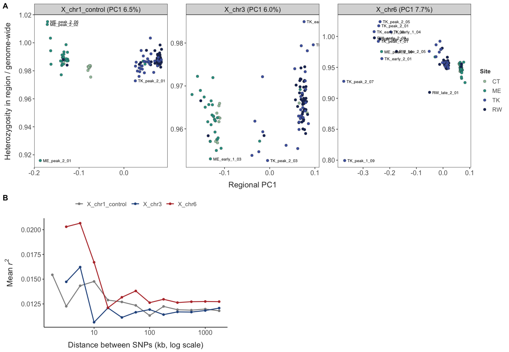

**Chromosome 6 (X)** fits a rare chromosomal variant such as an
inversion. A minority of individuals, almost all from St. Thomas de Kent
Wharf and a few from Ritchie Wharf, sits apart on the regional PC1. Most
of them are about 5% more heterozygous on chromosome 6 than their
genome-wide average, as expected for heterozygous carriers, while the
two most extreme individuals (TK_peak_1_09, TK_peak_2_07) are less
heterozygous, as expected for homozygotes of the rare arrangement. At
this frequency (roughly 5% of chromosomes overall) LD across the whole
sample is raised only slightly (panel B: higher at short distances and
marginally at 0.1–2 Mb than on the control chromosome). **Chromosome 3
(X)** does not: individuals split by site as on the control chromosome,
with no heterozygosity classes; only two or three TK early individuals
stand out on PC2 with slightly raised heterozygosity, which could be a
smaller rare variant within the region.

### Parasites and symbionts

Reads that did not map to the *A. tonsa* reference were screened for
small-subunit rRNA (phyloFlash, SILVA 138.1). Each read pair was
assigned to the shared ancestor of all equally good database hits, at a
rank limited by its identity, and host (*Acartia*) rRNA was removed. An
organism group was called present at ≥ 5 read pairs and ≥ 2 per million
library pairs (`Scripts/04_micro_calls.R`). Parasites (*Paradinium*,
trematodes) and epibionts (apostome and peritrich ciliates) show strong
site × season patterns: apostomes in every Connecticut late-season
individual, trematodes in most Ritchie Wharf peak-season individuals,
and *Zoothamnium* on late-season Maine and St. Thomas de Kent Wharf
copepods.

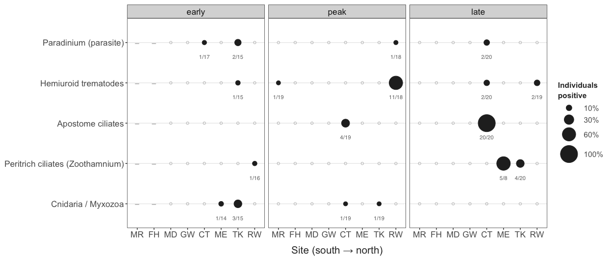

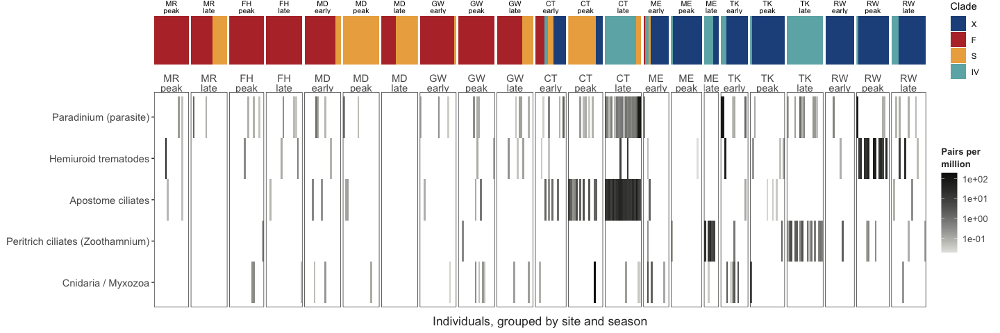

Kinetoplastids are present at low levels in most individuals, mostly at
the northern sites, and are treated as non-pathogenic background;
crustacean (Malacostraca) DNA is likely diet.

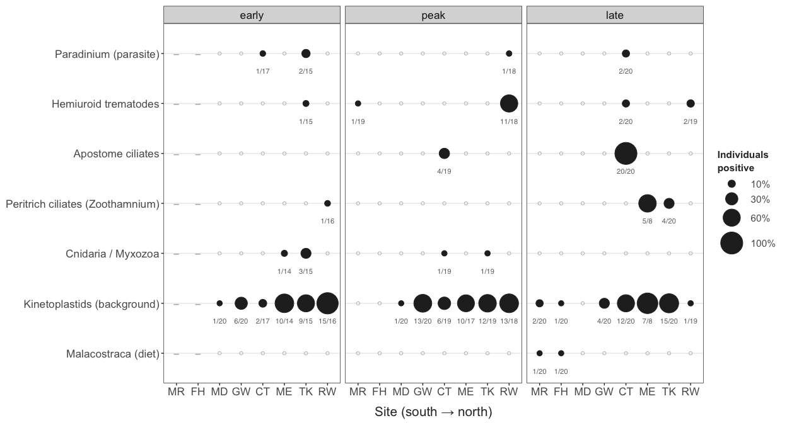

### Seasonal allele-frequency change

Allele frequencies per population at the unlinked SNP set (one SNP per
10 kb; Section 3.2, LD) were compared between seasons within each site.
Temporal differentiation is Nei & Tajima’s Fc ([Nei & Tajima
1981](https://doi.org/10.1093/genetics/98.3.625)) over SNPs with ≥ 5
individuals with data in both samples and a mean minor-allele frequency
of 0.05–0.95. Under the temporal method, Fc ≈
t/(2Ne) + sampling noise of both samples, so Ne
follows once the sampling noise is subtracted ([Waples
1989](https://doi.org/10.1093/genetics/121.2.379); [Jorde & Ryman
2007](https://doi.org/10.1534/genetics.107.075481)).

**Calibrating sampling noise.** With \< 1× coverage, frequencies are
sampled twice, once through the individuals and once through the reads,
so an individual contributes less than two chromosomes of information
([Jónás et al. 2016](https://doi.org/10.1534/genetics.116.191197)).
Pool-seq studies handle this with an “effective number of chromosomes”
([Feder et al. 2012](https://doi.org/10.1371/journal.pone.0048588);
[Bergland et al. 2014](https://doi.org/10.1371/journal.pgen.1004775);
[Machado et al. 2021](https://doi.org/10.7554/eLife.67577)). Here it was
measured directly: each population was split at random into two halves
(two replicates), allele frequencies were estimated for each half, and
Fc between the halves (pure sampling noise) was compared with
the 1/(2n) expectation. The ratio, c, is the effective number of
chromosomes per individual divided by two, and the sampling term for any
sample becomes 1/(2cn). This split-half calibration is an empirical
resampling check rather than a named published method.

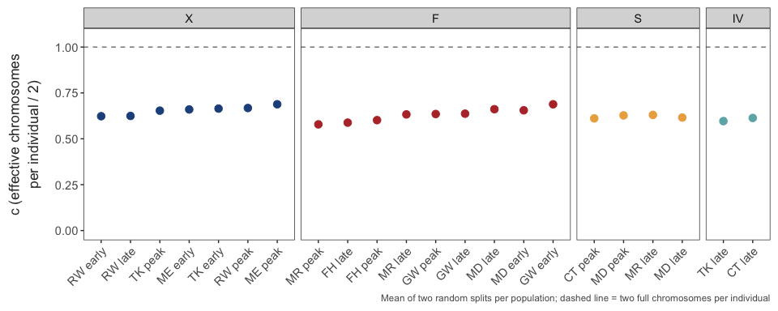

Every population gives c ≈ 0.6–0.7 (about 1.2–1.4 effective chromosomes
per individual), and the two random splits agree to within 0.02. The
calibration is therefore stable and similar across clades, sites and
seasons.

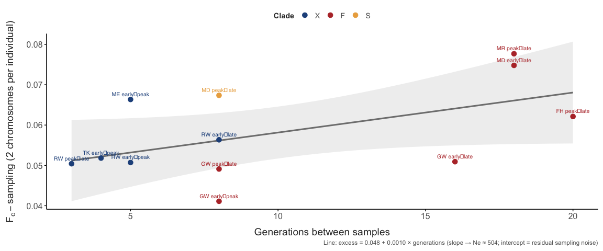

| Clade | Pair | Generations | SNPs | Fc | Excess (calibrated) | Ne | Ne 95% CI |
|:---|:---|---:|---:|---:|:---|:---|:---|
| F | FH peak→late | 20 | 33199 | 0.151 | 0.0019 ± 0.0014 | 5398 | 2155 – ∞ |
| F | GW early→late | 16 | 27144 | 0.138 | 0.0055 ± 0.0021 | 1450 | 838 – 5377 |
| F | GW early→peak | 8 | 27438 | 0.114 | 0.0036 ± 0.0018 | 1113 | 564 – 38734 |
| F | GW peak→late | 8 | 30102 | 0.136 | -0.0007 ± 0.0023 | ∞ | 1029 – ∞ |
| F | MD early→late | 18 | 20682 | 0.199 | 0.0107 ± 0.0019 | 838 | 620 – 1295 |
| F | MR peak→late | 18 | 24405 | 0.190 | 0.0052 ± 0.0015 | 1735 | 1118 – 3869 |
| S | MD peak→late | 8 | 24640 | 0.171 | 0.0039 ± 0.0016 | 1029 | 564 – 5888 |
| X | ME early→peak | 5 | 33373 | 0.179 | 0.0111 ± 0.0012 | 225 | 185 – 286 |
| X | RW early→late | 8 | 56735 | 0.147 | 0.0016 ± 0.0010 | 2459 | 1092 – ∞ |
| X | RW early→peak | 5 | 52812 | 0.136 | 0.0033 ± 0.0011 | 751 | 449 – 2297 |
| X | RW peak→late | 3 | 51775 | 0.139 | 0.0013 ± 0.0011 | 1176 | 434 – ∞ |
| X | TK early→peak | 4 | 46842 | 0.148 | 0.0023 ± 0.0016 | 880 | 375 – ∞ |

Temporal Fc and Ne per seasonal pair, with
sampling noise calibrated by the split-half c. CI from a
delete-one-chromosome jackknife of the excess; ∞ = excess not
distinguishable from zero.

| comparison |  snps |      r |    se |
|:-----------|------:|-------:|------:|
| ME vs TK   | 40454 | -0.013 | 0.006 |
| ME vs RW   | 40454 |  0.000 | 0.005 |
| TK vs RW   | 40454 | -0.002 | 0.006 |

Clade X: correlation of early→peak allele-frequency change between sites
(unlinked SNPs; SE from a delete-one-chromosome jackknife)

Calibration removes almost all of the apparent excess: with two
chromosomes per individual assumed, every pair showed an excess of ≈
0.05 regardless of the number of generations (open circles); with the
calibrated sampling term the excess is 0.000–0.011 (filled points). Most
pairs give Ne in the high hundreds to a few thousand, with
lower 95% bounds of roughly 400–2,000, and several upper bounds are
infinite (no drift detectable within the season). These estimates
describe drift over a few to ~20 generations within one season, not
long-term Ne, and they are at or above the lab estimate of
~400. ME early→peak is the exception (Ne ≈ 225, CI ≈
185–285): ME early is the smallest X sample (10 individuals), so a
modest error in its c would inflate the excess, and the value should be
checked before it is interpreted biologically. In clade X, early→peak
changes at different sites remain uncorrelated genome-wide (r ≈ 0).

**Per-SNP seasonal test.** For each SNP, the minor-allele count was
modelled with a binomial GLM, count ~ site + x, with each population
weighted by its effective number of chromosomes (2cn), as in the
*Drosophila* seasonal studies ([Bergland et
al. 2014](https://doi.org/10.1371/journal.pgen.1004775); [Machado et
al. 2021](https://doi.org/10.7554/eLife.67577)). Two versions of x were
fitted: (1) **time**, the collection day of year scaled from 0 (first
sampling event at a site) to 1 (last), which rewards change in the same
direction through the season at every site; and (2) **temperature**, the
mean MUR SST over the generation before each collection (Ganey’s Wharf
corrected against station ET5.1), which rewards change that tracks
temperature, so that a warming and a cooling step move frequencies in
opposite directions. Temperature matters because the season is not a
monotonic temperature ramp: water before the early and peak collections
was similar (or cooler at peak in the north), and the late collections
followed a strong cooling. The null distribution comes from permuting x
among each site’s sampling events, enumerating every distinct ordering
(time: X 11 and F 23 permutations, as reversing all sites only flips the
sign; temperature: X 23 and F 47). The genome-wide test asks whether
more SNPs reach a given p value with the real values than with the
permuted ones. Results are shown with and without chromosome 6, which
carries the likely inversion in clade X (Section 3.2). Clade S has a
single seasonal site (MD) with two samples, so it has no permutation
null and is not shown.

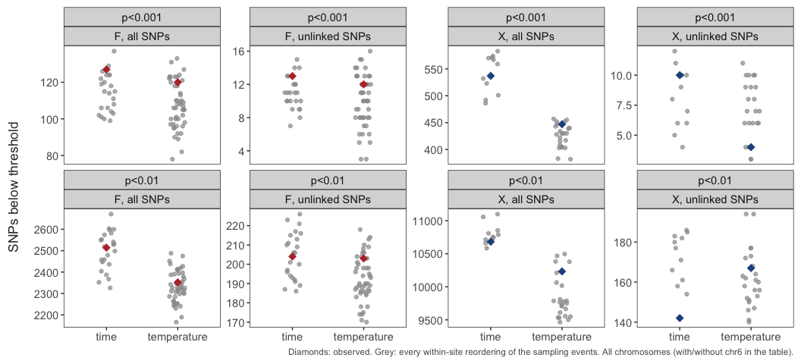

| Clade | SNPs | Model | Chromosomes | Threshold | Observed | Permutation mean | Permutation max | Rank of observed |
|:---|:---|:---|:---|:---|---:|---:|---:|:---|
| X | all | time | all chr. | p\<0.0001 | 17 | 19.5 | 28 | 11 / 12 |
| X | all | time | all chr. | p\<0.001 | 537 | 541.6 | 583 | 7 / 12 |
| X | all | time | all chr. | p\<0.01 | 10682 | 10798.4 | 11100 | 10 / 12 |
| X | all | time | no chr6 | p\<0.0001 | 16 | 18.6 | 24 | 11 / 12 |
| X | all | time | no chr6 | p\<0.001 | 496 | 507.7 | 540 | 9 / 12 |
| X | all | time | no chr6 | p\<0.01 | 10010 | 10164.2 | 10409 | 11 / 12 |
| X | all | temperature | all chr. | p\<0.0001 | 11 | 11.9 | 17 | 15 / 24 |
| X | all | temperature | all chr. | p\<0.001 | 447 | 425.2 | 457 | 6 / 24 |
| X | all | temperature | all chr. | p\<0.01 | 10233 | 9849.9 | 10496 | 5 / 24 |
| X | all | temperature | no chr6 | p\<0.0001 | 11 | 11.4 | 16 | 15 / 24 |
| X | all | temperature | no chr6 | p\<0.001 | 423 | 399.8 | 434 | 5 / 24 |
| X | all | temperature | no chr6 | p\<0.01 | 9615 | 9263.7 | 9844 | 5 / 24 |
| X | unlinked | time | all chr. | p\<0.0001 | 0 | 0.2 | 1 | 12 / 12 |
| X | unlinked | time | all chr. | p\<0.001 | 10 | 8.0 | 12 | 5 / 12 |
| X | unlinked | time | all chr. | p\<0.01 | 142 | 173.0 | 186 | 12 / 12 |
| X | unlinked | time | no chr6 | p\<0.0001 | 0 | 0.2 | 1 | 12 / 12 |
| X | unlinked | time | no chr6 | p\<0.001 | 10 | 7.3 | 11 | 2 / 12 |
| X | unlinked | time | no chr6 | p\<0.01 | 134 | 161.2 | 172 | 12 / 12 |
| X | unlinked | temperature | all chr. | p\<0.0001 | 0 | 0.2 | 1 | 24 / 24 |
| X | unlinked | temperature | all chr. | p\<0.001 | 4 | 7.1 | 11 | 22 / 24 |
| X | unlinked | temperature | all chr. | p\<0.01 | 167 | 161.5 | 194 | 8 / 24 |
| X | unlinked | temperature | no chr6 | p\<0.0001 | 0 | 0.2 | 1 | 24 / 24 |
| X | unlinked | temperature | no chr6 | p\<0.001 | 4 | 6.4 | 10 | 22 / 24 |
| X | unlinked | temperature | no chr6 | p\<0.01 | 158 | 150.7 | 181 | 9 / 24 |
| F | all | time | all chr. | p\<0.0001 | 2 | 3.3 | 9 | 19 / 24 |
| F | all | time | all chr. | p\<0.001 | 127 | 114.2 | 137 | 3 / 24 |
| F | all | time | all chr. | p\<0.01 | 2514 | 2498.2 | 2671 | 13 / 24 |
| F | all | time | no chr6 | p\<0.0001 | 2 | 3.0 | 9 | 19 / 24 |
| F | all | time | no chr6 | p\<0.001 | 116 | 103.2 | 122 | 3 / 24 |
| F | all | time | no chr6 | p\<0.01 | 2323 | 2286.2 | 2467 | 8 / 24 |
| F | all | temperature | all chr. | p\<0.0001 | 5 | 3.8 | 8 | 16 / 48 |
| F | all | temperature | all chr. | p\<0.001 | 120 | 107.5 | 133 | 13 / 48 |
| F | all | temperature | all chr. | p\<0.01 | 2352 | 2331.4 | 2488 | 17 / 48 |
| F | all | temperature | no chr6 | p\<0.0001 | 3 | 3.6 | 7 | 35 / 48 |
| F | all | temperature | no chr6 | p\<0.001 | 110 | 97.1 | 122 | 11 / 48 |
| F | all | temperature | no chr6 | p\<0.01 | 2162 | 2129.3 | 2305 | 16 / 48 |
| F | unlinked | time | all chr. | p\<0.0001 | 0 | 0.1 | 1 | 24 / 24 |
| F | unlinked | time | all chr. | p\<0.001 | 13 | 11.0 | 15 | 6 / 24 |
| F | unlinked | time | all chr. | p\<0.01 | 204 | 204.3 | 226 | 13 / 24 |
| F | unlinked | time | no chr6 | p\<0.0001 | 0 | 0.1 | 1 | 24 / 24 |
| F | unlinked | time | no chr6 | p\<0.001 | 12 | 9.9 | 14 | 6 / 24 |
| F | unlinked | time | no chr6 | p\<0.01 | 193 | 186.2 | 211 | 8 / 24 |
| F | unlinked | temperature | all chr. | p\<0.0001 | 0 | 0.1 | 1 | 48 / 48 |
| F | unlinked | temperature | all chr. | p\<0.001 | 12 | 10.1 | 16 | 20 / 48 |
| F | unlinked | temperature | all chr. | p\<0.01 | 203 | 192.9 | 218 | 13 / 48 |
| F | unlinked | temperature | no chr6 | p\<0.0001 | 0 | 0.1 | 1 | 48 / 48 |
| F | unlinked | temperature | no chr6 | p\<0.001 | 11 | 9.1 | 16 | 17 / 48 |
| F | unlinked | temperature | no chr6 | p\<0.01 | 189 | 176.2 | 206 | 10 / 48 |

Per-SNP seasonal GLM: SNPs below each p threshold with the real seasons
vs all within-site permutations (rank 1 = more than every permutation).

There is no genome-wide excess of seasonal SNPs in either clade, with
either model. With the real seasons, X and F have about as many low-p
SNPs as the permuted orderings, at every threshold, on both the unlinked
and the full SNP sets. Modelling temperature instead of time does not
change this: the closest to a signal is clade X on all SNPs (rank 5–6 of
24 at p \< 0.01 and p \< 0.001, i.e. p ≈ 0.2–0.25), which is not
significant and does not hold on the unlinked set. Removing chromosome 6
changes nothing, so the X inversion is not driving or masking a seasonal
signal. The genomic-control λ is close to 1 (X ≈ 1.1, F ≈ 1.0) for the
observed and permuted values alike, so the calibrated binomial weights
describe the sampling variance well. Together with the uncorrelated
early→peak changes across X sites, this means that any seasonal
selection in these populations acts on too few loci, or is too weak, to
show up genome-wide with 3–4 seasonal sites per clade, whether it is
modelled as a seasonal trend or as a response to temperature. Individual
SNPs with the smallest p values are listed in
`results/13_seasonal/*.top.tsv` and `results/13_seasonal/temp/*.top.tsv`
but are not more numerous than expected by chance, so none can be called
a seasonal candidate on its own. The permutation null is coarse (time:
12 and 24 orderings; temperature: 24 and 48), which limits the smallest
attainable rank-based p value to 1/12–1/48.

### Spatial vs. seasonal genetic variation

How much do allele frequencies differ between sites compared with
between seasons at the same site? Within each clade, the variance of
population allele frequencies at the unlinked SNPs was split into a
between-site component and a between-season (within-site) component,
after subtracting the calibrated sampling noise (1/(2cn) per population,
from the split-half calibration). Both are expressed relative to p̄(1 −
p̄), like FST, summed over SNPs (ratio of sums), with 95%
intervals from a delete-one-chromosome jackknife. The between-site
component reflects long-term history and spatial selection; the seasonal
component reflects drift and selection over a single season (3–20
generations).

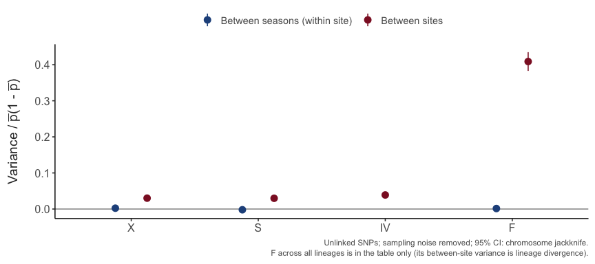

| Group | Sites | Sites with ≥ 2 seasons | Populations | SNPs | Between sites | Between seasons | Site : season ratio |
|:---|---:|---:|---:|---:|:---|:---|:---|
| X | 3 | 3 | 7 | 38543 | 0.0301 (0.0269, 0.0333) | 0.0023 (0.0012, 0.0034) | 13 |
| S | 3 | 1 | 4 | 16025 | 0.0298 (0.0231, 0.0365) | -0.0020 (-0.0044, 0.0004) | – |
| IV | 2 | 0 | 2 | 28489 | 0.0390 (0.0335, 0.0445) | – | – |
| F-N | 2 | 2 | 5 | 18186 | 0.0145 (0.0066, 0.0224) | 0.0026 (0.0012, 0.0040) | 6 |
| F (all lineages) | 4 | 4 | 9 | 24494 | 0.4088 (0.3829, 0.4347) | 0.0014 (0.0006, 0.0022) | 289 |

Allele-frequency variance between sites and between seasons within
sites, relative to p̄(1 − p̄), after removing sampling noise (95% CI).
Ratio shown only where the seasonal component is clearly above zero.

Allele frequencies differ far more between sites than between seasons at
the same site. In clade X, the between-site variance (0.030) is about 13
times the seasonal variance (0.0023); in F-N (MD vs. GW) the ratio is
about 6. The seasonal component is small but above zero in X and F-N,
consistent with the temporal Fc excess above (drift over a
season with Ne in the high hundreds to thousands); in S, with
one seasonal site, it is indistinguishable from zero. Across the F
lineages the between-site component (0.41) is an order of magnitude
larger, because it measures divergence between lineages rather than
among populations of one lineage. Seasonal change in allele frequencies
is therefore a small fraction of the spatial differentiation it would
have to reproduce for seasonal evolution to mirror spatial adaptation,
which fits the absence of concordance below.

### Does space substitute for time? Concordance of temperature responses

If the alleles that are more common at warmer sites are favoured by warm
conditions, they should also rise after warm periods and fall after cool
ones within sites. For every SNP, two temperature slopes were estimated
with the same binomial GLM and calibrated weights as above: a
**spatial** slope (frequency against each site’s long-term MUR SST, with
a site’s seasonal samples pooled) and a **seasonal** slope (the
temperature model above: frequency against site + temperature before
collection). Their agreement across the genome was measured as the
correlation of the two z-scores, and, among the 1% and 5% of SNPs with
the strongest spatial slopes, as the fraction whose seasonal slope has
the same sign (0.5 = no agreement). The null keeps the spatial slopes
and permutes temperatures among each site’s sampling events (as in the
seasonal test); a second, smaller null permutes site temperatures among
sites. This is the genomic counterpart of the within- vs between-site
comparison for CTmax (Section 4) and follows the seasonal–clinal
comparison of [Machado et
al. (2021)](https://doi.org/10.7554/eLife.67577).

Clade X (ME, TK, RW; one lineage, three seasonal sites) is the main
test. In clade F the warm sites (MR, FH) and the cool sites (MD, GW)
belong to different lineages, so its spatial slopes mostly reflect
lineage differences, not temperature; F is shown for completeness but
not interpreted. Clade S has one seasonal site, so its seasonal null has
a single alternative ordering.

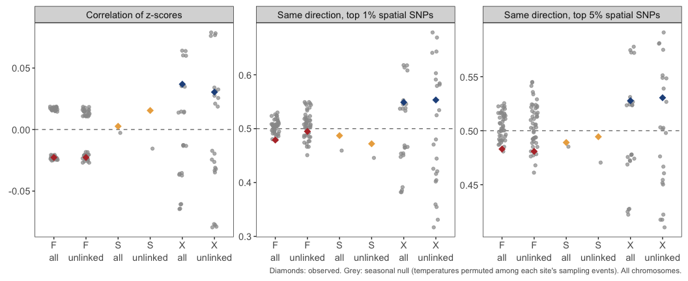

| Clade | SNPs | Chromosomes | SNPs tested | r | Rank | Top 1% same sign | Rank | Top 5% same sign | Rank |
|:---|:---|:---|---:|---:|:---|---:|:---|---:|:---|
| X | all | all chr. | 2056496 | 0.037 | 5 / 24 | 0.549 | 6 / 24 | 0.528 | 6 / 24 |
| X | all | no chr6 | 1918570 | 0.035 | 8 / 24 | 0.548 | 6 / 24 | 0.527 | 8 / 24 |
| X | unlinked | all chr. | 42357 | 0.030 | 8 / 24 | 0.553 | 10 / 24 | 0.530 | 9 / 24 |
| X | unlinked | no chr6 | 39302 | 0.030 | 9 / 24 | 0.555 | 10 / 24 | 0.534 | 9 / 24 |
| F | all | all chr. | 470321 | -0.023 | 36 / 48 | 0.479 | 48 / 48 | 0.483 | 47 / 48 |
| F | all | no chr6 | 437032 | -0.022 | 30 / 48 | 0.484 | 48 / 48 | 0.487 | 45 / 48 |
| F | unlinked | all chr. | 38608 | -0.023 | 36 / 48 | 0.495 | 34 / 48 | 0.481 | 43 / 48 |
| F | unlinked | no chr6 | 35928 | -0.023 | 34 / 48 | 0.493 | 33 / 48 | 0.486 | 39 / 48 |
| S | all | all chr. | 273722 | 0.003 | 1 / 2 | 0.487 | 1 / 2 | 0.489 | 1 / 2 |
| S | all | no chr6 | 254773 | 0.002 | 1 / 2 | 0.492 | 1 / 2 | 0.491 | 1 / 2 |
| S | unlinked | all chr. | 26743 | 0.016 | 1 / 2 | 0.472 | 1 / 2 | 0.494 | 1 / 2 |
| S | unlinked | no chr6 | 25076 | 0.016 | 1 / 2 | 0.472 | 1 / 2 | 0.494 | 1 / 2 |

Concordance of spatial and seasonal temperature slopes. Rank = position
of the observed value among all seasonal-null orderings (1 = higher than
every permutation).

In clade X the spatial and seasonal responses point weakly in the same
direction: across all SNPs the two slopes are slightly positively
correlated (r ≈ 0.04), and among the 1% of SNPs with the strongest
spatial slopes about 55% change in the same direction through the
season. But the real temperatures rank only 5th–6th of 24 orderings (p ≈
0.2), 8th–12th on the unlinked set, and the smaller spatial null (6
orderings) cannot go below p ≈ 0.17; removing chromosome 6 changes
nothing. So there is no detectable genome-wide concordance between
spatial and seasonal temperature responses. Two limits shape this
answer. First, the spatial temperature contrast within X is short
(7.1–9.9 °C long-term mean across ME, TK and RW), and the spatial slope
is mostly ME against the two Gulf of St. Lawrence sites, so it also
carries their geographic separation. Second, the null rests on only 24
orderings. A modest true concordance, of the size seen here, could go
undetected. Clade F shows the opposite tendency (its observed
concordance is the lowest of 48 orderings for the top-1% statistic), but
because its spatial contrast is a contrast between lineages (Florida
lineages vs F-N) it is not interpreted as a temperature response. Clade
S has no usable seasonal null.

In contrast to CTmax, whose between-site slope matches the within-site
(acclimation) slope (Section 4), allele frequencies give no evidence
that the response to temperature across sites predicts the response
through the season. The genomic side of the space-for-time question
therefore remains unresolved rather than negative: the data are
consistent with no shared response and with a weak one.

## 4. Clade-specific physiological patterns

### CTmax model

To more formally test the relationship between CTmax and collection
temperature, we used a linear mixed effects model, structured as
`ctmax ~ clade * temp_cent + (1 | site) + (1 | replicate) + (1 | tube)`.
This examines the effects of clade and temperature on CTmax, along with
clade-specific effects of temperature. Body size is not included, so
temperature effects include any effect acting through body size.
Collection temperature was centered before model fitting. The model also
includes random intercepts for each site, the assay run (replicate) and
the tube number (the position of each individual within the water bath
during the CTmax assay).

### Acclimation vs. site differences (within- and between-site temperature)

A single temperature slope mixes two processes. Within a site, CTmax
changes across the season as the same population experiences warmer or
cooler water, which is mostly acclimation. Between sites, CTmax differs
with each site’s typical temperature, which reflects acclimation plus
any local adaptation. Collection temperature was therefore split into a
within-site component (collection temperature minus the site’s mean
collection temperature, so it averages zero at every site) and a
between-site component (the site’s mean temperature minus the mean
across sites) ([van de Pol & Wright
2009](https://doi.org/10.1016/j.anbehav.2008.11.006)). If the
between-site slope equals the within-site slope, site differences are
explained by acclimation to different temperatures; a steeper
between-site slope indicates local adaptation on top of plasticity, and
a shallower one countergradient variation. Lineage (X, S, IV and the
four F lineages, F-MR, F-FH, F-N and F-NE) is in the model, so turnover
of lineages along the coast does not inflate the between-site slope;
grouping by clade would not suffice, because the F lineages replace one
another between sites (Florida vs. Chesapeake). The assay terms are kept
as in the CTmax model above; body size is not included, so the
temperature slopes include any effect acting through body size.

The site temperature is the long-term (2014–2023, full-year) MUR SST
mean (`Output_data/site_climatology.csv`, Section 1), not the mean of
the collection temperatures, which depends on which seasons were sampled
(MR and FH only at peak and late). The within-site component stays
centred on each site’s collection temperatures. Lineage-specific
within-site slopes are estimated for lineages with ≥ 15 individuals and
seasonal variation in collection temperature, and lineage-specific
between-site slopes only for lineages sampled at ≥ 3 sites (X, S, IV);
the remaining lineages share a pooled slope.

| term                      |  slope |    se |     lo |    hi |
|:--------------------------|-------:|------:|-------:|------:|
| Within site (acclimation) |  0.147 | 0.008 |  0.130 | 0.163 |
| Between sites             |  0.125 | 0.067 | -0.006 | 0.256 |
| Between − within          | -0.022 | 0.067 | -0.152 | 0.109 |

CTmax slopes (°C per °C) for within-site and between-site temperature,
all lineages (site temperature: long-term MUR SST mean). 95% CI = ± 1.96
SE.

| Lineage | Sites | Individuals | Within site | Between sites |
|:---|---:|---:|:---|:---|
| F-FH | 1 | 39 | 0.12 (0.08, 0.16) | – |
| F-MR | 1 | 28 | 0.12 (0.08, 0.17) | – |
| F-N | 2 | 78 | 0.16 (0.13, 0.19) | – |
| IV | 4 | 55 | 0.22 (0.16, 0.28) | -0.21 (-0.52, 0.09) |
| S | 4 | 71 | 0.16 (0.13, 0.20) | 0.19 (0.03, 0.35) |
| X | 4 | 118 | 0.10 (0.06, 0.14) | 0.25 (-0.06, 0.55) |
| other lineages (pooled) | NA | NA | – | -0.19 (-0.84, 0.47) |

Lineage-specific CTmax slopes. Sites = sites with ≥ 5 individuals of the
lineage. Between-site slopes are estimated only for lineages at ≥ 3
sites and rest on few sites; lineages without their own slope share the
pooled slope.

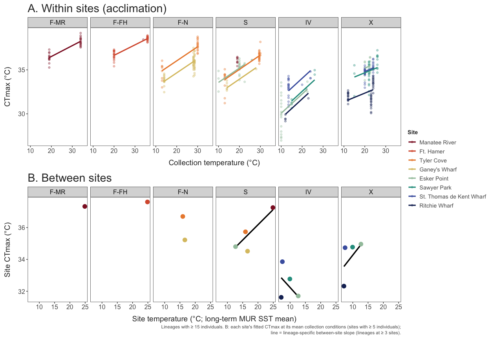

CTmax rises by 0.15 °C for every 1 °C of within-site temperature change
(95% CI 0.13–0.16), with lineage-specific acclimation slopes of 0.10 to
0.22. The between-site slope is 0.13 (CI -0.01 to 0.26; site
temperature: long-term MUR SST mean), and the difference between the two
is -0.02 (CI -0.15 to 0.11). If that interval includes zero, CTmax
differences between sites within a lineage are consistent with
acclimation to each site’s temperature, with no detectable local
adaptation beyond it; with only 1–5 sites per lineage, the test can rule
out only large differences between the slopes. Panel B shows the
site-level pattern behind the between-site slope: each point is a site’s
CTmax at its own mean collection conditions.

The Stage 1 clade calls (Section 3.1) were merged with the CTmax and
body size data set to examine clade-specific patterns of divergence. By
plotting CTmax and size against the collection temperature we can see
that these clades appear to be physiologically differentiated. Clades F
and S tend to have higher CTmax, even when collected at the same
temperatures as Clades X and IV. Size is more variable, with varying
degrees of temperature sensitivity across the clades. Overall, however,
Clade F tends to be smaller than Clades S and X. Clade IV tended to be
the largest.

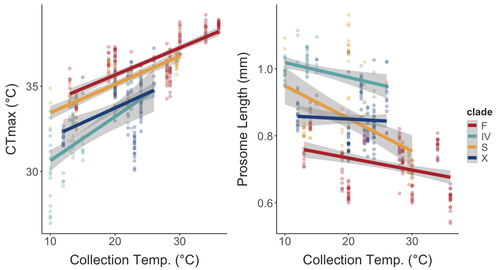

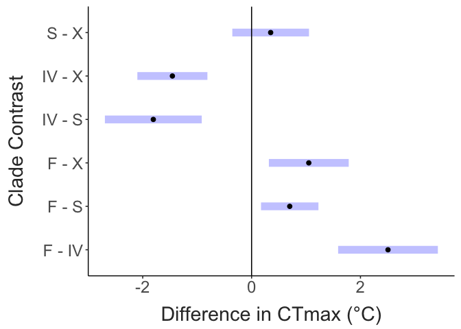

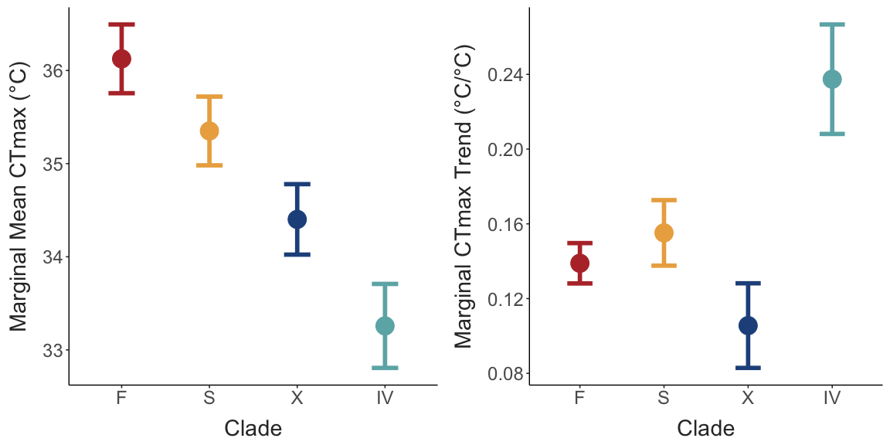

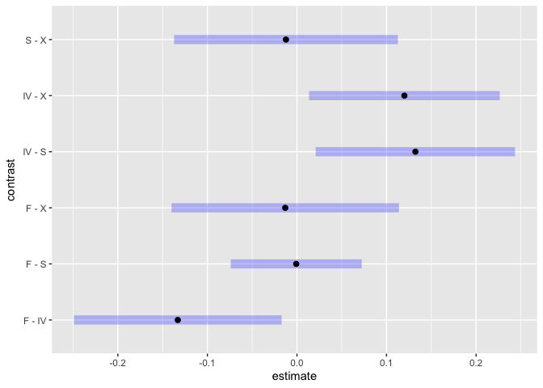

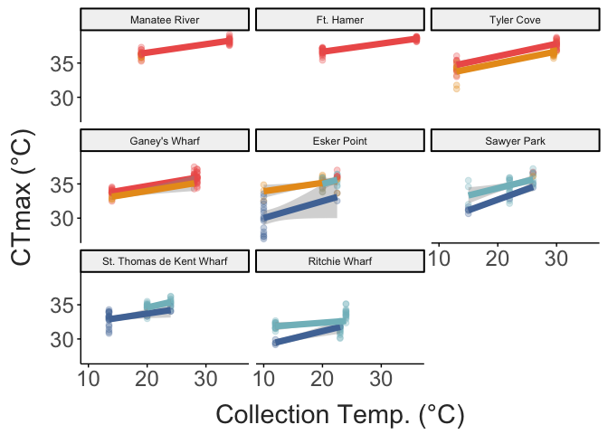

The general result here is that Clade F appears to be more thermally
tolerant than Clades S and X, which in turn are more thermally tolerant
than Clade IV. Clade IV does however, appear to exibit stronger
plasticity than the other clades (although this pattern is only
marginally significant in two of the comparisons; IV-S and IV-X)

These differences in physiology correspond to the distributional
patterns for each clade. Using a Loess smoother (span = 2) highlights
how the proportional abundance of the clades is affected by temperature
in different ways. Clade F occurs in high proportion at high
temperature, Clade IV occurs in high proportions at low temperatures,
while Clade X occurs in high proportions at intermediate temperatures.
Clade S generally occurs in low proportions, with a few exceptions.

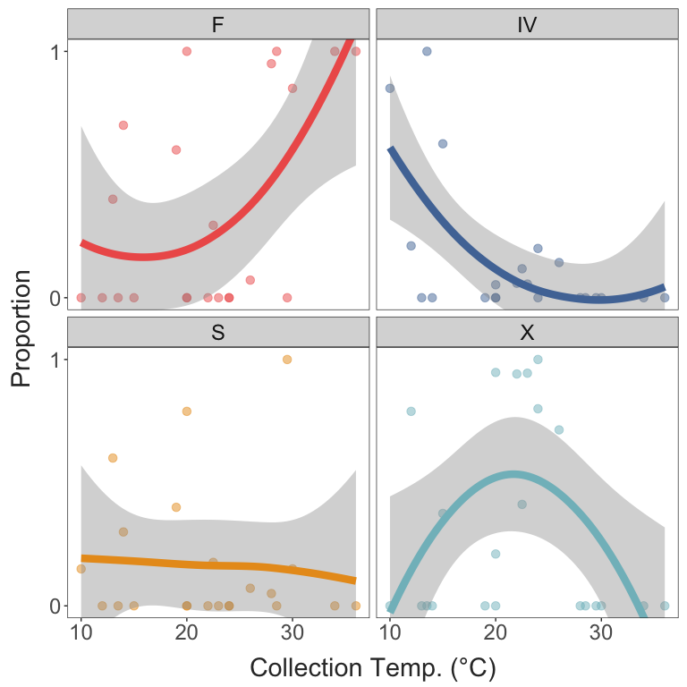

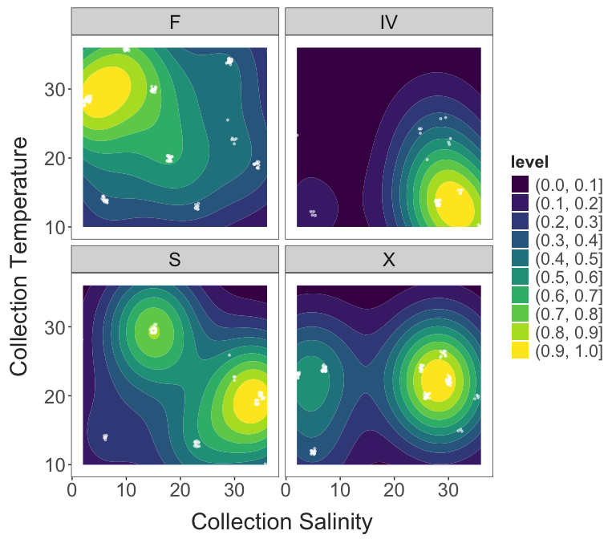

### Partitioning CTmax variation

How much of the variation in CTmax among individuals is due to lineage,
to the site an animal comes from, to the conditions at collection
(acclimation), to the assay, and to individuals? The variance was
partitioned with a mixed model with random effects for lineage, site,
collection (site × sampling event), assay run and tube position, plus,
in the second model, fixed effects for the within- and between-site
temperature components from the previous section (body size is not
included). The variance explained by each fixed effect is the variance
of its fitted contribution ([Nakagawa & Schielzeth
2013](https://doi.org/10.1111/j.2041-210x.2012.00261.x)). Comparing the
two models shows how much of the site and collection components the
temperature terms absorb: collection-level variance taken up by
within-site temperature is acclimation, and site-level variance taken up
by long-term site temperature is the between-site temperature effect.
Intervals are from 200 parametric bootstrap replicates.

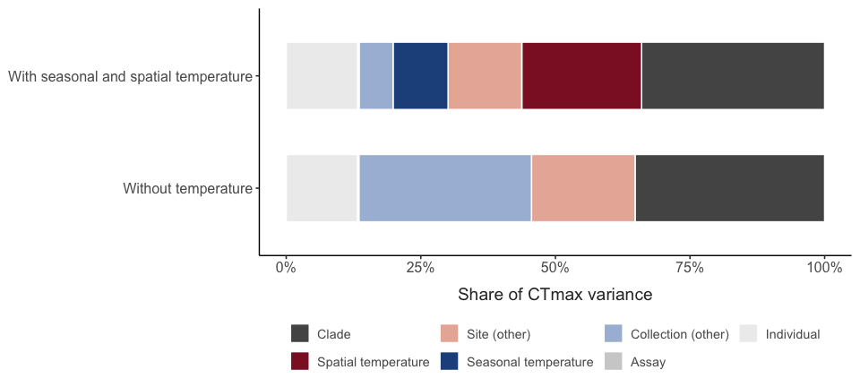

| Component | Without temperature | With within/between temperature |
|:---|:---|:---|
| Lineage | 29% (7–52) | 24% (3–48) |
| Site temperature | – | 20% (2–48) |
| Site (other) | 21% (0–55) | 16% (0–36) |
| Acclimation (within-site temperature) | – | 18% (9–34) |
| Collection (other) | 35% (15–66) | 8% (3–18) |
| Assay | 0% (0–1) | 0% (0–1) |
| Individual | 14% (9–26) | 14% (9–23) |

Share of CTmax variance (95% parametric bootstrap interval).

Without temperature terms, the largest components are collection (35%),
lineage (29%) and site (21%), with 14% among individuals within a
collection. Adding the temperature terms, within-site temperature
(acclimation) explains 18% of all CTmax variance and absorbs most of the
collection component (which drops to 8%), while long-term site
temperature explains 20% and the remaining site component is 16%.
Lineage accounts for 24%. Thermal tolerance in this complex is therefore
structured roughly equally by lineage, by acclimation to recent
conditions, and by site (temperature plus other site differences), with
little left to the assay. The intervals are wide because lineage and
site have few levels (7 lineages, 8 sites).

### Lineage differences under shared conditions (natural common garden)

Lineage accounts for about a quarter of CTmax variance (above), but
lineages occupy different sites, so their differences could partly
reflect the conditions they were collected in. Several collections,
however, contain two or more lineages sampled at the same time and
place: those animals experienced the same water before the assay, so
differences between them cannot be acclimation. Lineage differences were
therefore re-estimated using only collections with ≥ 2 lineages of ≥ 3
individuals each, with collection as a fixed effect, so each lineage
contrast is a within-collection comparison. These estimates are compared
with the lineage effects from all collections (the within/between model
above, which adjusts for temperature but compares lineages across
different collections). Differences that persist within collections are
heritable (genetic, or developmental/maternal), not plastic responses to
recent conditions.

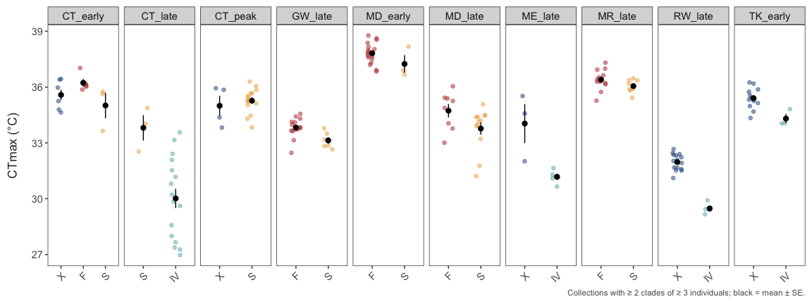

| Lineage pair (first − second) | Shared collections | Within shared collections | p | All collections (temperature-adjusted) |
|:---|---:|:---|---:|:---|
| F-MR – S | 1 | 0.34 (-0.53, 1.22) | 0.4400 | 0.21 (-0.57, 0.98) |
| F-N – S | 3 | 0.78 (0.21, 1.34) | 0.0075 | 0.93 (0.50, 1.36) |
| F-NE – S | 1 | 0.54 (-0.62, 1.71) | 0.3600 | 0.63 (-0.25, 1.51) |
| F-NE – X | 1 | 0.94 (-0.14, 2.01) | 0.0860 | 1.67 (0.81, 2.52) |
| IV – S | 1 | -2.85 (-3.66, -2.04) | 0.0000 | -2.87 (-3.42, -2.33) |
| S – X | 2 | 0.39 (-0.32, 1.11) | 0.2800 | 1.04 (0.49, 1.59) |
| IV – X | 3 | -2.46 (-3.09, -1.82) | 0.0000 | -1.83 (-2.19, -1.48) |

CTmax differences (°C, 95% CI) between lineages that co-occur in at
least one collection: estimated only within shared collections, and from
all collections in the within/between model.

The two largest lineage differences hold up when lineages are compared
side by side. IV is about 2.5–2.9 °C less tolerant than X and S in the
same collections (three and one shared collections), as large as or
larger than the difference estimated across all collections. F-N is
about 0.8 °C more tolerant than S across the three Chesapeake
collections where both occur (MD early and late, GW late), close to its
overall estimate. These differences cannot be acclimation. The S–X
difference is the exception: about 1 °C across all collections, but only
0.4 °C (CI spanning zero) in the two Connecticut collections where they
co-occur, so part of it may reflect where each lineage was collected
rather than the lineages themselves. The F-MR and F-NE contrasts each
rest on a single collection and are uninformative. Caveats: co-occurring
lineages may differ in body size, development or recent history (for
example, advection from elsewhere), so “heritable” here means not
explained by shared recent conditions, not necessarily genetic.

#### Does lineage turnover change seasonal thermal tolerance?

If lineages differ heritably in CTmax and their make-up changes through
the season, turnover alone shifts the CTmax a collection would have,
independent of acclimation. For each collection, the expected CTmax from
composition alone is the composition-weighted mean of the lineage
effects (temperature-adjusted lineage means from the within/between
model). Its within-site slope against collection temperature (site as a
fixed effect, weighted by individuals) is compared with the within-site
acclimation slope. The null shuffles lineage labels among individuals
across the seasons of each site (10⁴ permutations), keeping each site’s
lineages but removing their timing.

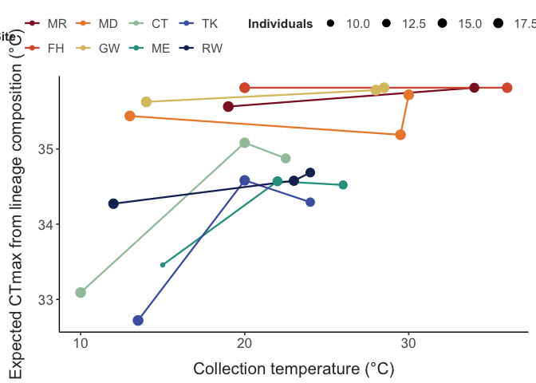

Composition alone shifts expected CTmax by 0.04 °C per °C of collection
temperature within sites (permutation p \< 0.001), compared with an
acclimation slope of 0.15 °C per °C within lineages: turnover adds about
27% to the seasonal change that acclimation produces. Collections are
dominated by more tolerant lineages when the water is warm and by less
tolerant lineages (above all IV) when it is cool, so turnover reinforces
acclimation rather than opposing it. This is a seasonal change in
thermal tolerance with a heritable basis that happens through the
sorting of lineages, not evolution within them. Caveat: composition
comes from the individuals sequenced per collection (about 20), so
proportions are coarse, and collections were sampled in one year.

### Genetic basis of CTmax within collections

Is CTmax variation among individuals collected together associated with
particular genetic variants? Within each lineage with ≥ 30 phenotyped
and sequenced individuals (collections with ≥ 8 individuals of the
lineage: X 104, F-N 78, S 54, F-FH 38, IV 36), CTmax was regressed on
genotype dosage (the expected number of minor alleles, from ANGSD
genotype posteriors) at every SNP, with collection and log mean
sequencing depth as covariates. Collection absorbs acclimation and
population differences, so individuals are compared only with others
collected at the same time and place; depth is included because at \< 1×
coverage deeper individuals show more minor alleles, which would
otherwise bias every SNP’s effect if depth tracks CTmax (it does,
weakly: +0.26 °C per log unit of depth within collections, all lineages
pooled). Individuals without reads at a SNP were given their
collection’s mean dosage. Body size was not included. Genome-wide
calibration comes from 100 replicates with CTmax shuffled among
individuals of the same collection, which keep each collection’s CTmax
distribution and all genotype structure but break any genotype–phenotype
link.

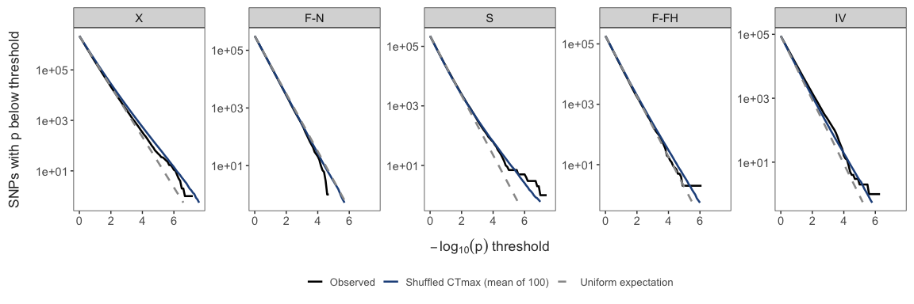

| Lineage | SNPs | λ | p \< 10⁻³ | p \< 10⁻⁴ | p \< 10⁻⁵ | p \< 10⁻⁶ |
|:---|---:|:---|:---|:---|:---|:---|
| X | 2209940 | 0.95 vs 1.04 (94) | 2570 vs 3743 (91) | 338 vs 553 (89) | 48 vs 88 (86) | 11 vs 14 (63) |
| F-N | 313838 | 0.95 vs 0.97 (65) | 265 vs 274 (52) | 21 vs 27 (73) | 0 vs 3 (101) | 0 vs 0 (101) |
| S | 223199 | 0.96 vs 0.94 (41) | 332 vs 355 (54) | 62 vs 63 (50) | 7 vs 12 (85) | 5 vs 3 (16) |
| F-FH | 183335 | 0.97 vs 1.00 (65) | 195 vs 232 (67) | 18 vs 30 (91) | 2 vs 4 (85) | 2 vs 1 (15) |
| IV | 88781 | 1.15 vs 1.05 (6) | 212 vs 140 (6) | 16 vs 19 (64) | 2 vs 3 (74) | 1 vs 0 (29) |

Observed vs. mean of 100 within-collection CTmax shuffles (rank of the
observed value among the 101; 1 = larger than every shuffle).

| Lineage | Comparison     | Unlinked SNPs | r      | Shuffle SD of r | Rank     |
|:--------|:---------------|--------------:|:-------|:----------------|:---------|
| X       | Spatial slope  |         41784 | 0.011  | 0.053           | 90 / 101 |
| X       | Seasonal slope |         41784 | -0.004 | 0.010           | 69 / 101 |
| S       | Spatial slope  |         17707 | 0.009  | 0.008           | 21 / 101 |
| S       | Seasonal slope |         17707 | -0.008 | 0.017           | 59 / 101 |

Correlation between each SNP’s CTmax effect (t) and its spatial or
seasonal temperature slope (z), against 100 within-collection CTmax
shuffles (two-sided rank).

| Lineage | SNPs (freq \< 0.15, \|t\| \> 2.6) | Observed | Shuffles: mean (95% range) | Rank |
|:---|---:|:---|:---|:---|
| X | 454 | 0.64 | 0.63 (0.54–0.71) | 41 / 101 |
| F-N | 94 | 0.69 | 0.58 (0.45–0.70) | 4 / 101 |
| S | 114 | 0.85 | 0.86 (0.78–0.93) | 66 / 101 |
| F-FH | 21 | 0.76 | 0.80 (0.56–0.96) | 73 / 101 |
| IV | 25 | 0.60 | 0.49 (0.25–0.70) | 21 / 101 |

Fraction of the stronger associations at rare SNPs (minor-allele
frequency \< 0.15) in which the minor allele lowers CTmax, observed
vs. shuffles.

No lineage shows more association signal than the shuffles: the observed
counts of small p values sit inside, and in X below, the shuffle
distribution at every threshold, with or without chromosome 6. The one
marginal exception is IV, where moderately small p values (p \< 0.001)
are more common than in 94 of 100 shuffles but the tail is not; with
five lineages tested and the smallest sample (36 individuals, 2
collections), this is consistent with chance. The smallest individual p
values (down to ~10⁻⁷–10⁻⁸) are typical of the shuffles too, and the top
SNPs share a profile – low frequency, reads in only part of the
individuals, large estimated effects – expected from chance at weakly
informative sites, so none is reported as a candidate.

Two patterns that appeared in a first version of the scan (without the
depth covariate, and with missing individuals given the overall rather
than the collection mean) do not survive comparison with the shuffles.
First, CTmax effects do not line up with the spatial or seasonal
temperature slopes in X or S: the observed correlations (\|r\| ≤ 0.011)
are well inside the shuffle distributions, whose spread (SD 0.01–0.05)
is much larger than a chromosome jackknife suggests, because one shuffle
shifts the effects of all SNPs together. Second, the excess of negative
effects at rare SNPs (minor allele lowering CTmax) is reproduced by the
shuffles (63–86% negative in X, S and F-FH, as observed), so it is a
property of dosage regression at low-frequency sites, not evidence for
deleterious rare variants; only F-N is slightly above its shuffles (0.69
vs. 0.58, rank 4 of 101), which with five lineages tested is not
significant.

CTmax among individuals collected together therefore shows no detectable
association with individual variants, no polygenic excess, and no link
between the alleles that track temperature in space or season and those
that affect CTmax. With 36–104 individuals per lineage this rules out
only loci of large effect; it is consistent with the variance partition
above, in which CTmax variation is dominated by lineage, acclimation and
site.

### Candidate genes: mitochondrial amino-acid differences

Lineage differences in CTmax are heritable but, within lineages, no SNP
associates with CTmax. The comparative alternative asks which protein
differences between lineages could underlie them. Mitochondrial OXPHOS
genes are the first candidates: they are inherited as a unit, they
define the clades, and amino-acid changes in COX1, CYTB and other
respiratory-chain subunits alter thermal performance in copepods
(*Tigriopus californicus*: Willett 2010, Harada et al. 2019) and other
ectotherms. The clade mitogenome contigs are unannotated de novo
assemblies, so protein-coding genes were found as open reading frames
(invertebrate mitochondrial code, ≥ 150 codons; COX1 and CYTB identified
by conserved motifs, other ORFs by length and strand). ORFs nested
inside an ORF on the opposite strand are flagged; one member of each
such pair is probably not a gene. The F contig (16.1 kb) covers most of
the mitogenome, so the four F lineages can be compared across 11 ORFs;
the X and IV contigs (about 5 kb) cover only COX1, CYTB and one further
ORF, so clades are compared there (`Scripts/07_mito_aa.R`).

| ORF | Strand | Position (bp) | Codons | Nested antisense | Fixed nt differences | Nonsynonymous | Synonymous |
|:---|:---|:---|---:|:---|---:|---:|---:|
| ORF559- | \- | 788–2464 | 559 |  | 184 | 44 | 140 |
| ORF311+ | \+ | 2901–3833 | 311 |  | 87 | 15 | 72 |
| ORF435+ | \+ | 4259–5563 | 435 |  | 135 | 30 | 105 |
| ORF157- | \- | 5928–6398 | 157 |  | 40 | 12 | 28 |
| COX1 | \+ | 7456–8997 | 514 |  | 132 | 3 | 129 |
| CYTB | \+ | 9072–10217 | 382 |  | 111 | 9 | 102 |
| ORF129- | \- | 9536–9922 | 129 | yes | 42 | 4 | 38 |
| ORF316+ | \+ | 11689–12636 | 316 |  | 107 | 32 | 75 |
| ORF155- | \- | 11715–12179 | 155 | yes | 41 | 15 | 26 |
| ORF219- | \- | 14127–14783 | 219 |  | 66 | 10 | 56 |
| ORF216- | \- | 14950–15597 | 216 |  | 71 | 53 | 18 |

Open reading frames on the F mitogenome contig and nucleotide
differences fixed (≥ 80% of ≥ 5 called individuals) between at least two
F lineages.

| Lineage pair | Amino-acid differences | Excluding ORF216- |
|:-------------|-----------------------:|------------------:|
| F-FH – F-MR  |                     52 |                52 |
| F-FH – F-N   |                     86 |                86 |
| F-FH – F-NE  |                     89 |                89 |
| F-MR – F-N   |                     95 |                91 |
| F-MR – F-NE  |                    100 |                96 |
| F-N – F-NE   |                     73 |                32 |

Fixed amino-acid differences between F lineages, all ORFs on the F
contig.

| Clade pair | COX1     | CYTB     | ORF (LQDA) |
|:-----------|:---------|:---------|:-----------|
| F – S      | 5 / 495  | 26 / 366 | 17 / 205   |
| F – X      | 2 / 495  | 15 / 364 | 13 / 207   |
| F – IV     | 10 / 495 | 31 / 366 | 22 / 204   |
| S – X      | 5 / 495  | 30 / 364 | 13 / 205   |
| S – IV     | 11 / 495 | 39 / 367 | 18 / 202   |
| X – IV     | 8 / 495  | 32 / 364 | 18 / 206   |

Amino-acid differences between clade consensus proteins (differences /
aligned positions) in the three genes covered by all four clade contigs.

| Gene     | Position (F protein) | F, S, X | IV  | Context (F) |
|:---------|---------------------:|:--------|:----|:------------|
| COX1     |                  176 | M       | L   | LRSFGMVLDLM |
| COX1     |                  415 | G       | A   | LKAQFGMMFLG |
| COX1     |                  416 | M       | T   | KAQFGMMFLGV |
| COX1     |                  467 | Y       | F   | VISIMYFLFIL |
| COX1     |                  495 | Y       | F   | SSLEXYHSFPP |
| COX1     |                  512 | I       | S   | SIPVVISK    |
| COX1     |                  514 | K       | S   | PVVISK      |
| CYTB     |                    7 | I       | V   | KQLKXISPVTK |
| CYTB     |                   20 | E       | D   | FGSVVELPTPS |
| CYTB     |                  105 | G       | S   | RGLYYGSYYFS |
| CYTB     |                  110 | S       | T   | GSYYFSHTWLV |
| CYTB     |                  159 | D       | E   | PYLGGDLVLWM |
| CYTB     |                  184 | L       | F   | FSLHFLIPFVV |
| CYTB     |                  188 | V       | I   | FLIPFVVAAMS |
| CYTB     |                  192 | M       | L   | FVVAAMSAVHL |
| CYTB     |                  324 | M       | T   | PLSKMMFWIQI |
| CYTB     |                  334 | L       | M   | IXIVILLTWIG |
| CYTB     |                  353 | I       | T   | IVIGQILSVVY |
| CYTB     |                  360 | S       | L   | SVVYFSYYFFQ |
| CYTB     |                  364 | F       | I   | FSYYFFQPLMM |
| CYTB     |                  368 | M       | L   | FFQPLMMMFWD |
| ORF_LQDA |                   66 | V       | I   | ACPSLVLLYLM |
| ORF_LQDA |                   99 | A       | P   | YXDMIAGHQFP |
| ORF_LQDA |                  103 | F       | S   | IAGHQFPFEFD |
| ORF_LQDA |                  132 | T       | I   | VDXRTTLPLHV |
| ORF_LQDA |                  135 | L       | M   | RTTLPLHVKIR |
| ORF_LQDA |                  181 | F       | Y   | DRPGLFFGQCS |
| ORF_LQDA |                  202 | I       | V   | PIVVEIVXVET |
| ORF_LQDA |                  209 | Y       | F   | XVETFYAYILS |

Substitutions unique to IV, the low-CTmax clade (IV differs; F, S and X
share the state).

COX1 is almost invariant: 3 nonsynonymous against 129 synonymous fixed
differences among F lineages, and at most 11 amino-acid differences
between any two clades. CYTB and the other ORFs carry most of the
amino-acid divergence. 29 substitutions are unique to IV (7 in COX1, 14
in CYTB, 8 in ORF_LQDA).

These are candidates, not results. Every substitution on the branch
leading to IV is equally consistent with IV’s low CTmax, and with one
low-CTmax clade there is no replication to separate causal changes from
the many neutral ones that accumulated with them. Two observations
constrain the mitochondrial explanation. First, among F lineages, the
southern F-MR differs from F-N at about 90 amino acids, yet with S as a
common yardstick (both co-occur with S) F-MR is not more tolerant than
F-N: F-MR exceeds S by 0.3 °C at MR, and F-N exceeds S by 0.8 °C in the
Chesapeake. Large mitochondrial divergence within F does not translate
into a CTmax difference. Second, IV is not more divergent than other
clades in COX1, the most constrained OXPHOS gene. The useful next step
is structural: placing the IV-specific CYTB and COX1 substitutions on
the respiratory-complex structures (quinone-binding sites of complex
III, the proton channels of complex IV) to see whether any sit where
function, rather than sequence, changes. ORF216- is unreliable: it has
no calls in F-FH or F-MR, and F-N and F-NE differ there mostly at
nonsynonymous sites, the pattern of a misassembled or non-coding region
rather than a gene.

The nuclear part of the candidate analysis (heat-shock proteins, nuclear
OXPHOS subunits, lipid desaturases and elongases) needs the RefSeq
annotation of the reference genome (GCF_053477335.1), which is not yet
in the project.

### Trait variability within clades

Shown below is the trait variation (ranges) for each site. Ranges are
calculated for each collection separately.

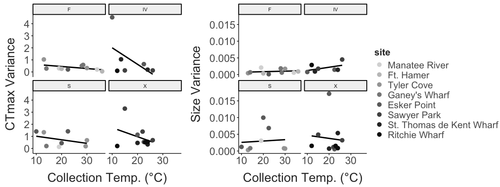

Changes in trait variance may be indicative of phenotypic selection. If
selection (as opposed to acclimation) are driving seasonal changes, we
may expect to see a reduction in variance in the peak samples relative
to the early season samples. Note that early season collection
temperatures this year were higher than expected, driven by fairly
strong heatwaves across the North Atlantic. As shown in the temperature
profiles for each site, the ‘early’ samples were collected just after
high temperatures were reached, while ‘peak’ samples were collected
after sites had experienced high temperatures for several weeks
(generations). As warming tolerances were fairly high throughout this
period, we will assume that selection was weak before the early samples.
If the early onset of high temperatures filtered out vulnerable
genotypes prior to our sampling, the results will be a conservative
estimate of the effects of selection on trait variance.

### Parasites, epibionts and thermal limits

Infected and uninfected individuals are compared within the same
collection (same site, date and collection temperature), so differences
are not confounded with acclimation temperature. Only collections with
at least two positive and two negative individuals are shown.

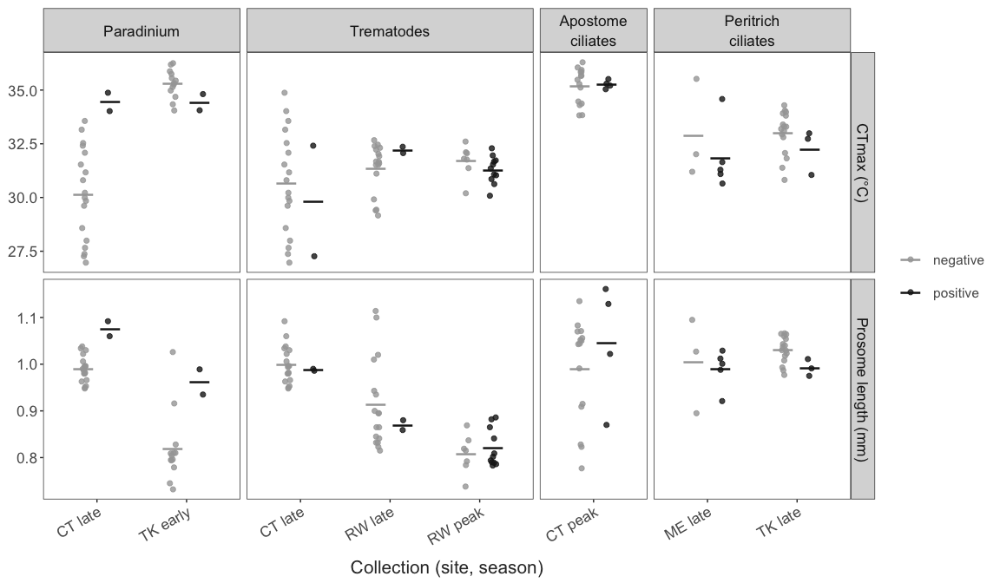

| covariate    | trait | n_collections | n_positive | effect |    se |
|:-------------|:------|--------------:|-----------:|-------:|------:|
| parasite_any | ctmax |             6 |         23 |  0.361 | 0.304 |
| parasite_any | size  |             6 |         23 |  0.009 | 0.012 |
| epibiont_any | ctmax |             4 |         13 | -0.233 | 0.312 |
| epibiont_any | size  |             4 |         13 | -0.013 | 0.023 |

Effect of carrying a parasite or epibiont on CTmax and size, within
collections (trait ~ status + clade + (1 \| collection)); only
collections with both positive and negative individuals.

## 5. Partitioning vulnerability

Warming tolerance (CTmax minus habitat temperature) is the usual summary
of vulnerability, and it is usually computed from a single CTmax per
species. The results above show that “*A. tonsa*” CTmax varies at two
levels that a single value ignores: heritable differences between
lineages (common garden), and acclimation within lineages, which is the
same across sites and seasons (within/between model). Lineage make-up
also changes through the season. Three scenarios show how much each
level changes where the species looks vulnerable.

- **Fixed CTmax:** one value for everyone, the mean of all peak-season
  individuals.
- **Lineage means:** each lineage’s peak-season mean CTmax (its mean
  over all collections when it has \< 5 peak-season individuals),
  weighted by the lineage make-up of the site’s peak collection.
- **Lineages + acclimation:** CTmax predicted for each lineage on each
  day from the within/between model (population-level, no site random
  effect): lineage + within-site temperature (the day’s temperature
  minus the site’s mean collection temperature) + between-site
  temperature (the site’s long-term MUR mean). The day’s temperature is
  clamped to the range of collection temperatures at which that lineage
  was sampled, so acclimation is not extrapolated beyond the data. Same
  peak-season make-up.

Habitat temperature is the bias-corrected daily MUR SST, 2014–2023
(Section 1), plus 0 or 4 °C for a uniform-warming scenario. Two
summaries per site, over August–September (the warmest months, peak
abundance, and the period the peak collections represent): the mean
warming tolerance of the peak-season population, and the warming
tolerance on the warmest August–September day of each year (averaged
over years) for the least tolerant lineage making up ≥ 10% of the peak
collection. Intervals are 95% ranges from 1,000 bootstrap resamples of
individuals (fixed and lineage means) or 1,000 draws of the model’s
fixed effects (lineages + acclimation). Individuals’ CTmax was measured
against collection-day water temperature, while predictions use MUR SST,
which in summer runs cooler than the in-situ collection temperatures at
the northern sites (Section 1); the acclimation scenario therefore uses
MUR temperatures on a model fitted to in-situ ones.

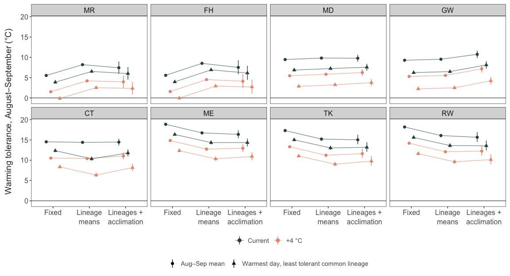

| Metric | Scenario | Range among sites (°C) | Change vs fixed CTmax |
|:---|:---|---:|:---|
| Aug–Sep mean | Fixed CTmax | 13.3 | – |
| Aug–Sep mean | Lineage means | 8.5 | -36% |
| Aug–Sep mean | Lineages + acclimation | 8.9 | -33% |
| Aug–Sep mean | Lineages + acclimation (annual make-up) | 8.8 | -34% |
| Warmest day, least tolerant common lineage | Fixed CTmax | 12.5 | – |
| Warmest day, least tolerant common lineage | Lineage means | 7.9 | -37% |
| Warmest day, least tolerant common lineage | Lineages + acclimation | 8.3 | -33% |
| Warmest day, least tolerant common lineage | Lineages + acclimation (annual make-up) | 8.0 | -36% |

Spread of warming tolerance among sites under current conditions. The
last scenario uses each site’s lineage make-up across all collections
instead of the peak collection.

Relative to a single CTmax, lineage means change the spread of
peak-season warming tolerance among sites by -36%, and lineages with
acclimation by -33% (warmest-day metric: -37% and -33%). With +4 °C, the
lowest warming tolerance on the warmest day is at MR under Fixed CTmax
(-0.1 °C); GW under Lineage means (2.5 °C); MR under Lineages +
acclimation (2.3 °C).

What changes, site by site:

- **A single CTmax makes the south look more vulnerable and the north
  less vulnerable than its lineages are.** Florida’s lineages (F-FH,
  F-MR) are the most tolerant, so lineage means raise Florida’s warming
  tolerance by about 3 °C, enough that +4 °C warming no longer pushes
  the warmest day to zero. The northern sites’ X and IV are less
  tolerant than the species average, so their margin drops by about 2
  °C. Peak-season means in the Chesapeake and Connecticut barely move,
  because their peak-season lineages (F-N, S) are close to the average;
  at CT the warmest-day margin still drops by 2 °C, set by the X
  minority.
- **Acclimation adds little at the peak and helps most under warming.**
  The peak-season means already include acclimation to summer water, so
  acclimation changes current warming tolerance by a few tenths of a
  degree; with +4 °C it adds up to about 2 °C (GW), limited by the clamp
  to sampled temperatures. Its intervals are the widest, because it
  rests on a model rather than direct measurements.
- **Seasonal turnover keeps the least tolerant lineage out of the
  heat.** Using each site’s make-up over all collections instead of the
  peak collection lowers the warmest-day margin by about 2 °C at CT and
  TK, because IV, the least tolerant lineage, is common there only in
  autumn. Annual composition would overstate vulnerability where
  turnover is strongest.

These are illustrations, not forecasts: they assume composition and the
acclimation response stay as observed, warming is uniform through the
season, and CTmax is the relevant limit.
