Comparing seasonal and latitudinal patterns in thermal adaptation
================
2023-11-30

- [Site Characteristics](#site-characteristics)
- [Phenotypic Measurements](#phenotypic-measurements)
  - [Critical Thermal Limits](#critical-thermal-limits)
  - [Warming tolerance](#warming-tolerance)
  - [Body Size](#body-size)
  - [Salinity Pair Comparisons](#salinity-pair-comparisons)
- [Trait Correlations](#trait-correlations)
- [Trait Variability](#trait-variability)
- [Comparing rates of change](#comparing-rates-of-change)
- [Why does intraspecific data
  matter?](#why-does-intraspecific-data-matter)
- [Next Steps](#next-steps)
- [Misc. Details](#misc-details)

## Site Characteristics

``` r
site_temps = full_data %>% 
  dplyr::select(site, lat, season, doy, collection_temp, collection_salinity) %>%  
  distinct() %>% 
  filter(doy > 100) 
```

Copepods were collected by surface tow from sites across the Western
Atlantic at several times throughout the year. The sites are shown
below. Temperatures at the time of collection were measured using a
manual thermometer. Across the entire set of collections, temperature
ranged from 10°C to 36°C.

``` r
coords = site_data %>%
  dplyr::select(site, long, lat) %>%
  distinct()

site_map = map_data("world") %>% 
  filter(region %in% c("USA", "Canada")) %>% 
  ggplot() + 
  geom_polygon(aes(x = long, y = lat, group = group),
               fill = "lightgrey") + 
  coord_map(xlim = c(-85,-60),
            ylim = c(25, 48)) + 
  geom_point(data = coords,
             mapping = aes(x = long, y = lat, colour = site),
             size = 3) +
  scale_colour_manual(values = site_cols) + 
  labs(x = "Longitude", 
       y = "Latitude") + 
  theme_matt(base_size = 16)

site_temp_plot = ggplot(site_temps, aes(x = doy, y = collection_temp, colour = site)) + 
  geom_line(linewidth = 2) + 
  geom_point(size = 5) +
  scale_colour_manual(values = site_cols) + 
  labs(y = "Temperature (°C)",
       x = "Day of the Year") +
  theme_matt() + 
  theme(legend.position = "right")

ggarrange(site_map, site_temp_plot, common.legend = T, legend = "bottom")
```


Collections aimed to obtain copepods near the onset of peak
temperatures, after peak temperatures, and then at low temperatures.
Regional data is not available for all sites, so here we’ve pieced
together daily temperature values from either local temperature sensors
(sites in Florida and the Chesapeake) and high resolution satellite
temperature data (Connecticut, Maine, and the Canadian sites). This
satellite data comes from the NOAA 1/4° Daily Optimum Interpolation Sea
Surface Temperature (OISST).

These temperature profiles are shown below, with the temperatures
measured during the time of collection included for comparison In
several cases collection temperature does not match the recorded daily
averages, but the temperature records do give a general sense of the
timing of seasonal maxima. In general, the first sample from each site
fell just after the site reached the warmest period. The exception to
that pattern is in Florida, where collections occurred after an extended
period of high temperatures.

``` r
temp_profiles = temp_profiles %>% 
  mutate(region = fct_relevel(region, "Florida", "Chesapeake", "Connecticut",
                              "Maine", "Shediac", "Miramichi"))

site_temps2 = site_temps %>% 
  mutate(region = case_when(
    site == "Manatee River" ~ "Florida",
    site == "Ft. Hamer" ~ "Florida",
    site == "Tyler Cove" ~ "Chesapeake",
    site == "Ganey's Wharf" ~ "Chesapeake",
    site == "Esker Point" ~ "Connecticut",
    site == "Sawyer Park" ~ "Maine",
    site == "St. Thomas de Kent Wharf" ~ "Shediac",
    site == "Ritchie Wharf" ~ "Miramichi"),
    region = fct_relevel(region, "Florida", "Chesapeake", "Connecticut",
                              "Maine", "Shediac", "Miramichi"))

ggplot(temp_profiles, aes(x = doy, y = temp_c)) + 
  facet_wrap(region~.) + 
  geom_point(data = site_temps2,
             aes(x = doy, y = collection_temp, colour = site),
             size = 3) +
    geom_line() + 
  scale_colour_manual(values = site_cols) + 
  labs(x = "Day of the Year", 
       y = "Mean Daily Temp. (°C)") + 
  theme_matt_facets() + 
  theme(legend.position = "none")
```


Exact locations for the sites are provided here.

``` r
site_data %>%  
  arrange(lat) %>%  
  select("Site" = site, "Region" = region, "Lat" = lat, "Long" = long) %>% 
  knitr::kable(align = "c")
```

|           Site           |    Region     |   Lat    |   Long    |
|:------------------------:|:-------------:|:--------:|:---------:|
|        Key Largo         |    Florida    | 25.28391 | -80.33014 |
|      Manatee River       |    Florida    | 27.50561 | -82.57277 |
|        Ft. Hamer         |    Florida    | 27.52488 | -82.43101 |
|        Tyler Cove        |   Maryland    | 38.35083 | -76.22902 |
|      Ganey’s Wharf       |   Maryland    | 38.80555 | -75.90906 |
|       Esker Point        |  Connecticut  | 41.32081 | -72.00166 |
|       Sawyer Park        |     Maine     | 43.90698 | -69.87179 |
| St. Thomas de Kent Wharf | New Brunswick | 46.44761 | -64.63692 |
|      Ritchie Wharf       | New Brunswick | 47.00481 | -65.56291 |

Nested within each of the three regions (South, Central, and Northern
regions) are pairs of low and high salinity sites:

``` r
data.frame("Region" = c("South", "Central", "North"),
           "Low Salinity" = c("Ft. Hamer", "Ganey's Wharf", "Ritchie Wharf"),
           "High Salinity" = c("Manatee River", "Tyler Cove", "St. Thomas de Kent Wharf")) %>% 
  knitr::kable(align = "c")
```

| Region  | Low.Salinity  |      High.Salinity       |
|:-------:|:-------------:|:------------------------:|
|  South  |   Ft. Hamer   |      Manatee River       |
| Central | Ganey’s Wharf |        Tyler Cove        |
|  North  | Ritchie Wharf | St. Thomas de Kent Wharf |

 

There are fairly well-established divergences between high salinity and
low salinity populations of *Acartia tonsa*. These sets of
geographically proximate but isolated populations provide independent
comparisons of the effects of seasonality. Shown here are the collection
conditions for these pairs of sites. Temperature was typically similar
across the pairs within each collection, while salinity differences were
fairly stable across collections.

``` r
season_cols = c("early" = "grey75", 
                "peak" = "grey50", 
                "late" = "grey25")

sal_regions = data.frame(region = rep(c("South", "Central", "North"), each = 2), 
                         site = c("Ft. Hamer", "Manatee River", 
                                  "Ganey's Wharf", "Tyler Cove", 
                                  "Ritchie Wharf", "St. Thomas de Kent Wharf"),
                         salinity = c("low", "high"))

sal_comps = full_data %>% 
  filter(site %in% sal_regions$site) %>% 
  inner_join(sal_regions, by = c("site")) %>% 
  select( region = region.y, site, salinity, season, doy, collection_temp, collection_salinity,
          size, ctmax, warming_tol) %>% 
  mutate(salinity = fct_relevel(salinity, "low", "high"),
         region = fct_relevel(region, "South", "Central", "North"))

sal_comp_temps = sal_comps %>%  
  select(salinity, season, region, collection_temp, collection_salinity) %>% 
  distinct() %>% 
  ggplot(aes(x = salinity, y = collection_temp, colour = season, group = season)) + 
  facet_wrap(region~.) + 
  geom_line(linewidth = 1.5) + 
  geom_point(size = 4) + 
  scale_colour_manual(values = season_cols) + 
  labs(y = "Collection Temp. (°C)",
       x = "") + 
  theme_matt_facets(base_size = 14)

sal_comp_sal = sal_comps %>%  
  select(salinity, season, region, collection_temp, collection_salinity) %>% 
  distinct() %>% 
  ggplot(aes(x = salinity, y = collection_salinity, colour = season, group = season)) + 
  facet_wrap(region~.) + 
  geom_line(linewidth = 1.5) + 
  geom_point(size = 4) + 
  scale_colour_manual(values = season_cols) + 
  labs(y = "Collection Salinity (psu)",
       x = "Salinity") + 
  theme_matt_facets(base_size = 14)

ggarrange(sal_comp_temps, sal_comp_sal, nrow = 2, common.legend = T, legend = "right")
```


``` r

# sal_comps %>%  
#   select(site, salinity, season, region, collection_temp, collection_salinity) %>% 
#   distinct() %>% 
#   ggplot(aes(x = collection_salinity, y = collection_temp, colour = site)) + 
#   facet_grid(region~.) + 
#   geom_point(size = 4) + 
#   #stat_ellipse() +
#   #geom_path(arrow = arrow(length = unit(0.1, "inches"), type = "closed")) + 
#   scale_colour_manual(values = site_cols) + 
#   theme_matt_facets(base_size = 14)
```

The latitudinal gradient covers a wide range of seasonality. Shown below
is the temperature range. While based on collection temperatures, and
therefore an underestimate of the total seasonal range of temperatures,
these patterns are representative of the expected latitudinal gradient
in seasonality.

``` r
site_temps %>% 
  group_by(site, lat) %>%  
  summarise(temp_range = max(collection_temp) - min(collection_temp)) %>%  
  ggplot(aes(x = lat, y = temp_range)) + 
  geom_point(aes(colour = site),
             size = 3) + 
  scale_color_manual(values = site_cols) + 
  labs(x = "Latitude", 
       y = "Collection Temp. Range (°C)") + 
  theme_matt() + 
  theme(legend.position = "right")
```


## Phenotypic Measurements

### Critical Thermal Limits

A total of 436 individuals were examined. Critical thermal limits and
body size measurements were made before individuals were preserved in
ethanol. We excluded data for 6 individuals, detailed below. These
individuals had either very low CTmax or were, upon re-examination of
photographs, identified as juveniles instead of mature females. With
these individuals excluded, **the full data set contains 430 phenotyped
individuals**.

``` r
excluded %>% 
  select(region, site, season, collection_temp, collection_salinity, replicate, tube, ctmax, size) %>% 
  knitr::kable(align = "c")
```

|    region     |           site           | season | collection_temp | collection_salinity | replicate | tube |  ctmax   | size  |
|:-------------:|:------------------------:|:------:|:---------------:|:-------------------:|:---------:|:----:|:--------:|:-----:|
|    Florida    |      Manatee River       |  peak  |      34.0       |         29          |     2     |  6   | 38.45833 | 0.616 |
|    Florida    |      Manatee River       |  peak  |      34.0       |         29          |     2     |  7   | 38.23750 | 0.593 |
|   Maryland    |        Tyler Cove        |  peak  |      29.5       |         15          |     2     |  2   | 36.84375 | 0.614 |
|  Connecticut  |       Esker Point        | early  |      22.5       |         30          |     2     |  3   | 30.02604 | 0.687 |
|     Maine     |       Sawyer Park        |  peak  |      22.0       |         30          |     1     |  4   | 30.81424 | 0.865 |
| New Brunswick | St. Thomas de Kent Wharf |  late  |      13.5       |         28          |     1     |  3   | 28.78299 | 1.039 |

Critical thermal maxima (CTmax) was measured using a custom setup. The
method uses a standard dynamic ramping assay to determine the maximum
temperature individuals could sustain normal functioning. This differs
from lethal temperatures, and indeed, all individuals observed so far
recovered following the assay.

Individuals were rested for one hour after collection before the assay.
During the assay, copepods were held in artificial seawater, composed of
bottled spring water and Instant Ocean salt mix adjusted to match
collection salinities. During the assay, several ‘control’ individuals
were maintained in this solution at ambient temperatures without the
temperature ramp to ensure that there was no background mortality. When
sorting individuals from the plankton tow contents, they were held in a
50:50 mix of 60 um filtered water from the collection site and
artificial seawater as an additional acclimation step.

Shown below are the measured CTmax values. Note: CTmax values for the
early season Key Largo copepods were collected at the end of February
2023 as part of a separate project. Body size values were not measured
during this project, nor were copepods individually preserved after the
experiments. These early season CTmax values are included as a point of
comparison. Individual measurements are shown in small points for each
collection. The large points indicate the median values for each
collection.

``` r
mean_ctmax = full_data %>% 
  group_by(site, season, doy, collection_temp) %>% 
  summarize(mean_ctmax = mean(ctmax),
            median_ctmax = median(ctmax))

ggplot(full_data, aes(x = season, y = ctmax, colour = site)) + 
  geom_line(data = mean_ctmax, 
            aes(y = median_ctmax, group = site),
            position = position_dodge(width = 0.4),
            linewidth = 1) + 
  geom_point(position = position_jitterdodge(jitter.width = 0.1, jitter.height = 0,
                                             dodge.width = 0.4),
             alpha = 0.3) + 
  geom_point(data = mean_ctmax, 
             aes(y = median_ctmax),
             position = position_dodge(width = 0.4),
             size = 4) + 
  scale_colour_manual(values = site_cols) + 
  labs(y = "CTmax (°C)",
       x = "Season") +
  theme_matt() + 
  theme(legend.position = "right", 
        legend.title.align = 0.125)
```


The same data is shown below, plotted against day of the year instead of
season. This accounts for the variable timing of collections across
regions (e.g. - the compressed collections from the Northern sites to
accomodate the earlier onset of cold temperatures).

``` r
ggplot(filter(full_data, site != "Key Largo"), aes(x = doy, y = ctmax, colour = site)) + 
  geom_line(data = filter(mean_ctmax, site != "Key Largo"), 
            aes(y = median_ctmax, group = site),
            position = position_dodge(width = 0.4),
            linewidth = 1) + 
  geom_point(position = position_jitterdodge(jitter.width = 0.1, jitter.height = 0,
                                             dodge.width = 0.4),
             alpha = 0.3) + 
  geom_point(data = filter(mean_ctmax, site != "Key Largo"), 
             aes(y = median_ctmax),
             position = position_dodge(width = 0.4),
             size = 4) + 
  scale_colour_manual(values = site_cols) + 
  labs(y = "CTmax (°C)",
       x = "Season") +
  theme_matt() + 
  theme(legend.position = "right", 
        legend.title.align = 0.125)
```


CTmax data for each individual site is shown below, plotted against day
of the year. The grey line in each facet shows the collection
temperatures. Note that both axes vary across facets.

``` r
ggplot(full_data, aes(x = doy, y = ctmax, colour = site)) + 
  facet_wrap(.~site, scales = "free") + 
  geom_line(data = mean_ctmax, 
            aes(y = median_ctmax, group = site),
            position = position_dodge(width = 0.4),
            linewidth = 3, alpha = 0.5) + 
  geom_line(data = mean_ctmax, 
            aes(y = collection_temp, group = site),
            position = position_dodge(width = 0.4),
            linewidth = 2,
            colour = "grey") + 
  geom_point(position = position_jitterdodge(jitter.width = 0.1, jitter.height = 0,
                                             dodge.width = 0.4),
             alpha = 0.8) + 
  # geom_point(data = mean_ctmax, 
  #            aes(y = median_ctmax),
  #            position = position_dodge(width = 0.4),
  #            size = 4) + 
  scale_colour_manual(values = site_cols) + 
  labs(y = "CTmax (°C)",
       x = "Day of Year") +
  theme_matt() + 
  theme(legend.position = "none", 
        legend.title.align = 0.125)
```

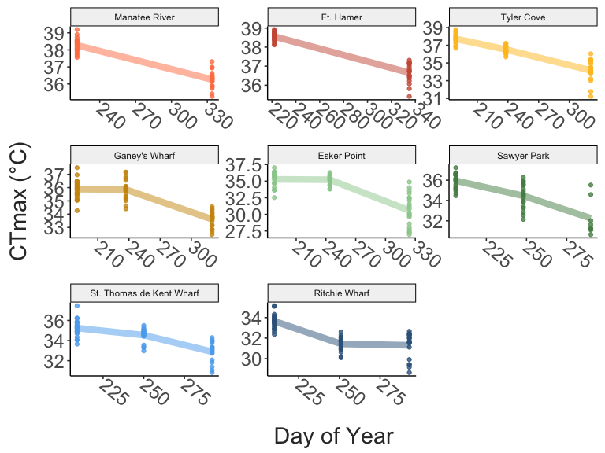

### Warming tolerance

Warming tolerance (the difference between thermal limits and
environmental temperatures) is a commonly used metric of climate
vulnerability. We calculated this as the difference between measured
CTmax values and the collection temperature. Smaller warming tolerance
values indicate that populations were nearer to their upper thermal
limits, and may therefore be more vulnerable to additional warming.

``` r
mean_wt = full_data %>% 
  group_by(site, season) %>% 
  summarize(mean_wt = mean(warming_tol),
            median_wt = median(warming_tol))

ggplot(full_data, aes(x = season, y = warming_tol, colour = site)) + 
  geom_line(data = mean_wt, 
            aes(y = median_wt, group = site),
            position = position_dodge(width = 0.4),
            linewidth = 1) + 
  geom_point(position = position_jitterdodge(jitter.width = 0.1, jitter.height = 0,
                                             dodge.width = 0.4),
             alpha = 0.3) + 
  geom_point(data = mean_wt, 
             aes(y = median_wt),
             position = position_dodge(width = 0.4),
             size = 4) + 
  scale_colour_manual(values = site_cols) + 
  labs(y = "Warming Tolerance (°C)",
       x = "Season") +
  theme_matt() + 
  theme(legend.position = "right", 
        legend.title.align = 0.125)
```


### Body Size

Following the CTmax assay, individuals were photographed for body size
measurements. Prosome lengths were measured from these photographs using
a scale micrometer and the software ImageJ. These measurements are shown
below. As before, large points indicate the median body size.

``` r
mean_size = full_data %>% 
  group_by(site, season, doy, collection_temp) %>% 
  summarize(mean_size = mean(size),
            median_size = median(size))

ggplot(full_data, aes(x = season, y = size, colour = site)) + 
  geom_line(data = mean_size, 
            aes(y = median_size, group = site),
            position = position_dodge(width = 0.4),
            linewidth = 1) + 
  geom_point(position = position_jitterdodge(jitter.width = 0.1, jitter.height = 0,
                                             dodge.width = 0.4),
             alpha = 0.3) + 
  geom_point(data = mean_size, 
             aes(y = median_size),
             position = position_dodge(width = 0.4),
             size = 4) + 
  scale_colour_manual(values = site_cols) + 
  labs(y = "Prosome Length (mm)",
       x = "Season") +
  theme_matt() + 
  theme(legend.position = "right", 
        legend.title.align = 0.125)
```


``` r
ggplot(drop_na(full_data, size), aes(x = doy, y = size, colour = site)) + 
  geom_line(data = drop_na(mean_size, mean_size), 
            aes(y = median_size, group = site),
            position = position_dodge(width = 0.4),
            linewidth = 1) + 
  geom_point(position = position_jitterdodge(jitter.width = 0.1, jitter.height = 0,
                                             dodge.width = 0.4),
             alpha = 0.3) + 
  geom_point(data = drop_na(mean_size, mean_size), 
             aes(y = median_size),
             position = position_dodge(width = 0.4),
             size = 4) + 
  scale_colour_manual(values = site_cols) + 
  labs(y = "Prosome Length (mm)",
       x = "Season") +
  theme_matt() + 
  theme(legend.position = "right", 
        legend.title.align = 0.125)
```

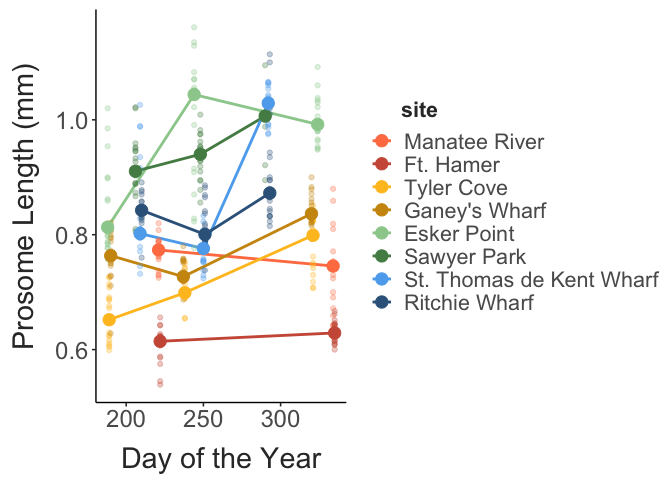

``` r
ggplot(drop_na(full_data, size), aes(x = doy, y = size, colour = site)) + 
  facet_wrap(.~site) + 
  geom_line(data = drop_na(mean_size, mean_size), 
            aes(y = median_size, group = site),
            position = position_dodge(width = 0.4),
            linewidth = 3, alpha = 0.5) + 
  geom_point(position = position_jitterdodge(jitter.width = 0.1, jitter.height = 0,
                                             dodge.width = 0.4),
             alpha = 0.8) + 
  # geom_point(data = mean_ctmax, 
  #            aes(y = median_ctmax),
  #            position = position_dodge(width = 0.4),
  #            size = 4) + 
  scale_colour_manual(values = site_cols) + 
  labs(y = "Prosome Length (mm)",
       x = "Day of Year") +
  theme_matt() + 
  theme(legend.position = "none", 
        legend.title.align = 0.125)
```

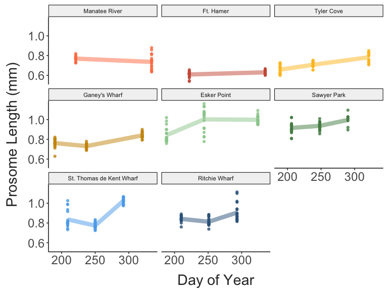

### Salinity Pair Comparisons

The three pairs of salinity comparisons do not show any general pattern,
with variation dominated by seasonal changes.

``` r
sal_comp_ctmax_plot = sal_comps %>% 
  ggplot(aes(x = salinity, y = ctmax, colour = season, group = season)) + 
  facet_wrap(region~.) + 
  geom_point(size = 2,
             position = position_dodge(width = 0.2)) + 
  #geom_line(size = 1.5) + 
  scale_colour_manual(values = season_cols) + 
  labs(y = "CTmax (°C)",
       x = "") + 
  theme_matt_facets(base_size = 14)

sal_comp_size_plot = sal_comps %>% 
  ggplot(aes(x = salinity, y = size, colour = season, group = season)) + 
  facet_wrap(region~.) + 
  geom_point(size = 2, 
             position = position_dodge(width = 0.2)) + 
  #geom_line(size = 1.5) + 
  scale_colour_manual(values = season_cols) + 
  labs(y = "Prosome Length (mm)",
       x = "") + 
  theme_matt_facets(base_size = 14)

ggarrange(sal_comp_ctmax_plot, sal_comp_size_plot, nrow = 2, common.legend = T, legend = "right")
```

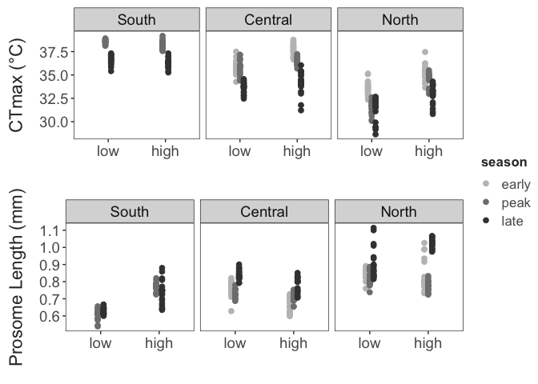

``` r

###

sal_comp_ctmax.model = lm(ctmax ~ collection_temp, data = sal_comps)
# summary(ctmax_temp.model)
# car::Anova(ctmax_temp.model)
sal_comp_ctmax_resids = residuals(sal_comp_ctmax.model)

sal_comp_size.model = lm(size ~ collection_temp, data = sal_comps)
# summary(size_temp.model)
# car::Anova(size_temp.model)
sal_comp_size_resids = residuals(sal_comp_size.model)

sal_comp_ctmax_resid_plot = sal_comps %>%
  mutate(ctmax_resids = sal_comp_ctmax_resids,
         size_resids = sal_comp_size_resids) %>%
  ggplot(aes(x = salinity, y = ctmax_resids, colour = season, group = season)) +
  facet_wrap(region~.) +
  geom_point(size = 2,
             position = position_dodge(width = 0.5)) +
  #geom_line(size = 1.5) +
  scale_colour_manual(values = season_cols) +
  labs(y = "CTmax \nResiduals",
       x = "") +
  theme_matt_facets(base_size = 14)

sal_comp_size_resid_plot = sal_comps %>%
  mutate(ctmax_resids = sal_comp_ctmax_resids,
         size_resids = sal_comp_size_resids) %>%
  ggplot(aes(x = salinity, y = size_resids, colour = season, group = season)) +
  facet_wrap(region~.) +
  geom_point(size = 2,
             position = position_dodge(width = 0.5)) +
  #geom_line(size = 1.5) +
  scale_colour_manual(values = season_cols) +
  labs(y = "Prosome Length \nResiduals",
       x = "") +
  theme_matt_facets(base_size = 14)

#ggarrange(sal_comp_ctmax_resid_plot, sal_comp_size_resid_plot, nrow = 2, common.legend = T, legend = "right")
```

## Trait Correlations

We expect that collections from warmer waters should yield copepods with
higher thermal limits and smaller body sizes. Our observations largely
fit this expectation, with strong increases in CTmax at higher
temperatures, and a general decrease in prosome lengths as temperature
increased.

``` r
ctmax_temp_plot = ggplot(full_data, aes(x = collection_temp, y = ctmax)) + 
  geom_smooth(method = "lm", se = T,
              linewidth = 2, 
              colour = "grey") + 
  geom_point(aes(colour = site), 
             size = 2, alpha = 0.7) + 
  scale_colour_manual(values = site_cols) + 
  labs(y = "CTmax (°C)",
       x = "Collection Temp. (°C)") +
  theme_matt() + 
  theme(legend.position = "none")

size_temp_plot = ggplot(full_data, aes(x = collection_temp, y = size)) + 
  geom_smooth(method = "lm", se = T,
              linewidth = 2, 
              colour = "grey") + 
  geom_point(aes(colour = site), 
             size = 2, alpha = 0.7) + 
  scale_colour_manual(values = site_cols) + 
  labs(y = "Prosome Length (mm)",
       x = "Collection Temp. (°C)") +
  theme_matt() + 
  theme(legend.position = "right")

wt_temp_plot = ggplot(full_data, aes(x = collection_temp, y = warming_tol)) + 
  geom_smooth(method = "lm", se = T,
              linewidth = 2, 
              colour = "grey") + 
  geom_point(aes(colour = site), 
             size = 2, alpha = 0.7) + 
  scale_colour_manual(values = site_cols) + 
  labs(y = "Warming Tolerance (°C)",
       x = "Collection Temp. (°C)") +
  theme_matt() + 
  theme(legend.position = "right")

ggarrange(ctmax_temp_plot, wt_temp_plot, size_temp_plot, common.legend = T, legend = "bottom", nrow = 1)
```

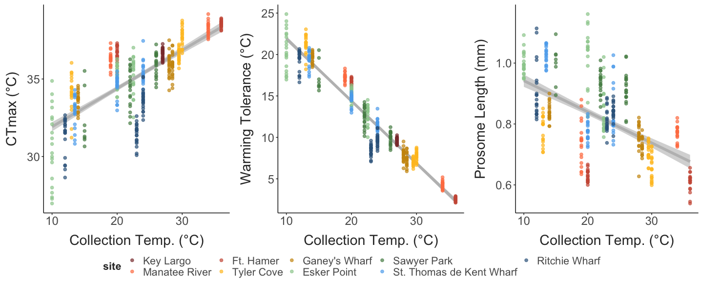

Of particular interest is the relationship between prosome length and
CTmax. In many cases, larger body sizes are associated with cold
adaptation/acclimation. We may therefore see this pattern emerge across
populations or seasons. If populations contain a mix of cold- and
warm-adapted genotypes, however, we might also see this relationship
emerge **within** populations or even individual collections. Shown
below is the relationship between prosome length and CTmax in our data
set. Individual regression lines for each site are also included - the
dark grey lines in the background represent the ‘universal’ regression
for that site, with individual colored regression lines for each
collection.

``` r
universal_size = full_data %>% 
  ggplot(aes(x = size, y = ctmax)) + 
  # geom_smooth(data = filter(full_data, ctmax > 31), 
  #             aes(x = size, y = ctmax),
  #             method = "lm", 
  #             colour = "grey60", 
  #             se = F,
  #             linewidth = 2) + 
  geom_smooth(method = "lm", se = T,
              linewidth = 2,
              colour = "grey70") + 
  geom_point(aes(colour = site),
             size = 2, alpha = 0.7) + 
  scale_colour_manual(values = site_cols) + 
  labs(y = "CTmax (°C)",
       x = "") +
  theme_matt(base_size = 14) + 
  theme(legend.position = "right",
        axis.title.x = element_blank())

pop_size = full_data %>% 
  ggplot(aes(x = size, y = ctmax, colour = site, group = season)) + 
  facet_wrap(site~.) + 
  # geom_smooth(data = filter(full_data, ctmax > 31), 
  #             aes(x = size, y = ctmax),
  #             method = "lm", 
  #             colour = "grey60", 
  #             se = F,
  #             linewidth = 2) + 
  geom_smooth(data = full_data, 
              aes(x = size, y = ctmax, group = site), 
              colour = "grey20", method = "lm", se = F) + 
  geom_point(size = 1.3, alpha = 0.3) + 
  geom_smooth(method = "lm", se = F,
              linewidth = 1) + 
  scale_colour_manual(values = site_cols) + 
  scale_x_continuous(breaks = c(0.6, 0.8, 1)) + 
  labs(y = "CTmax (°C)",
       x = "Prosome Length (mm)") +
  theme_matt(base_size = 14) + 
  theme(legend.position = "right")

ggarrange(universal_size, pop_size, common.legend = T, legend = "none", nrow = 2)
```


This relationship may be affected by changes in temperature at each
site, however, which is controlled for here by examining the
relationship between CTmax and size residuals, acquired from regressions
of these traits against collection temperature. This substantially
reduces the strength of the apparent relationship, but there is still a
slightly negative overall relationship.

``` r
filtered_data = full_data %>% 
  drop_na(size, ctmax)

ctmax_temp.model = lm(ctmax ~ collection_temp + site, data = filtered_data)
ctmax_resids = residuals(ctmax_temp.model)

size_temp.model = lm(size ~ collection_temp + site, data = filtered_data)
size_resids = residuals(size_temp.model)

universal_resids = filtered_data %>% 
  mutate(ctmax_resids = ctmax_resids,
         size_resids = size_resids) 

all_resids = ggplot(universal_resids, aes(x = size_resids, y = ctmax_resids)) + 
  # geom_smooth(data = filter(full_data, ctmax > 31), 
  #             aes(x = size, y = ctmax),
  #             method = "lm", 
  #             colour = "grey60", 
  #             se = F,
  #             linewidth = 2) + 
  geom_smooth(method = "lm", se = T,
              linewidth = 2,
              colour = "grey70") + 
  geom_point(aes(colour = site),
             size = 2, alpha = 0.7) + 
  scale_colour_manual(values = site_cols) + 
  labs(y = "CTmax Residuals",
       x = "") +
  theme_matt(base_size = 14) + 
  theme(legend.position = "right",
        axis.title.x = element_blank())

pop_resids = ggplot(universal_resids, aes(x = size_resids, y = ctmax_resids, colour = site, group = season)) + 
  facet_wrap(site~.) + 
  # geom_smooth(data = filter(full_data, ctmax > 31), 
  #             aes(x = size, y = ctmax),
  #             method = "lm", 
  #             colour = "grey60", 
  #             se = F,
  #             linewidth = 2) + 
  geom_smooth(aes(x = size_resids, y = ctmax_resids, group = site), 
              colour = "grey20", method = "lm", se = F) + 
  geom_point(size = 1.3, alpha = 0.3) + 
  geom_smooth(method = "lm", se = F,
              linewidth = 1) + 
  scale_colour_manual(values = site_cols) + 
  labs(y = "CTmax Residuals",
       x = "Prosome Length Residuals") +
  theme_matt(base_size = 14) + 
  theme(legend.position = "right")

ggarrange(all_resids, pop_resids, common.legend = T, legend = "none", nrow = 2)
```


To more formally test the relationships between CTmax, collection
temperature, and size, we used a linear mixed effects model, structured
as `ctmax ~ collection_temp + size + (1|site)`. This examines the
effects of temperature and size on CTmax, with random intercepts for
each site. Both fixed effects have a significant effect on CTmax. The
overall effect of temperature suggests an increase in CTmax of 0.18°C
per °C increase in collection temperature (i.e. - an ARR value of 0.18),
while increasing body sizes decrease CTmax by -3.67°C per mm (or a
decrease of ~-0.367°C per tenth of a mm, which is more biologically
realistic for *A. tonsa*). This ARR value is slightly lower than
observed for other copepod species, but well within the range of
previously observed values. The estimated effect of body size is, as
expected, similar to that from the residuals plot above.

``` r

#summary(ctmax.model)

effects_summary = data.frame(
  "Temperature" = unname(fixef(ctmax.model)["collection_temp"]),
  "Size" = unname(fixef(ctmax.model)["size"]))

knitr::kable(effects_summary)
```

| Temperature |      Size |
|------------:|----------:|
|   0.1777391 | -3.672851 |

By extracting the conditional mode for the random effects, we can also
examine how thermal limits vary across sites beyond the influence of
collection temperatures and body sizes. Shown below are these values,
extracted from the linear mixed effects model. We can see that, similar
to what’s been observed in common garden experiments with *A. tonsa*
previously, copepods from southern sites had higher thermal limits than
those from northern sites. Interestingly, these population effects
indicate that low salinity sites tended to have lower thermal limits
than their paired high salinity site.

``` r
pop_effs = REsim(ctmax.model) %>% 
  dplyr::select("site" = groupID, term, mean, sd) %>% 
  filter(term == "(Intercept)") %>% 
  inner_join(site_data, by = c("site")) %>% 
  mutate(site = fct_reorder(site, lat))

# coefficients(ctmax.model)$site %>%
#   janitor::clean_names() %>% 
#   rownames_to_column(var = "site") %>% 
#   ggplot(aes(x = intercept, y = collection_temp)) +
#   geom_point(aes(colour = site),
#              size = 5) + 
#   scale_colour_manual(values = site_cols) + 
#   theme_matt() + 
#   theme(legend.position = "right")

#plotREsim(REsim(ctmax.model))  # plot the interval estimates

ggplot(pop_effs, aes(x = lat, y = mean, colour = site)) + 
  geom_hline(yintercept = 0) +
  geom_errorbar(aes(ymin = mean - 1.96 * sd, ymax = mean + 1.96 * sd),
                width = 0.5, linewidth = 1) + 
  geom_point(size = 3) + 
  scale_colour_manual(values = site_cols) + 
  labs(x = "Latitude", 
       y = "Population Effect") + 
  theme_matt() + 
  theme(legend.position = "right")
```


## Trait Variability

Shown below is the trait variation (ranges) for each site. Ranges are
calculated for each collection separately.

``` r
trait_ranges = full_data %>% 
  group_by(site, season, collection_temp, collection_salinity, doy, lat) %>% 
  summarise(mean_ctmax = mean(ctmax),
            ctmax_range = max(ctmax) - min(ctmax),
            ctmax_var = var(ctmax),
            mean_size = mean(size),
            size_range = max(size) - min(size),
            size_var = var(size)) %>% 
  mutate(prop_ctmax_range = ctmax_range / mean_ctmax,
         prop_size_range = size_range / mean_size)

ctmax_range_temp = ggplot(trait_ranges, aes(x = collection_temp, y = ctmax_range, colour = site)) + 
  geom_point(size = 3) + 
  scale_colour_manual(values = site_cols) + 
  labs(y = "CTmax Range (°C)",
       x = "Collection Temp. (°C)") +
  theme_matt() + 
  theme(legend.position = "right")

ctmax_var_temp = ggplot(trait_ranges, aes(x = collection_temp, y = ctmax_var, colour = site)) + 
  geom_point(size = 3) + 
  scale_colour_manual(values = site_cols) + 
  labs(y = "CTmax Range (°C)",
       x = "Collection Temp. (°C)") +
  theme_matt() + 
  theme(legend.position = "right")

size_range_temp = ggplot(trait_ranges, aes(x = collection_temp, y = size_range, colour = site)) + 
  geom_point(size = 3) + 
  scale_colour_manual(values = site_cols) + 
  labs(y = "Size Range (mm)",
       x = "Collection Temp. (°C)") +
  theme_matt() + 
  theme(legend.position = "right")

size_var_temp = ggplot(trait_ranges, aes(x = collection_temp, y = size_var, colour = site)) + 
  geom_point(size = 3) + 
  scale_colour_manual(values = site_cols) + 
  labs(y = "Size Range (mm)",
       x = "Collection Temp. (°C)") +
  theme_matt() + 
  theme(legend.position = "right")

ggarrange(ctmax_range_temp, size_range_temp, common.legend = T, legend = "bottom")
```


Changes in trait variance may be indicative of phenotypic selection. If
selection (as opposed to acclimation) are driving seasonal changes, we
may expect to see a reduction in variance in the peak samples relative
to the early season samples. Note that early season collection
temperatures this year were higher than expected, driven by fairly
strong heatwaves across the North Atlantic.

``` r
ggplot(trait_ranges, aes(x = season, y = ctmax_var, colour = site)) + 
  geom_line(aes(group = site), 
            linewidth = 1.5) + 
  geom_point(size = 3) + 
  scale_colour_manual(values = site_cols) + 
  labs(y = "CTmax Variance",
       x = "Season") +
  theme_matt() + 
  theme(legend.position = "right", 
        legend.title.align = 0.125)
```


## Comparing rates of change

Both CTmax and body size varied between sites and across seasons. It can
be difficult to directly compare these two traits. We take two
approaches to ease this comparison. Shown below is a comparison of the
slopes from the trait regressions against collection temperature for
each population, standardized by the standard deviation of the trait for
each population (across all collections). This presents change per
degree change in collection temperature in units of standard deviations
for both CTmax and body size.

``` r
adj_slopes = full_data %>% 
  group_by(site, lat) %>% 
  arrange(doy) %>%  
  filter(site != "Key Largo") %>%
  summarize("ctmax_slope" = coef(lm(ctmax ~ collection_temp))["collection_temp"], 
            "mean_ctmax" = mean(ctmax),
            "ctmax_sd" = sd(ctmax),
            "size_slope" = coef(lm(size ~ collection_temp))["collection_temp"], 
            "mean_size" = mean(size),
            "size_sd" = sd(size), 
            "temp_range" = max(collection_temp) - min(collection_temp)) %>%  
  drop_na() %>% 
  mutate(adj_ctmax_slope = ctmax_slope / ctmax_sd,
         adj_size_slope = size_slope / size_sd) %>% 
  pivot_longer(cols = contains("_slope"), 
               names_to = "slope_type",
               values_to = "slope")

# ggplot(adj_slopes, aes(x = lat, y = temp_range)) + 
#   geom_point() + 
#   theme_matt()

ggplot(filter(adj_slopes, str_detect(slope_type, "adj_")), aes(x = slope_type, y = abs(slope), 
                                                               group = site, colour = site)) + 
  geom_hline(yintercept = 0) + 
  geom_line(linewidth = 1) + 
  scale_colour_manual(values = site_cols) + 
  labs(x = "", 
       y = "Slope (absolute value)") + 
  theme_matt() + 
  theme(legend.position = "right",
        axis.text.x = element_text(angle = 300, hjust = 0, vjust = 0.5))
```

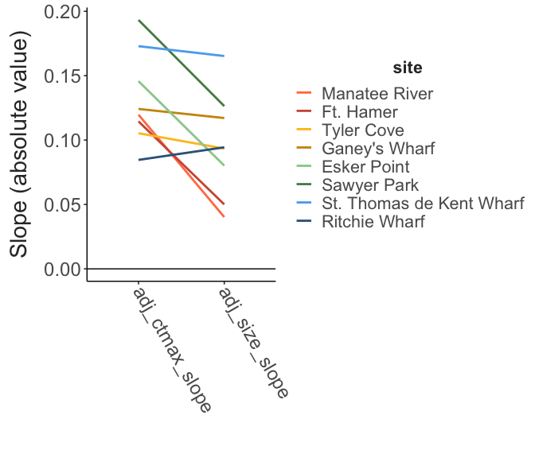

Haldanes are a similar unit, representing change in units of standard
deviations per generation. This can be a useful metric for comparing
across traits, especially as the number of generations covered by our
sampling period likely varies across populations. The calculation of
haldanes is taken from Hendry and Kinnison (1999), which in turn is
based on work from Gingerich (1993). We estimated the number of
generations passed between collections using the empirical relationship
between temperature and development time for *Acartia tonsa* from
Leandro et al. (2006). For initial estimates, we used a temperature
halfway between what was observed during collection. Changes were
examined for each pair of collections (early to peak, and peak to late).

Shown below is a comparison of the estimated haldane values for CTmax
and body size, separated by season. Keep in mind that while this metric
accounts for differences in the number of generations between
collections, it does not directly account for differences in
temperature, leading to inflated values in the “peak to late”
comparisons, which typically covered a larger range of temperatures.

``` r
early_peak = full_data %>% 
  filter(season %in% c("early", "peak")) %>% 
  mutate(season = if_else(season == "early", "one", "two")) %>% 
  group_by(site) %>% 
  mutate(ctmax_sd_p = sd(ctmax),
         size_sd_p = sd(size), 
         temp_change = max(collection_temp) - min(collection_temp),
         avg_temp = (max(collection_temp) + min(collection_temp)) / 2,
         days_passed = max(doy) - min(doy)) %>% 
  select(site, lat, season, 
         ctmax_sd_p, size_sd_p, 
         temp_change, avg_temp, days_passed, 
         ctmax, size) %>%
  group_by(site, lat, season, 
           ctmax_sd_p, size_sd_p, 
           temp_change, avg_temp, days_passed) %>% 
  summarize(ctmax = mean(ctmax),
            size = mean(size)) %>% 
  pivot_wider(id_cols = c(site, lat, ctmax_sd_p, size_sd_p, 
                          temp_change, avg_temp, days_passed), 
              names_from = season, 
              values_from = c(ctmax, size)) %>% 
  mutate(season = "early_to_peak") %>%  
  drop_na()

peak_late = full_data %>% 
  filter(season %in% c("peak", "late")) %>% 
  mutate(season = if_else(season == "peak", "one", "two")) %>% 
  group_by(site) %>% 
  mutate(ctmax_sd_p = sd(ctmax),
         size_sd_p = sd(size), 
         temp_change = last(collection_temp) - first(collection_temp),
         avg_temp = (max(collection_temp) + min(collection_temp)) / 2,
         days_passed = max(doy) - min(doy)) %>% 
  select(site, lat, season, ctmax_sd_p, size_sd_p, 
         temp_change, avg_temp, days_passed, 
         ctmax, size) %>%
  group_by(site, lat, season, ctmax_sd_p, size_sd_p, 
           temp_change, avg_temp, days_passed) %>% 
  summarize(ctmax = mean(ctmax),
            size = mean(size)) %>% 
  pivot_wider(id_cols = c(site, lat, ctmax_sd_p, size_sd_p, 
                          temp_change, avg_temp, days_passed), 
              names_from = season, 
              values_from = c(ctmax, size)) %>% 
  mutate(season = "peak_to_late") %>%  
  drop_na()

calc_halds = function(x1, x2, sd_p, g){
  ((x2 / sd_p) - (x1 / sd_p)) / g
}

haldanes = bind_rows(early_peak, peak_late) %>% 
  mutate("gen_time" = 5490*(avg_temp + 1)^-2.05, 
         "gens" = floor(days_passed / gen_time),
         "ctmax_haldanes" = calc_halds(x2 = ctmax_two, x1 = ctmax_one, 
                                       sd_p = ctmax_sd_p, g = gens),
         "size_haldanes" = calc_halds(x2 = size_two, x1 = size_one, 
                                      sd_p = size_sd_p, g = gens))

haldanes %>% 
  ungroup() %>% 
  select(site, temp_change, season, ctmax_haldanes, size_haldanes) %>% 
  pivot_longer(cols = c(ctmax_haldanes, size_haldanes),
               names_to = c("type", NA), 
               names_sep = "_",
               values_to = "haldanes") %>% 
  ggplot(aes(x = type, y = haldanes, group = site, colour = site)) + 
  facet_wrap(season~.) + 
  geom_hline(yintercept = 0) + 
  geom_line(aes(linewidth = desc(temp_change))) + 
  scale_colour_manual(values = site_cols) + 
  labs(x = "Trait", 
       y = "Haldanes", 
       linewidth = "Temp. Change") + 
  theme_matt_facets()
```

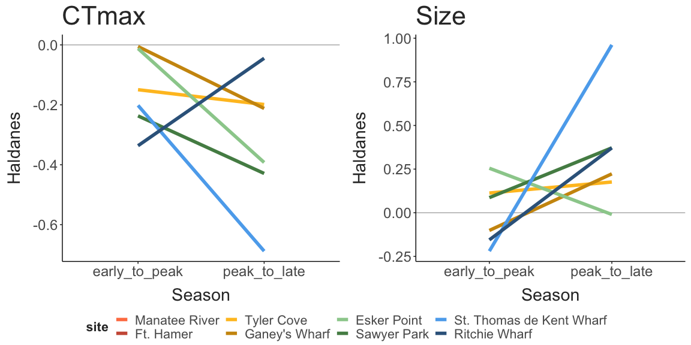

Shown below are the haldane values plotted against latitude. Note that
even though large changes in temperature occured between peak and late
samples in the Chesapeake, the change in haldanes is relatively small,
while in the Northern populations, changes are larger, though more
variable.

``` r
ctmax_haldanes = ggplot(haldanes, aes(x = lat, y = ctmax_haldanes, colour = site, shape = season)) + 
  geom_hline(yintercept = 0) + 
  geom_point(size = 3) + 
  scale_colour_manual(values = site_cols) + 
  labs(x = "Latitude",
       y = "Change in CTmax (haldanes)") + 
  theme_matt_facets()

size_haldanes = ggplot(haldanes, aes(x = lat, y = size_haldanes, colour = site, shape = season)) + 
  geom_hline(yintercept = 0) + 
  geom_point(size = 3) + 
  scale_colour_manual(values = site_cols) + 
  labs(x = "Latitude",
       y = "Change in Size (haldanes)") + 
  theme_matt_facets()

ggarrange(ctmax_haldanes, size_haldanes, common.legend = T, legend = "right", nrow = 2)
```

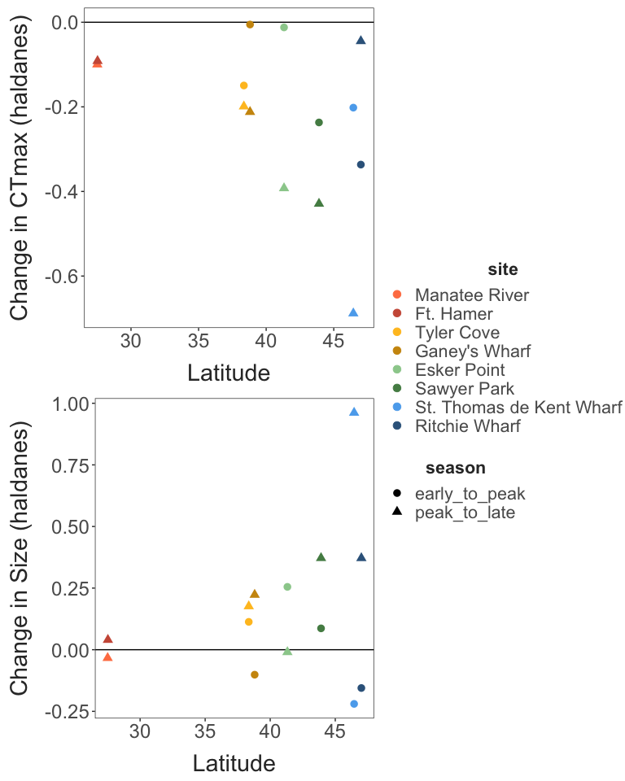

## Why does intraspecific data matter?

``` r
# Compare estimated warming tolerance "ranges" when: 1) CTmax for "average" collection is used; 2) When CTmax for one collection per population is used; and 3) When all collections are used. The idea is to show that not accounting for intra-specific and intra-population variation leads to incorrect predictions of vulnerability to warming because this variation can be substantial - across populations within each seasonal collection, there is at least 5°C variation in thermal limits, while across collections within populations, acclimation to changes in temperature can drive substantial variation. 

## Scenario 1 - single point estimates 

est_1 = full_data %>% 
  group_by(site, season) %>% 
  summarise("mean_ctmax" = mean(ctmax)) %>% 
  filter(site == "Tyler Cove", season == "peak")

scenario_1 = full_data %>% 
  mutate(rep_ctmax = est_1$mean_ctmax,
         pred_wt = rep_ctmax - collection_temp, 
         wt_diff = pred_wt - warming_tol)

ggplot(scenario_1, aes(x = lat, y = wt_diff)) + 
  facet_wrap(season~., nrow = 3) + 
  geom_hline(yintercept = 0) + 
  geom_point() + 
  labs(x = "Latitude", 
       y = "Predicted - Observed WT") + 
  theme_matt_facets()
```


## Next Steps

After phenotyping, each individual was preserved in 95% ethanol.
Individual DNA libraries will be prepared using Twist Bio 96-plex prep
kits, then sequenced on an Illumina NovaSeq X Plus. Using the
low-coverage whole genome sequences, we will examine seasonal patterns
in allele frequency change, and compare these fine scale temporal
patterns with the larger latitudinal patterns in allele frequency to
determine whether the same alleles driving rapid seasonal adaptation are
in play over larger spatial (and longer temporal) scales.

## Misc. Details

``` r
ggplot(temp_record, aes(x = minute_passed, y = temp_C, group = factor(run))) + 
  geom_abline(slope = 0.3, intercept = mean(temp_record[temp_record$minute_interval == 0, 8])) + 
  geom_abline(slope = 0.1, intercept = mean(temp_record[temp_record$minute_interval == 0, 8])) + 
  geom_line(linewidth = 0.2, alpha = 0.8) + 
  geom_point(data = full_data, 
             aes(x = time, y = ctmax + 0.4),
             size = 2,
             shape = 25) +
  labs(x = "Time passed (minutes)",
       y = "Temperature (degrees C)",
       fill = "Trial Number") + 
  guides(colour = "none") + 
  theme_matt(base_size = 16) + 
  theme(legend.position = "right")
```


``` r
ramp_record2 = ramp_record %>% 
  group_by(run, minute_interval) %>% 
  summarise(mean_ramp = mean(ramp_per_minute)) %>% 
  ungroup()

ggplot(ramp_record2, aes(x = minute_interval, y = mean_ramp)) + 
  geom_hline(yintercept = 0.3) + 
  geom_hline(yintercept = 0.1) + 
  #geom_point() + 
  geom_hex(bins = 30) + 
  ylim(0, 0.35) + 
  labs(y = "Ramp Rate (deg. C / min.)",
       x = "Time into run (minute)") + 
  theme_matt(base_size = 16) 
```


``` r
full_data %>% 
  drop_na(replicate) %>%  
  ggplot(aes(x = factor(replicate), y = ctmax, group = site)) + 
  facet_grid(site~season, scales = "free_y") + 
  geom_point(position = position_jitter(width = 0.1, height = 0),
             alpha = 0.4,
             colour = "grey30") + 
  geom_smooth(method = "lm", colour = "black") + 
  labs(x = "Replicate", 
       y = "CTmax") + 
  theme_matt_facets()
```

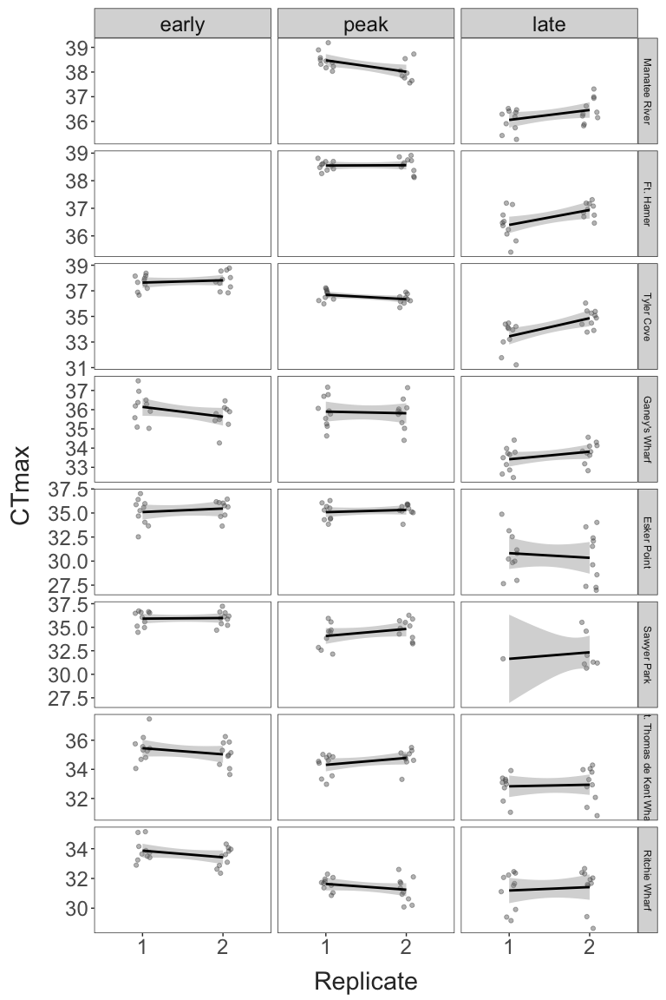

``` r
ggplot(haldanes, aes(x = lat, y = gens, colour = site, shape = season)) + 
  geom_hline(yintercept = 0) + 
  geom_point(size = 5) + 
  scale_colour_manual(values = site_cols) + 
  labs(x = "Latitude", 
       y = "Generations between \ncollections") +
  scale_y_continuous(breaks = seq(from = 0, to = 21, by = 5)) + 
  theme_matt() + 
  theme(legend.position = "right")
```

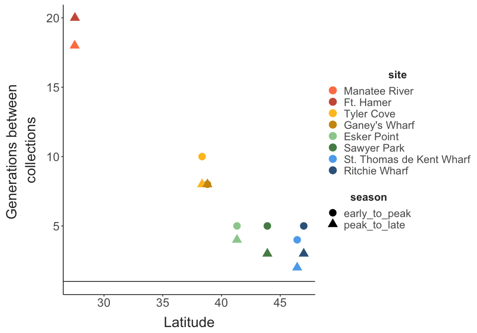

``` r
obs_ranks = ggplot(full_data, aes(x = rank)) + 
  facet_wrap(tube~.) + 
  geom_histogram(binwidth = 1) + 
  scale_x_continuous(breaks = c(2,4,6,8,10)) + 
  ggtitle("Observation") + 
  theme_matt_facets()

sim_data = data.frame()
for(i in 1:max(full_data$run)){
  rep_data = data.frame("tube" = sample(c(1:10), size = 10, replace = F), 
                        "rank" = c(1:10),
                        "rep" = i) %>% 
    arrange(tube)
  
  sim_data = bind_rows(sim_data, rep_data)
  
}

sim_ranks = ggplot(sim_data, aes(x = rank)) + 
  facet_wrap(tube~.) + 
  geom_histogram(binwidth = 1) + 
  scale_x_continuous(breaks = c(2,4,6,8,10)) + 
  ggtitle("Simulation") + 
  theme_matt_facets()


ggarrange(obs_ranks, sim_ranks)
```

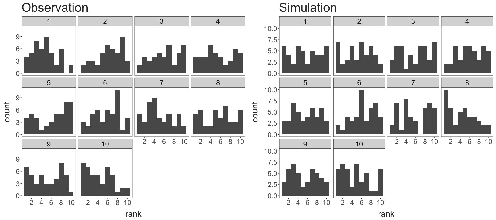
