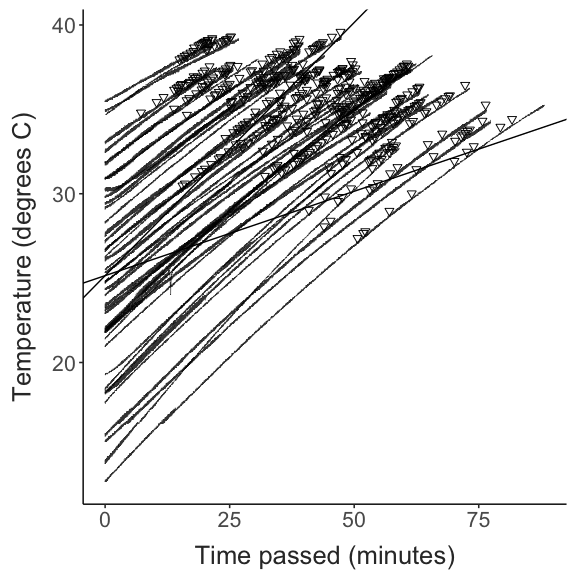
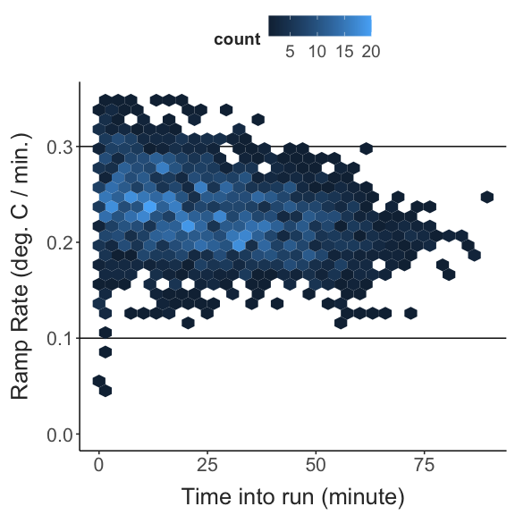

Comparing seasonal and latitudinal patterns in thermal adaptation
================
2023-07-09

- [Site Characteristics](#site-characteristics)
- [Critical Thermal Limits](#critical-thermal-limits)
- [Body Size](#body-size)
- [Trait Correlations](#trait-correlations)
- [Next Steps](#next-steps)
- [Misc. Details](#misc-details)

## Site Characteristics

Copepods were collected by surface tow from sites across the Western
Atlantic at several times throughout the year. The sites are shown
below. Temperatures at the time of collection were measured using a
manual thermometer.

``` r
coords = site_data %>%
  select(site, long, lat) %>%
  distinct()

site_map = map_data("world") %>% 
  filter(region %in% c("USA", "Canada")) %>% 
  ggplot() + 
  geom_polygon(aes(x = long, y = lat, group = group),
               fill = "lightgrey") + 
  coord_map(xlim = c(-85,-60),
            ylim = c(25, 48)) + 
  geom_point(data = coords,
              mapping = aes(x = long, y = lat, colour = site),
              size = 3) +
  scale_colour_manual(values = site_cols) + 
  labs(x = "Longitude", 
       y = "Latitude") + 
  theme_matt(base_size = 16)

site_temp_plot = full_data %>% 
  select(site, season, doy, collection_temp, collection_salinity) %>%  
  distinct() %>% 
ggplot(aes(x = doy, y = collection_temp, colour = site)) + 
  geom_point(size = 6) + 
  geom_line(linewidth = 1) + 
  scale_colour_manual(values = site_cols) + 
  labs(y = "Temperature (°C)",
       x = "Day of the Year") +
  theme_matt() + 
  theme(legend.position = "right")

ggpubr::ggarrange(site_map, site_temp_plot, common.legend = T, legend = "bottom")
```


## Critical Thermal Limits

Critical thermal maxima (CTmax) was measured using a custom setup. The
method uses a standard dynamic ramping assay to determine the maximum
temperature individuals could sustain normal functioning. This differs
from lethal temperatures, and indeed, all individuals observed so far
recovered following the assay.

Individuals were rested for one hour after collection before the assay.
During the assay, copepods were held in 0.2 um filtered seawater,
adjusted to match the salinity at the time of collection with bottled
spring water. During the assay, several ‘control’ individuals were
maintained in this adjusted salinity solution, but did not experience
the temperature ramp, to ensure that there was no background mortality.

Shown below are the measured CTmax values.

``` r
ggplot(full_data, aes(x = season, y = ctmax, colour = site)) + 
  geom_point(position = position_jitterdodge(jitter.width = 0.1, jitter.height = 0,
                                             dodge.width = 0.25)) + 
  scale_colour_manual(values = site_cols) + 
  labs(y = "CTmax (°C)",
       x = "Season") +
  theme_matt() + 
  theme(legend.position = "right")
```


## Body Size

Following the CTmax assay, individuals were photographed for body size
measurements. Prosome lengths were measured from these photographs using
a scale micrometer and the software ImageJ. These measurements are shown
below.

``` r
ggplot(full_data, aes(x = season, y = size, colour = site)) + 
  geom_point(position = position_jitterdodge(jitter.width = 0.1, jitter.height = 0,
                                             dodge.width = 0.25)) + 
  scale_colour_manual(values = site_cols) + 
  labs(y = "CTmax (°C)",
       x = "Season") +
  theme_matt() + 
  theme(legend.position = "right")
```


## Trait Correlations

Shown below is the relationship between prosome length and CTmax.
Individual regression lines for each site are shown along with a
‘universal’ regression in grey.

``` r
full_data %>%  
  filter(ctmax > 31) %>% 
ggplot(aes(x = size, y = ctmax, colour = site)) + 
  geom_smooth(data = filter(full_data, ctmax > 31), 
              aes(x = size, y = ctmax),
              method = "lm", 
              colour = "grey60", 
              se = F,
              linewidth = 2) + 
  geom_point(size = 2, alpha = 0.7) + 
  geom_smooth(method = "lm", se = F,
              linewidth = 2) + 
  scale_colour_manual(values = site_cols) + 
  labs(y = "CTmax (°C)",
       x = "Prosome Length (mm)") +
  theme_matt() + 
  theme(legend.position = "right")
```


## Next Steps

After phenotyping, each individual was preserved in 95% ethanol.
Individual DNA libraries will be prepared using Twist Bio 96-plex prep
kits, then sequenced on an Illumina NovaSeq X Plus. Using the
low-coverage whole genome sequences, we will examine seasonal patterns
in allele frequency change, and compare these fine scale temporal
patterns with the larger latitudinal patterns in allele frequency to
determine whether the same alleles driving rapid seasonal adaptation are
in play over larger spatial (and longer temporal) scales.

## Misc. Details

``` r
ggplot(temp_record, aes(x = minute_passed, y = temp_C, group = factor(run))) + 
  geom_abline(slope = 0.3, intercept = mean(temp_record[temp_record$minute_interval == 0, 8])) + 
  geom_abline(slope = 0.1, intercept = mean(temp_record[temp_record$minute_interval == 0, 8])) + 
  geom_line(linewidth = 0.2, alpha = 0.8) + 
  geom_point(data = full_data, 
             aes(x = time, y = ctmax + 0.4),
             size = 2,
             shape = 25) +
  labs(x = "Time passed (minutes)",
       y = "Temperature (degrees C)",
       fill = "Trial Number") + 
  guides(colour = "none") + 
  theme_matt(base_size = 16) + 
  theme(legend.position = "right")
```



``` r
ramp_record2 = ramp_record %>% 
  group_by(run, minute_interval) %>% 
  summarise(mean_ramp = mean(ramp_per_minute)) %>% 
  ungroup()

ggplot(ramp_record2, aes(x = minute_interval, y = mean_ramp)) + 
  geom_hline(yintercept = 0.3) + 
  geom_hline(yintercept = 0.1) + 
  #geom_point() + 
  geom_hex(bins = 30) + 
  ylim(0, 0.35) + 
  labs(y = "Ramp Rate (deg. C / min.)",
       x = "Time into run (minute)") + 
  theme_matt(base_size = 16) 
```


