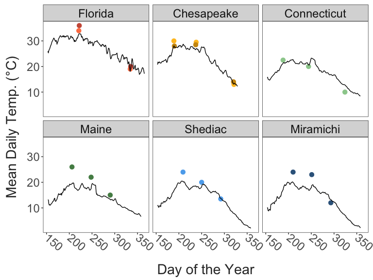
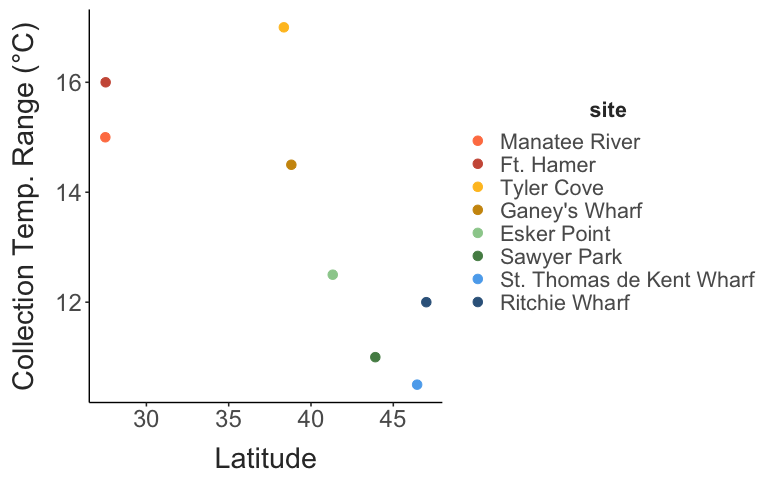
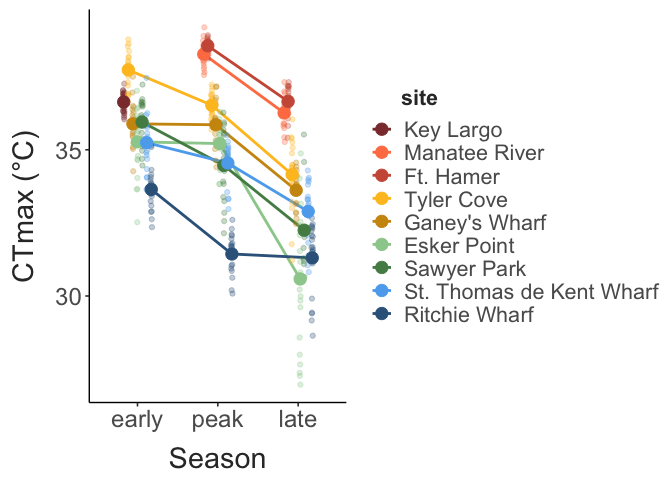
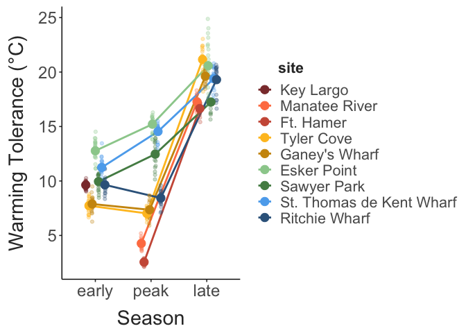
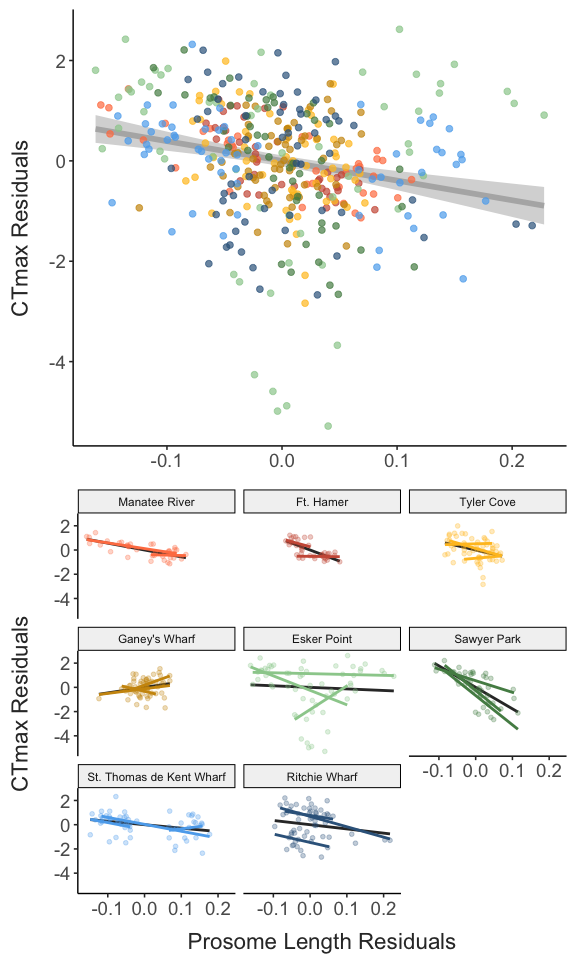
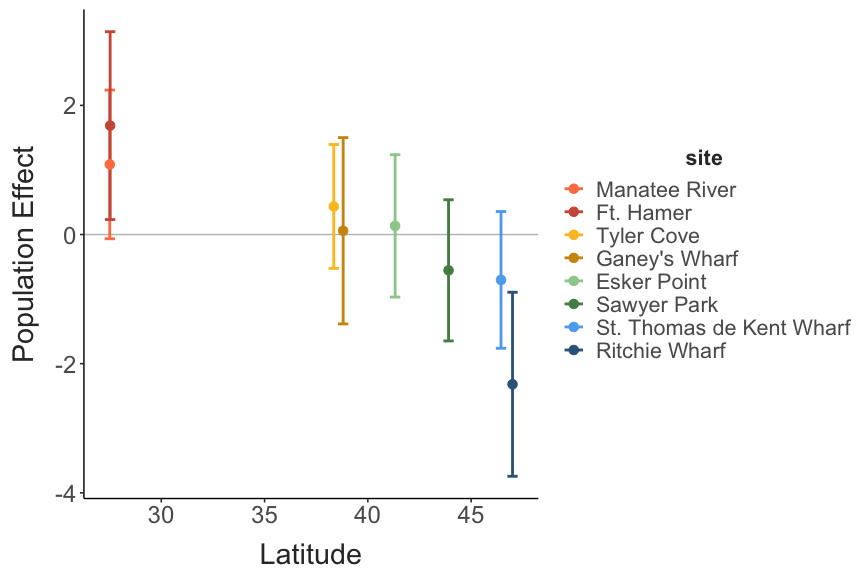
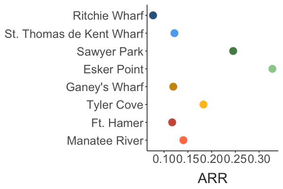
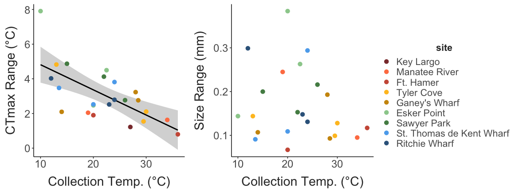
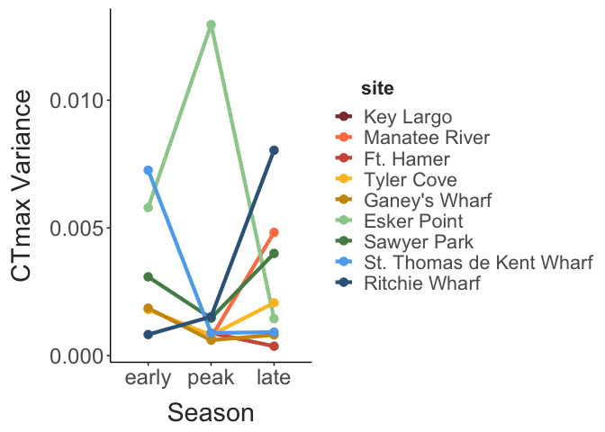
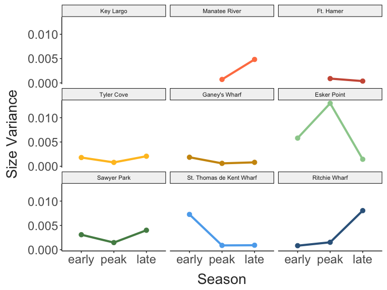

Comparing seasonal and latitudinal patterns in thermal adaptation
================
2024-05-13

- [Site Characteristics](#site-characteristics)
- [Phenotypic Measurements](#phenotypic-measurements)
  - [Critical Thermal Limits](#critical-thermal-limits)
  - [Warming tolerance](#warming-tolerance)
  - [Body Size](#body-size)
  - [Salinity Pair Comparisons](#salinity-pair-comparisons)
- [Trait Correlations](#trait-correlations)
- [Trait Variability](#trait-variability)

## Site Characteristics

``` r
site_temps = full_data %>% 
  dplyr::select(site, lat, season, doy, collection_temp, collection_salinity) %>%  
  distinct() %>% 
  filter(doy > 100) 
```

Copepods were collected by surface tow from sites across the Western
Atlantic at several times throughout the year. The sites are shown
below. Temperatures at the time of collection were measured using a
manual thermometer. Across the entire set of collections, temperature
ranged from 10°C to 36°C.

``` r
coords = site_data %>%
  dplyr::select(site, long, lat) %>%
  distinct()

site_map = map_data("world") %>% 
  filter(region %in% c("USA", "Canada")) %>% 
  ggplot() + 
  geom_polygon(aes(x = long, y = lat, group = group),
               fill = "lightgrey") + 
  coord_map(xlim = c(-85,-60),
            ylim = c(25, 48)) + 
  geom_point(data = coords,
             mapping = aes(x = long, y = lat, colour = site),
             size = 3) +
  scale_colour_manual(values = site_cols) + 
  labs(x = "Longitude", 
       y = "Latitude") + 
  theme_matt(base_size = 16)

site_temp_plot = ggplot(site_temps, aes(x = doy, y = collection_temp, colour = site)) + 
  geom_line(linewidth = 2) + 
  geom_point(size = 5) +
  scale_colour_manual(values = site_cols) + 
  labs(y = "Temperature (°C)",
       x = "Day of the Year") +
  theme_matt() + 
  theme(legend.position = "right")

ggarrange(site_map, site_temp_plot, common.legend = T, legend = "bottom")
```


Collections aimed to obtain copepods near the onset of peak
temperatures, after peak temperatures, and then at low temperatures.
Regional data is not available for all sites, so here we’ve pieced
together daily temperature values from either local temperature sensors
(sites in Florida and the Chesapeake) and high resolution satellite
temperature data (Connecticut, Maine, and the Canadian sites). This
satellite data comes from the NOAA 1/4° Daily Optimum Interpolation Sea
Surface Temperature (OISST).

These temperature profiles are shown below, with the temperatures
measured during the time of collection included for comparison In
several cases collection temperature does not match the recorded daily
averages, but the temperature records do give a general sense of the
timing of seasonal maxima. In general, the first sample from each site
fell just after the site reached the warmest period. The exception to
that pattern is in Florida, where collections occurred after an extended
period of high temperatures.

``` r
temp_profiles = temp_profiles %>% 
  filter(doy > 100) %>% 
  mutate(region = fct_relevel(region, "Florida", "Chesapeake", "Connecticut",
                              "Maine", "Shediac", "Miramichi"))

site_temps2 = site_temps %>% 
  mutate(region = case_when(
    site == "Manatee River" ~ "Florida",
    site == "Ft. Hamer" ~ "Florida",
    site == "Tyler Cove" ~ "Chesapeake",
    site == "Ganey's Wharf" ~ "Chesapeake",
    site == "Esker Point" ~ "Connecticut",
    site == "Sawyer Park" ~ "Maine",
    site == "St. Thomas de Kent Wharf" ~ "Shediac",
    site == "Ritchie Wharf" ~ "Miramichi"),
    region = fct_relevel(region, "Florida", "Chesapeake", "Connecticut",
                         "Maine", "Shediac", "Miramichi"))

ggplot(temp_profiles, aes(x = doy, y = temp_c)) + 
  facet_wrap(region~.) + 
  geom_point(data = site_temps2,
             aes(x = doy, y = collection_temp, colour = site),
             size = 3) +
  geom_line() + 
  scale_colour_manual(values = site_cols) + 
  labs(x = "Day of the Year", 
       y = "Mean Daily Temp. (°C)") + 
  theme_matt_facets() + 
  theme(legend.position = "none", 
        axis.text.x = element_text(angle = 320, hjust = 0, vjust = 0.5))
```



Exact locations for the sites are provided here.

``` r
site_data %>%  
  arrange(lat) %>%  
  select("Site" = site, "Region" = region, "Lat" = lat, "Long" = long) %>% 
  knitr::kable(align = "c")
```

|           Site           |    Region     |   Lat    |   Long    |
|:------------------------:|:-------------:|:--------:|:---------:|
|        Key Largo         |    Florida    | 25.28391 | -80.33014 |
|      Manatee River       |    Florida    | 27.50561 | -82.57277 |
|        Ft. Hamer         |    Florida    | 27.52488 | -82.43101 |
|        Tyler Cove        |   Maryland    | 38.35083 | -76.22902 |
|      Ganey’s Wharf       |   Maryland    | 38.80555 | -75.90906 |
|       Esker Point        |  Connecticut  | 41.32081 | -72.00166 |
|       Sawyer Park        |     Maine     | 43.90698 | -69.87179 |
| St. Thomas de Kent Wharf | New Brunswick | 46.44761 | -64.63692 |
|      Ritchie Wharf       | New Brunswick | 47.00481 | -65.56291 |

Nested within each of the three regions (South, Central, and Northern
regions) are pairs of low and high salinity sites:

``` r
data.frame("Region" = c("South", "Central", "North"),
           "Low Salinity" = c("Ft. Hamer", "Ganey's Wharf", "Ritchie Wharf"),
           "High Salinity" = c("Manatee River", "Tyler Cove", "St. Thomas de Kent Wharf")) %>% 
  knitr::kable(align = "c")
```

| Region  | Low.Salinity  |      High.Salinity       |
|:-------:|:-------------:|:------------------------:|
|  South  |   Ft. Hamer   |      Manatee River       |
| Central | Ganey’s Wharf |        Tyler Cove        |
|  North  | Ritchie Wharf | St. Thomas de Kent Wharf |

 

There are fairly well-established divergences between high salinity and
low salinity populations of *Acartia tonsa*. These sets of
geographically proximate but isolated populations provide independent
comparisons of the effects of seasonality. Shown here are the collection
conditions for these pairs of sites. Temperature was typically similar
across the pairs within each collection, while salinity differences were
fairly stable across collections.

``` r
season_cols = c("early" = "grey75", 
                "peak" = "grey50", 
                "late" = "grey25")

sal_regions = data.frame(region = rep(c("South", "Central", "North"), each = 2), 
                         site = c("Ft. Hamer", "Manatee River", 
                                  "Ganey's Wharf", "Tyler Cove", 
                                  "Ritchie Wharf", "St. Thomas de Kent Wharf"),
                         salinity = c("low", "high"))

sal_comps = full_data %>% 
  filter(site %in% sal_regions$site) %>% 
  inner_join(sal_regions, by = c("site")) %>% 
  select( region = region.y, site, salinity, season, doy, collection_temp, collection_salinity,
          size, ctmax, warming_tol) %>% 
  mutate(salinity = fct_relevel(salinity, "low", "high"),
         region = fct_relevel(region, "South", "Central", "North"))

sal_comp_temps = sal_comps %>%  
  select(salinity, season, region, collection_temp, collection_salinity) %>% 
  distinct() %>% 
  ggplot(aes(x = salinity, y = collection_temp, colour = season, group = season)) + 
  facet_wrap(region~.) + 
  geom_line(linewidth = 1.5) + 
  geom_point(size = 4) + 
  scale_colour_manual(values = season_cols) + 
  labs(y = "Collection Temp. (°C)",
       x = "") + 
  theme_matt_facets(base_size = 14)

sal_comp_sal = sal_comps %>%  
  select(salinity, season, region, collection_temp, collection_salinity) %>% 
  distinct() %>% 
  ggplot(aes(x = salinity, y = collection_salinity, colour = season, group = season)) + 
  facet_wrap(region~.) + 
  geom_line(linewidth = 1.5) + 
  geom_point(size = 4) + 
  scale_colour_manual(values = season_cols) + 
  labs(y = "Collection Salinity (psu)",
       x = "Salinity") + 
  theme_matt_facets(base_size = 14)

ggarrange(sal_comp_temps, sal_comp_sal, nrow = 2, common.legend = T, legend = "right")
```


The latitudinal gradient covers a wide range of seasonality. Shown below
is the temperature range. While based on collection temperatures, and
therefore an underestimate of the total seasonal range of temperatures,
these patterns are representative of the expected latitudinal gradient
in seasonality.

``` r
site_temps %>% 
  group_by(site, lat) %>%  
  summarise(temp_range = max(collection_temp) - min(collection_temp)) %>%  
  ggplot(aes(x = lat, y = temp_range)) + 
  geom_point(aes(colour = site),
             size = 3) + 
  scale_color_manual(values = site_cols) + 
  labs(x = "Latitude", 
       y = "Collection Temp. Range (°C)") + 
  theme_matt() + 
  theme(legend.position = "right")
```



## Phenotypic Measurements

### Critical Thermal Limits

A total of 456 individuals were examined. Critical thermal limits and
body size measurements were made before individuals were preserved in
ethanol. We excluded data for 7 individuals, detailed below. These
individuals had either very low CTmax or were, upon re-examination of
photographs, identified as juveniles instead of mature females. With
these individuals excluded, **the full data set contains 449 phenotyped
individuals**.

``` r
excluded %>% 
  select(region, site, season, collection_temp, collection_salinity, replicate, tube, ctmax, size) %>% 
  knitr::kable(align = "c")
```

|    region     |           site           | season | collection_temp | collection_salinity | replicate | tube |  ctmax   | size  |
|:-------------:|:------------------------:|:------:|:---------------:|:-------------------:|:---------:|:----:|:--------:|:-----:|
|    Florida    |      Manatee River       |  peak  |      34.0       |         29          |     2     |  6   | 38.45833 | 0.616 |
|    Florida    |      Manatee River       |  peak  |      34.0       |         29          |     2     |  7   | 38.23750 | 0.593 |
|    Florida    |        Ft. Hamer         |  late  |      20.0       |         18          |     2     |  3   | 36.59280 | 0.619 |
|   Maryland    |        Tyler Cove        |  peak  |      29.5       |         15          |     2     |  2   | 36.84375 | 0.614 |
|  Connecticut  |       Esker Point        | early  |      22.5       |         30          |     2     |  3   | 30.02604 | 0.687 |
|     Maine     |       Sawyer Park        |  peak  |      22.0       |         30          |     1     |  4   | 30.81424 | 0.865 |
| New Brunswick | St. Thomas de Kent Wharf |  late  |      13.5       |         28          |     1     |  3   | 28.78299 | 1.039 |

Critical thermal maxima (CTmax) was measured using a custom setup. The
method uses a standard dynamic ramping assay to determine the maximum
temperature individuals could sustain normal functioning. This differs
from lethal temperatures, and indeed, all individuals observed so far
recovered following the assay.

Individuals were rested for one hour after collection before the assay.
During the assay, copepods were held in artificial seawater, composed of
bottled spring water and Instant Ocean salt mix adjusted to match
collection salinities. During the assay, several ‘control’ individuals
were maintained in this solution at ambient temperatures without the
temperature ramp to ensure that there was no background mortality. When
sorting individuals from the plankton tow contents, they were held in a
50:50 mix of 60 um filtered water from the collection site and
artificial seawater as an additional acclimation step.

Sample sizes varied slightly across experiments, but most sites had 20
individuals measured per season. The major exceptions were the early
samples from the Florida sites and the late sample from Sawyer Park
(Maine). Only two sets of samples (peak and late) were collected from
Fort Hamer and Manatee River. No samples were collected from Key Largo
for this project, as *Acartia tonsa* wasn’t present in the water during
the peak season, likely due to the recent extreme heat event. The late
season collection from Sawyer Park occurred after *Acartia tonsa*
abundance decreased. Samples from this period were dominated by *Acartia
hudsonica* instead.

``` r
ggplot(full_data, aes(x = site, fill = site)) + 
  facet_wrap(season~.) + 
  geom_hline(yintercept = c(0,20),
             colour = "grey70") + 
  geom_bar() + 
  scale_fill_manual(values = site_cols) + 
  coord_flip() +
  theme_matt() + 
  theme(legend.position = "none",
        panel.border = element_rect(linewidth = 1,
                                    fill = NA),
        strip.text = element_text(size = 20),
        axis.title.y = element_blank())
```


Shown below are the measured CTmax values. Note: CTmax values for the
early season Key Largo copepods were collected at the end of February
2023 as part of a separate project. Body size values were not measured
during this project, nor were copepods individually preserved after the
experiments. These early season CTmax values are included as a point of
comparison. Individual measurements are shown in small points for each
collection. The large points indicate the mean values for each
collection.

``` r
mean_ctmax = full_data %>% 
  group_by(site, season, doy, collection_temp) %>% 
  summarize(mean_ctmax = mean(ctmax),
            median_ctmax = median(ctmax))

ctmax_plot = ggplot(full_data, aes(x = season, y = ctmax, colour = site)) + 
  geom_line(data = mean_ctmax, 
            aes(y = mean_ctmax, group = site),
            position = position_dodge(width = 0.4),
            linewidth = 1) + 
  geom_point(position = position_jitterdodge(jitter.width = 0.1, jitter.height = 0,
                                             dodge.width = 0.4),
             alpha = 0.3) + 
  geom_point(data = mean_ctmax, 
             aes(y = mean_ctmax),
             position = position_dodge(width = 0.4),
             size = 4) + 
  scale_colour_manual(values = site_cols) + 
  labs(y = "CTmax (°C)",
       x = "Season") +
  theme_matt() + 
  theme(legend.position = "right", 
        legend.title.align = 0.125)

ctmax_plot
```



### Warming tolerance

Warming tolerance (the difference between thermal limits and
environmental temperatures) is a commonly used metric of climate
vulnerability. We calculated this as the difference between measured
CTmax values and the collection temperature. Smaller warming tolerance
values indicate that populations were nearer to their upper thermal
limits, and may therefore be more vulnerable to additional warming.

``` r
mean_wt = full_data %>% 
  group_by(site, season) %>% 
  summarize(mean_wt = mean(warming_tol),
            median_wt = median(warming_tol))

ggplot(full_data, aes(x = season, y = warming_tol, colour = site)) + 
  geom_line(data = mean_wt, 
            aes(y = mean_wt, group = site),
            position = position_dodge(width = 0.4),
            linewidth = 1) + 
  geom_point(position = position_jitterdodge(jitter.width = 0.1, jitter.height = 0,
                                             dodge.width = 0.4),
             alpha = 0.3) + 
  geom_point(data = mean_wt, 
             aes(y = mean_wt),
             position = position_dodge(width = 0.4),
             size = 4) + 
  scale_colour_manual(values = site_cols) + 
  labs(y = "Warming Tolerance (°C)",
       x = "Season") +
  theme_matt() + 
  theme(legend.position = "right", 
        legend.title.align = 0.125)
```



### Body Size

Following the CTmax assay, individuals were photographed for body size
measurements. Prosome lengths were measured from these photographs using
a scale micrometer and the software ImageJ. These measurements are shown
below. As before, large points indicate the mean body size. While less
cohesive than CTmax, a general trend of increasing body size with
latitude and time of year can be seen.

``` r
mean_size = full_data %>% 
  group_by(site, season, doy, collection_temp) %>% 
  summarize(mean_size = mean(size),
            median_size = median(size))

ggplot(full_data, aes(x = season, y = size, colour = site)) + 
  geom_line(data = mean_size, 
            aes(y = mean_size, group = site),
            position = position_dodge(width = 0.4),
            linewidth = 1) + 
  geom_point(position = position_jitterdodge(jitter.width = 0.1, jitter.height = 0,
                                             dodge.width = 0.4),
             alpha = 0.3) + 
  geom_point(data = mean_size, 
             aes(y = mean_size),
             position = position_dodge(width = 0.4),
             size = 4) + 
  scale_colour_manual(values = site_cols) + 
  labs(y = "Prosome Length (mm)",
       x = "Season") +
  theme_matt() + 
  theme(legend.position = "right", 
        legend.title.align = 0.125)
```


### Salinity Pair Comparisons

The three pairs of cross-salinity comparisons do show evidence for
fine-scale trait divergence, although there was no consistent pattern in
the direction or magnitude of differences. CTmax was similar across
sites in the Southern and Central pairs. In the Northern pair, CTmax
tended to be slightly lower for individuals from the low salinity site.
Size was more variable between the paired sites. In the South, low
salinity individuals were consistently smaller than high salinity
individuals, despite experiencing similar temperatures. In the Central
pair, individuals from the low salinity site tended to be slightly
larger than those from the high salinity site, although this varied
seasonally. Sizes tended to be more similar across the collections from
the Northern pair.

``` r
sal_comp_ctmax_plot = sal_comps %>% 
  ggplot(aes(x = salinity, y = ctmax, colour = season, group = season)) + 
  facet_wrap(region~.) + 
  geom_point(size = 2,
             position = position_dodge(width = 0.2)) + 
  #geom_line(size = 1.5) + 
  scale_colour_manual(values = season_cols) + 
  labs(y = "CTmax (°C)",
       x = "") + 
  theme_matt_facets(base_size = 14)

sal_comp_size_plot = sal_comps %>% 
  ggplot(aes(x = salinity, y = size, colour = season, group = season)) + 
  facet_wrap(region~.) + 
  geom_point(size = 2, 
             position = position_dodge(width = 0.2)) + 
  #geom_line(size = 1.5) + 
  scale_colour_manual(values = season_cols) + 
  labs(y = "Prosome Length (mm)",
       x = "") + 
  theme_matt_facets(base_size = 14)

ggarrange(sal_comp_ctmax_plot, sal_comp_size_plot, nrow = 2, common.legend = T, legend = "right")
```


``` r

###
# 
# sal_comp_ctmax.model = lm(ctmax ~ collection_temp, data = sal_comps)
# # summary(ctmax_temp.model)
# # car::Anova(ctmax_temp.model)
# sal_comp_ctmax_resids = residuals(sal_comp_ctmax.model)
# 
# sal_comp_size.model = lm(size ~ collection_temp, data = sal_comps)
# # summary(size_temp.model)
# # car::Anova(size_temp.model)
# sal_comp_size_resids = residuals(sal_comp_size.model)
# 
# sal_comp_ctmax_resid_plot = sal_comps %>%
#   mutate(ctmax_resids = sal_comp_ctmax_resids,
#          size_resids = sal_comp_size_resids) %>%
#   ggplot(aes(x = salinity, y = ctmax_resids, colour = season, group = season)) +
#   facet_wrap(region~.) +
#   geom_point(size = 2,
#              position = position_dodge(width = 0.5)) +
#   #geom_line(size = 1.5) +
#   scale_colour_manual(values = season_cols) +
#   labs(y = "CTmax \nResiduals",
#        x = "") +
#   theme_matt_facets(base_size = 14)
# 
# sal_comp_size_resid_plot = sal_comps %>%
#   mutate(ctmax_resids = sal_comp_ctmax_resids,
#          size_resids = sal_comp_size_resids) %>%
#   ggplot(aes(x = salinity, y = size_resids, colour = season, group = season)) +
#   facet_wrap(region~.) +
#   geom_point(size = 2,
#              position = position_dodge(width = 0.5)) +
#   #geom_line(size = 1.5) +
#   scale_colour_manual(values = season_cols) +
#   labs(y = "Prosome Length \nResiduals",
#        x = "") +
#   theme_matt_facets(base_size = 14)
# 
# ggarrange(sal_comp_ctmax_resid_plot, sal_comp_size_resid_plot, nrow = 2, common.legend = T, legend = "right")
```

## Trait Correlations

Regardless of the underlying mechanism (genetic differentiation or
phenotypic plasticity), we expect that collections from warmer waters
should yield copepods with higher thermal limits and smaller body sizes.
Our observations largely fit this expectation, with strong increases in
CTmax at higher temperatures, and a general decrease in prosome lengths
as temperature increased. There was a larger correlation between CTmax
and temperature than size and temperature. There are myriad reasons this
might be observed, but one potential is the potential for acclimation of
thermal limits. Body size is fixed in the adult stage, while CTmax can
continue to vary as water temperature changes. This is indirect evidence
for the importance of rapid acclimation in the observed patterns.

``` r
ctmax_temp_plot = ggplot(full_data, aes(x = collection_temp, y = ctmax)) + 
  geom_smooth(method = "lm", se = T,
              linewidth = 2, 
              colour = "grey") + 
  geom_point(aes(colour = site), 
             size = 2, alpha = 0.7) + 
  scale_colour_manual(values = site_cols) + 
  labs(y = "CTmax (°C)",
       x = "Collection Temp. (°C)") +
  theme_matt() + 
  theme(legend.position = "none")

size_temp_plot = ggplot(full_data, aes(x = collection_temp, y = size)) + 
  geom_smooth(method = "lm", se = T,
              linewidth = 2, 
              colour = "grey") + 
  geom_point(aes(colour = site), 
             size = 2, alpha = 0.7) + 
  scale_colour_manual(values = site_cols) + 
  labs(y = "Prosome Length (mm)",
       x = "Collection Temp. (°C)") +
  theme_matt() + 
  theme(legend.position = "right")

wt_temp_plot = ggplot(full_data, aes(x = collection_temp, y = warming_tol)) + 
  geom_smooth(method = "lm", se = T,
              linewidth = 2, 
              colour = "grey") + 
  geom_point(aes(colour = site), 
             size = 2, alpha = 0.7) + 
  scale_colour_manual(values = site_cols) + 
  labs(y = "Warming Tolerance (°C)",
       x = "Collection Temp. (°C)") +
  theme_matt() + 
  theme(legend.position = "right")

ggarrange(ctmax_temp_plot, wt_temp_plot, size_temp_plot, common.legend = T, legend = "bottom", nrow = 1)
```


One additional correlation of interest is the relationship between
prosome length and CTmax. In many cases, larger body sizes are
associated with cold adaptation/acclimation, and there is a general
trend of decreasing thermal limits with increasing size. Shown below is
the relationship between prosome length and CTmax in our data set.
Individual regression lines for each site are also included - the dark
grey lines in the background represent the ‘universal’ regression for
that site, with individual colored regression lines for each collection.
Across our collections, we see evidence for this relationship, with
larger individuals having lower thermal limits.

``` r
universal_size = full_data %>% 
  ggplot(aes(x = size, y = ctmax)) + 
  # geom_smooth(data = filter(full_data, ctmax > 31), 
  #             aes(x = size, y = ctmax),
  #             method = "lm", 
  #             colour = "grey60", 
  #             se = F,
  #             linewidth = 2) + 
  geom_smooth(method = "lm", se = T,
              linewidth = 2,
              colour = "grey70") + 
  geom_point(aes(colour = site),
             size = 2, alpha = 0.7) + 
  scale_colour_manual(values = site_cols) + 
  labs(y = "CTmax (°C)",
       x = "") +
  theme_matt(base_size = 14) + 
  theme(legend.position = "right",
        axis.title.x = element_blank())

pop_size = full_data %>% 
  ggplot(aes(x = size, y = ctmax, colour = site, group = season)) + 
  facet_wrap(site~.) + 
  # geom_smooth(data = filter(full_data, ctmax > 31), 
  #             aes(x = size, y = ctmax),
  #             method = "lm", 
  #             colour = "grey60", 
  #             se = F,
  #             linewidth = 2) + 
  geom_smooth(data = full_data, 
              aes(x = size, y = ctmax, group = site), 
              colour = "grey20", method = "lm", se = F) + 
  geom_point(size = 1.3, alpha = 0.3) + 
  geom_smooth(method = "lm", se = F,
              linewidth = 1) + 
  scale_colour_manual(values = site_cols) + 
  scale_x_continuous(breaks = c(0.6, 0.8, 1)) + 
  labs(y = "CTmax (°C)",
       x = "Prosome Length (mm)") +
  theme_matt(base_size = 14) + 
  theme(legend.position = "right")

ggarrange(universal_size, pop_size, common.legend = T, legend = "none", nrow = 2)
```


This relationship may be affected by changes in temperature at each
site, however, which can affect both body size and thermal limits. If
there is a true mechanistic relationship between body size and thermal
limits, we would expect to see this relationship emerge **within**
populations, or even individual collections. Shown below is the
relationship between CTmax and size residuals, acquired from regressions
of these traits against collection temperature. This substantially
reduces the strength of the apparent relationship, but there is still a
slightly negative overall relationship, spanning both across-population,
within-population, and even within-collection scales (see the Sawyer
Park collections, for example).

``` r
filtered_data = full_data %>% 
  drop_na(size, ctmax) %>% 
  mutate(temp_cent = scale(collection_temp, scale = F),
         size_cent = scale(size, scale = F),
         sal_cent = scale(collection_salinity, scale = F),
         sal_type = if_else(collection_salinity > 20, "High", "Low"))

ctmax_temp.model = lm(ctmax ~ collection_temp + site, data = filtered_data)
ctmax_resids = residuals(ctmax_temp.model)

size_temp.model = lm(size ~ collection_temp + site, data = filtered_data)
size_resids = residuals(size_temp.model)

universal_resids = filtered_data %>% 
  mutate(ctmax_resids = ctmax_resids,
         size_resids = size_resids) 

all_resids = ggplot(universal_resids, aes(x = size_resids, y = ctmax_resids)) + 
  # geom_smooth(data = filter(full_data, ctmax > 31), 
  #             aes(x = size, y = ctmax),
  #             method = "lm", 
  #             colour = "grey60", 
  #             se = F,
  #             linewidth = 2) + 
  geom_smooth(method = "lm", se = T,
              linewidth = 2,
              colour = "grey70") + 
  geom_point(aes(colour = site),
             size = 2, alpha = 0.7) + 
  scale_colour_manual(values = site_cols) + 
  labs(y = "CTmax Residuals",
       x = "") +
  theme_matt(base_size = 14) + 
  theme(legend.position = "right",
        axis.title.x = element_blank())

pop_resids = ggplot(universal_resids, aes(x = size_resids, y = ctmax_resids, colour = site, group = season)) + 
  facet_wrap(site~.) + 
  # geom_smooth(data = filter(full_data, ctmax > 31), 
  #             aes(x = size, y = ctmax),
  #             method = "lm", 
  #             colour = "grey60", 
  #             se = F,
  #             linewidth = 2) + 
  geom_smooth(aes(x = size_resids, y = ctmax_resids, group = site), 
              colour = "grey20", method = "lm", se = F) + 
  geom_point(size = 1.3, alpha = 0.3) + 
  geom_smooth(method = "lm", se = F,
              linewidth = 1) + 
  scale_colour_manual(values = site_cols) + 
  labs(y = "CTmax Residuals",
       x = "Prosome Length Residuals") +
  theme_matt(base_size = 14) + 
  theme(legend.position = "right")

ggarrange(all_resids, pop_resids, common.legend = T, legend = "none", nrow = 2)
```



To more formally test the relationships between CTmax, collection
temperature, and size, we used a linear mixed effects model, structured
as
`ctmax ~ collection temp. + size + salinity + (1 + collection temp.|site)`.
This examines the effects of temperature and size on CTmax, along with
differences between the salinity groupings. Collection temperature and
size were both centered and salinity transformed into a categorical
variable (“low” salinity as anything below 20 psu, “high” salinity as
anything above 20 psu) before model fitting. The model also includes
random intercepts for each site and random slopes for collection
temperature (i.e. - variation in the acclimation capacity of CTmax). A
random intercept for season is also included.

Collection temperature and body size both had a significant effect on
CTmax, but salinity type did not. The overall effect of temperature
suggests an increase in CTmax of 0.17°C per °C increase in collection
temperature (i.e. - an ARR value of 0.17), while increasing body sizes
decrease CTmax by -3.17°C per mm (or a decrease of ~-0.317°C per tenth
of a mm, which is more biologically realistic for *A. tonsa*). While not
significant, the model suggests low salinity sites had lower thermal
limits by ~0.7°C.

``` r

effects_summary = data.frame(
  "Temperature" = unname(fixef(ctmax.model)["temp_cent"]),
  "Size" = unname(fixef(ctmax.model)["size"]),
  "Salinity" = unname(fixef(ctmax.model)["sal_typeLow"])) %>%  
  select("Temperature (per degree)" = Temperature, 
         "Size (per mm)" = Size, 
         "Salinity (Low vs. High)" = Salinity)

knitr::kable(effects_summary)
```

| Temperature (per degree) | Size (per mm) | Salinity (Low vs. High) |
|-------------------------:|--------------:|------------------------:|
|                0.1664574 |     -3.165841 |              -0.6942512 |

By extracting the conditional mode for the random effects, we can also
examine how thermal limits vary across sites beyond the influence of
collection temperatures and body sizes. Shown below are these
“population” values (essentially, all else being equal, how would
thermal limit vary across populations). We can see that, similar to
what’s been observed in common garden experiments with *A. tonsa*
previously, significant divergences are present at only a few sites near
the latitudinal extremes, with Fort Hamer and Ritchie Wharf having
increased and decreased thermal limits respectively. Interestingly, both
of these sites were low salinity sites, also in line with previous
results suggesting gene flow between high salinity sites may constrain
differentiation.

``` r
pop_effs = REsim(ctmax.model) %>% 
  dplyr::select("site" = groupID, term, mean, sd) %>% 
  filter(term == "(Intercept)") %>% 
  inner_join(site_data, by = c("site")) %>% 
  mutate(site = fct_reorder(site, lat))

season_effs = REsim(ctmax.model) %>% 
  dplyr::select("site" = groupID, term, mean, sd) %>% 
  filter(site %in% c("early", "peak", "late")) %>% 
  select("season" = site, mean, sd)

#plotREsim(REsim(ctmax.model))  # plot the interval estimates

pop_effs_plot = ggplot(pop_effs, aes(x = lat, y = mean, colour = site)) + 
  geom_hline(yintercept = 0, colour = "grey") +
  geom_errorbar(aes(ymin = mean - 1.96 * sd, ymax = mean + 1.96 * sd),
                width = 0.5, linewidth = 1) + 
  geom_point(size = 3) + 
  scale_colour_manual(values = site_cols) + 
  labs(x = "Latitude", 
       y = "Population Effect") + 
  theme_matt() + 
  theme(legend.position = "right")

pop_effs_plot
```



Finally, shown below are the estimated random slopes for each site.
These represent the effects of collection temperature on CTmax for each
site. Interestingly, these estimates diverge from the results of
previous common garden experiments, which showed the strongest
plasticity in high latitude sites. Here, acclimation appears to peak in
mid-latitudes, and decrease at both high and low latitude sites. This
suggests factors may constrain acclimation capacity in natural
populations (e.g. food availability, environmental variation, pathogens,
etc.).

``` r
coefficients(ctmax.model)$site %>%
  janitor::clean_names() %>%
  rownames_to_column(var = "site") %>%
  inner_join(site_data) %>% 
  mutate(site = fct_reorder(site, lat)) %>% 
  ggplot(aes(x = temp_cent, y = site)) +
  geom_point(aes(colour = site),
             size = 5) +
  scale_colour_manual(values = site_cols) +
  labs(x = "ARR") + 
  theme_matt() +
  theme(legend.position = "none",
        axis.title.y = element_blank())
```



## Trait Variability

Shown below is the trait variation (ranges) for each site. Ranges are
calculated for each collection separately.

``` r
trait_ranges = full_data %>% 
  group_by(site, season, collection_temp, collection_salinity, doy, lat) %>% 
  summarise(mean_ctmax = mean(ctmax),
            ctmax_range = max(ctmax) - min(ctmax),
            ctmax_var = var(ctmax),
            mean_size = mean(size),
            size_range = max(size) - min(size),
            size_var = var(size)) %>% 
  mutate(prop_ctmax_range = ctmax_range / mean_ctmax,
         prop_size_range = size_range / mean_size)

ctmax_range_temp = ggplot(trait_ranges, aes(x = collection_temp, y = ctmax_range)) + 
  geom_smooth(method = "lm", colour = "black") + 
  geom_point(aes(colour = site), 
             size = 3) + 
  scale_colour_manual(values = site_cols) + 
  labs(y = "CTmax Range (°C)",
       x = "Collection Temp. (°C)") +
  theme_matt() + 
  theme(legend.position = "right")

ctmax_var_temp = ggplot(trait_ranges, aes(x = collection_temp, y = ctmax_var, colour = site)) + 
  geom_point(size = 3) + 
  scale_colour_manual(values = site_cols) + 
  labs(y = "CTmax Range (°C)",
       x = "Collection Temp. (°C)") +
  theme_matt() + 
  theme(legend.position = "right")

size_range_temp = ggplot(trait_ranges, aes(x = collection_temp, y = size_range, colour = site)) + 
  geom_point(size = 3) + 
  scale_colour_manual(values = site_cols) + 
  labs(y = "Size Range (mm)",
       x = "Collection Temp. (°C)") +
  theme_matt() + 
  theme(legend.position = "right")

size_var_temp = ggplot(trait_ranges, aes(x = collection_temp, y = size_var, colour = site)) + 
  geom_point(size = 3) + 
  scale_colour_manual(values = site_cols) + 
  labs(y = "Size Range (mm)",
       x = "Collection Temp. (°C)") +
  theme_matt() + 
  theme(legend.position = "right")

ggarrange(ctmax_range_temp, size_range_temp, common.legend = T, legend = "right")
```



Changes in trait variance may be indicative of phenotypic selection. If
selection (as opposed to acclimation) are driving seasonal changes, we
may expect to see a reduction in variance in the peak samples relative
to the early season samples. Note that early season collection
temperatures this year were higher than expected, driven by fairly
strong heatwaves across the North Atlantic. As shown in the temperature
profiles for each site, the ‘early’ samples were collected just after
high temperatures were reached, while ‘peak’ samples were collected
after sites had experienced high temperatures for several weeks
(generations). As warming tolerances were fairly high throughout this
period, we will assume that selection was weak before the early samples.
If the early onset of high temperatures filtered out vulnerable
genotypes prior to our sampling, the results will be a conservative
estimate of the effects of selection on trait variance.

Shown below is the seasonal progression of variance in CTmax for each
site. For many sites, variance decreased between the early and peak
samples, and then increased again in the late sample. For some sites
(e.g. Esker Point), this increase in the late sample was substantial.

``` r
ggplot(trait_ranges, aes(x = season, y = ctmax_var, colour = site)) + 
  geom_line(aes(group = site), 
            linewidth = 1.5) + 
  geom_point(size = 3) + 
  scale_colour_manual(values = site_cols) + 
  labs(y = "CTmax Variance",
       x = "Season") +
  theme_matt() + 
  theme(legend.position = "right", 
        legend.title.align = 0.125)
```


Shown below is the seasonal progression of variance in body size. A
similar pattern of decreasing variance in peak samples relative to early
and late samples is again seen for many sites. The obvious exception is
the Esker Point sample, which saw the opposite trend.

``` r
ggplot(trait_ranges, aes(x = season, y = size_var, colour = site)) + 
  geom_line(aes(group = site), 
            linewidth = 1.5) + 
  geom_point(size = 3) + 
  scale_colour_manual(values = site_cols) + 
  labs(y = "CTmax Variance",
       x = "Season") +
  theme_matt() + 
  theme(legend.position = "right", 
        legend.title.align = 0.125)
```



Shown below are the seasonal changes in trait variance for each site
individually.

``` r
ggplot(trait_ranges, aes(x = season, y = ctmax_var, colour = site)) + 
  facet_wrap(site~.) + 
  geom_line(aes(group = site), 
            linewidth = 1.5) + 
  geom_point(size = 3) + 
  scale_colour_manual(values = site_cols) + 
  labs(y = "CTmax Variance",
       x = "Season") +
  theme_matt() + 
  theme(legend.position = "none", 
        legend.title.align = 0.125)
```


``` r

ggplot(trait_ranges, aes(x = season, y = size_var, colour = site)) + 
  facet_wrap(site~.) + 
  geom_line(aes(group = site), 
            linewidth = 1.5) + 
  geom_point(size = 3) + 
  scale_colour_manual(values = site_cols) + 
  labs(y = "Size Variance",
       x = "Season") +
  theme_matt() + 
  theme(legend.position = "none", 
        legend.title.align = 0.125)
```



``` r

knitr::knit_exit()
```
